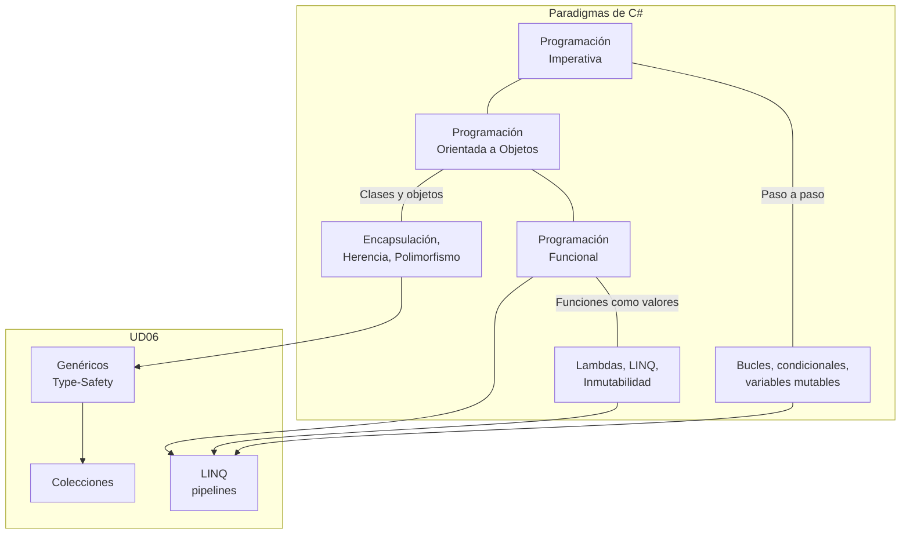

- [1. Introducción](#1-introducción)
  - [1.1. Relación entre programación funcional, genéricos y colecciones](#11-relación-entre-programación-funcional-genéricos-y-colecciones)
  - [1.2. Paradigmas de programación en C#](#12-paradigmas-de-programación-en-c)

# 1. Introducción

Este tema abarca tres conceptos fundamentales en la programación moderna con C# y .NET:

**Tipos Genéricos**: Aprenderás a escribir código reutilizable y seguro en cuanto a tipos, evitando la duplicación de código y mejorando el rendimiento de tus aplicaciones.

**Programación Funcional**: Descubrirás un nuevo paradigma de programación que te permitirá escribir código más expresivo, conciso y fácil de mantener, tratando las funciones como elementos de primera clase.

**Colecciones**: Dominarás las estructuras de datos que C# y .NET ponen a tu disposición para almacenar, organizar y manipular conjuntos de datos de manera eficiente.

Estos tres conceptos están profundamente interrelacionados. Los genéricos nos permiten crear colecciones que funcionan con cualquier tipo de dato manteniendo la seguridad de tipos. La programación funcional nos proporciona herramientas poderosas para manipular estas colecciones de manera elegante y eficiente. Y las colecciones son el terreno perfecto donde aplicar tanto genéricos como técnicas funcionales.

## 1.1. Relación entre programación funcional, genéricos y colecciones

Imagina que tienes un array de números y quieres:
- Filtrar solo los números pares
- Multiplicar cada uno por 2
- Sumar todos los resultados

Sin las herramientas que aprenderás en este tema, necesitarías escribir bucles anidados, variables temporales y mucho código imperativo. Con genéricos, programación funcional y un buen conocimiento de las colecciones, podrás expresar esta operación de manera clara y concisa.

Es decir antes harías algo así:

```csharp
int[] numeros = { 1, 2, 3, 4, 5, 6 };
int suma = 0;
for (int i = 0; i < numeros.Length; i++)
{
    if (numeros[i] % 2 == 0)
    {
        suma += numeros[i] * 2;
    }
}
```

Ahora, con las herramientas que aprenderías, podrías hacerlo así:

```csharp
int[] numeros = { 1, 2, 3, 4, 5, 6 };
int resultado = numeros
    .Where(n => n % 2 == 0)   // Filtrar pares
    .Select(n => n * 2)       // Multiplicar por 2
    .Sum();                    // Sumar resultados
```

**🧠 Analogía:** La Receta de Cocina

Imagina que tienes una receta de cocina que funciona para cualquier tipo de ingrediente:

- **Sin genéricos**: Tendrías una receta específica para pollo, otra para verduras, otra para pescado...
- **Con genéricos**: Tienes una receta genérica que funciona con cualquier ingrediente, siempre que sigan el "contrato" de poder cocinarse.
- **Con programación funcional**: En lugar de especificar cada paso del cocinero, le das instrucciones de ALTO NIVEL como "filtra los ingredientes buenos", "mezcla los seleccionados", "sirve el resultado".
- **Con colecciones**: Tienes diferentes recipientes (olla, sartén, bandeja) según el tipo de preparación.

> 📝 **Nota del Profesor**: Esta unidad es EL CORAZÓN de la programación moderna en C#. Si dominas genéricos + funcional + colecciones, puedes escribir código que antes requería cientos de líneas en apenas unas pocas. Es la diferencia entre ser un programador básico y uno profesional.

> 💡 **Tip del Examinador**: En los exámenes, siempre preguntan la relación entre estos tres conceptos. Recuerda: **Los genéricos proporcionan la estructura type-safe, la programación funcional proporciona las operaciones, y las colecciones proporcionan el almacenamiento.**

Este código será:
- **Declarativo**: Expresa QUÉ quieres hacer, no CÓMO hacerlo
- **Legible**: Cualquiera puede entender la intención
- **Reutilizable**: Cada operación es independiente
- **Seguro**: Los genéricos garantizan que trabajas con el tipo correcto

## 1.2. Paradigmas de programación en C#

C# es un lenguaje **multiparadigma**, lo que significa que soporta diferentes estilos de programación:

**Programación Imperativa**: Le dices al ordenador paso a paso qué hacer.

```csharp
int suma = 0;
for (int i = 0; i < numeros.Length; i++)
{
    if (numeros[i] % 2 == 0)
    {
        suma += numeros[i] * 2;
    }
}
```

**Programación Orientada a Objetos (POO)**: Organizas el código en clases y objetos con estado y comportamiento.

```csharp
public class CalculadoraNumeros
{
    public int CalcularSumaParesDobles(int[] numeros)
    {
        // ...
    }
}
```

**Programación Funcional**: Tratas las funciones como valores, evitas el estado mutable y prefieres composición de funciones.

```csharp
Func<int, bool> esPar = n => n % 2 == 0;
Func<int, int> duplicar = n => n * 2;

// Cuando veamos colecciones
int resultado = numeros
    .Where(esPar)
    .Select(duplicar)
    .Sum();
```

**⚠️ Advertencia:** ¡No Te Cases con un Solo Paradigma!

C# te permite combinar lo mejor de cada paradigma según tus necesidades. No existe "EL paradigma perfecto" para todo.

> 💡 **Tip del Examinador**: La pregunta clásica de examen es: "¿Cuándo usar programación funcional vs imperativa?" Respuesta: Usa funcional cuando puedas expresar la lógica de forma clara con pipelines (filtros, transformaciones, agregaciones). Usa imperativa cuando necesites control fino sobre el flujo o cuando la lógica sea muy secuencial con muchos efectos secundarios.



En este tema nos centraremos especialmente en la **programación funcional**, pero verás cómo C# te permite combinar lo mejor de cada paradigma según tus necesidades.

**🧠 Analogía:** Las Herramientas del Taller

Imagina un taller de madera:
- **Imperativo**: Usar una sierra y medir cada corte manualmente
- **POO**: Tener máquinas especializadas (torno, fresadora) con instrucciones
- **Funcional**: Tener una línea de montaje donde cada estación hace una operación específica y el producto fluye automáticamente

En la práctica, un buen carpenter@ usa todas las herramientas según la tarea. Lo mismo ocurre con la programación.
