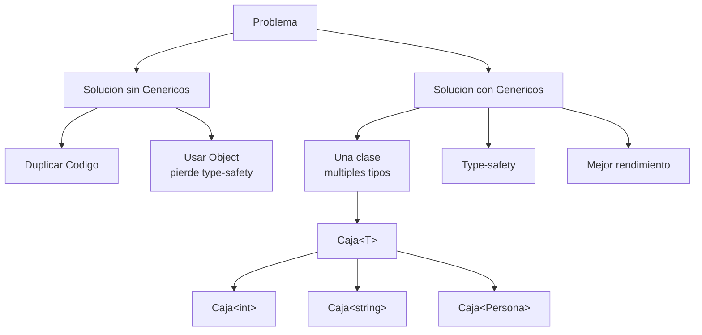
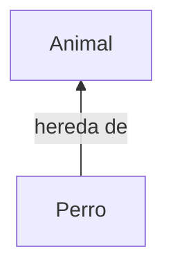
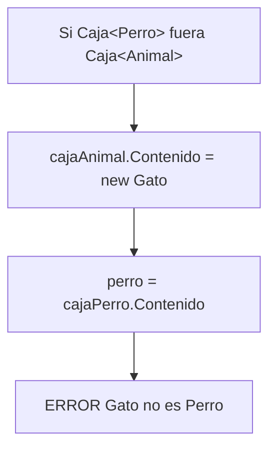
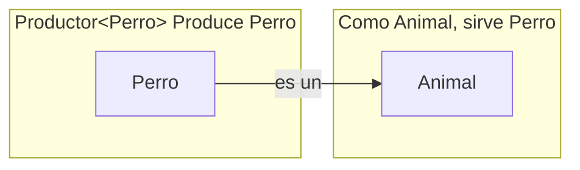
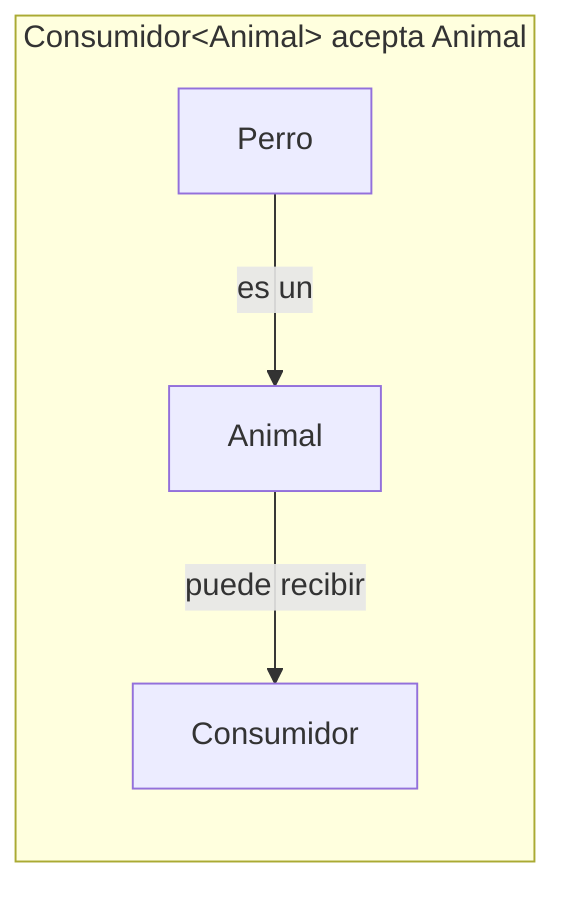
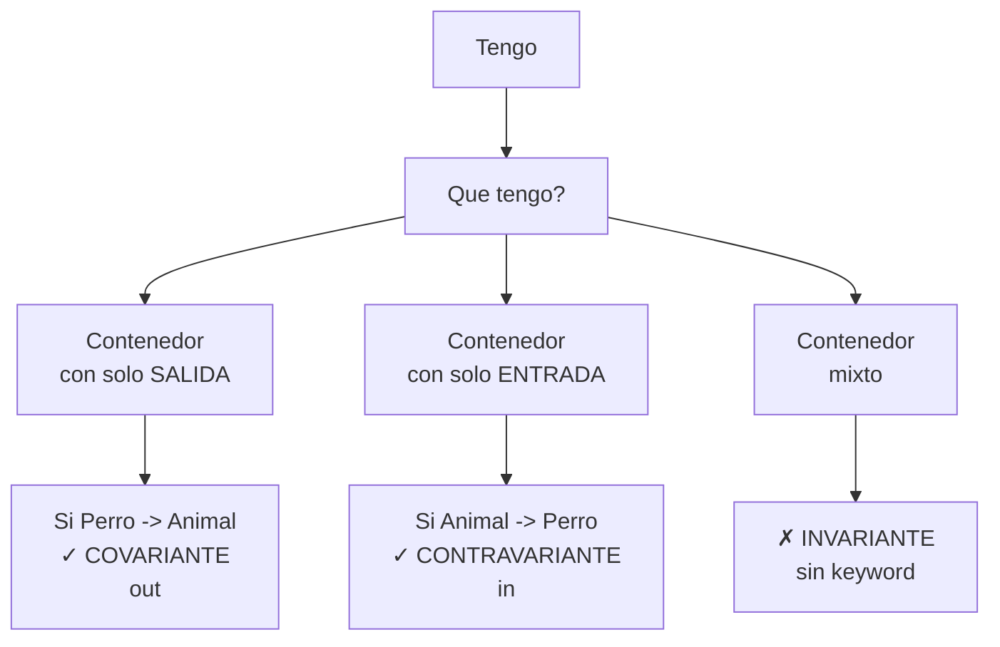
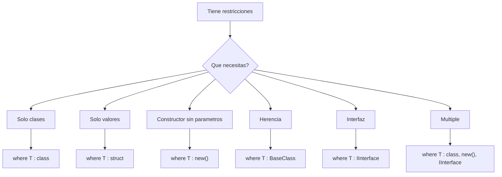

- [2. Tipos Genéricos en C#](#2-tipos-genéricos-en-c)
  - [2.1. Introducción a los Genéricos](#21-introducción-a-los-genéricos)
    - [2.1.1. ¿Qué son y para qué sirven?](#211-qué-son-y-para-qué-sirven)
    - [2.1.2. Ventajas: reutilización, type-safety, rendimiento](#212-ventajas-reutilización-type-safety-rendimiento)
    - [📊 Comparación de Rendimiento](#-comparación-de-rendimiento)
    - [2.1.3. Historia y evolución en C#](#213-historia-y-evolución-en-c)
  - [2.2. Clases Genéricas](#22-clases-genéricas)
    - [2.2.1. Definición y sintaxis](#221-definición-y-sintaxis)
    - [2.2.2. Parámetros de tipo único](#222-parámetros-de-tipo-único)
    - [2.2.3. Parámetros de tipo múltiples](#223-parámetros-de-tipo-múltiples)
    - [2.2.4. Clases genéricas anidadas](#224-clases-genéricas-anidadas)
  - [2.3. Métodos Genéricos](#23-métodos-genéricos)
    - [2.3.1. Sintaxis y casos de uso](#231-sintaxis-y-casos-de-uso)
    - [2.3.2. Inferencia de tipos](#232-inferencia-de-tipos)
    - [2.3.3. Métodos genéricos en clases no genéricas](#233-métodos-genéricos-en-clases-no-genéricas)
    - [2.3.4. Métodos genéricos estáticos](#234-métodos-genéricos-estáticos)
  - [2.4. Varianza en Genéricos](#24-varianza-en-genéricos)
    - [2.4.1. Conceptos Fundamentales](#241-conceptos-fundamentales)
    - [¿Qué es la varianza?](#qué-es-la-varianza)
    - [2.4.2. Invarianza (comportamiento por defecto)](#242-invarianza-comportamiento-por-defecto)
    - [2.4.3. Covarianza (out)](#243-covarianza-out)
    - [2.4.4. Contravarianza (in)](#244-contravarianza-in)
    - [2.4.5. Resumen: ¿Cuándo se permite la conversión?](#245-resumen-cuándo-se-permite-la-conversión)
    - [2.4.6. Interfaces importantes de .NET](#246-interfaces-importantes-de-net)
  - [2.5. Restricciones de Tipos (Constraints)](#25-restricciones-de-tipos-constraints)
    - [2.5.1. Restricciones básicas](#251-restricciones-básicas)
    - [2.5.2. Múltiples restricciones combinadas](#252-múltiples-restricciones-combinadas)
    - [2.5.3. Restricciones con múltiples parámetros de tipo](#253-restricciones-con-múltiples-parámetros-de-tipo)
    - [2.5.4. Ejemplos prácticos avanzados](#254-ejemplos-prácticos-avanzados)
  - [2.6. Tipos Genéricos Anulables](#26-tipos-genéricos-anulables)
    - [2.6.1. Nullable y la sintaxis T?](#261-nullable-y-la-sintaxis-t)
    - [2.6.2. Uso exclusivo con tipos de valor (struct)](#262-uso-exclusivo-con-tipos-de-valor-struct)
    - [2.6.3. Propiedades: HasValue, Value](#263-propiedades-hasvalue-value)
    - [2.6.4. Operadores y conversiones](#264-operadores-y-conversiones)

# 2. Tipos Genéricos en C#

Los **genéricos** (generics en inglés) son una característica del lenguaje que te permite escribir código que funciona con diferentes tipos de datos sin perder la seguridad de tipos (type safety) y sin duplicar código.

## 2.1. Introducción a los Genéricos



### 2.1.1. ¿Qué son y para qué sirven?

Imagina que necesitas crear una clase que almacene un valor. Podrías hacerlo así:

```csharp
// Clase que almacena un entero
public class CajaDeEnteros
{
    private int valor;

    public CajaDeEnteros(int valor)
    {
        this.valor = valor;
    }

    public int ObtenerValor()
    {
        return valor;
    }
}
```

Pero, ¿qué pasa si ahora necesitas una caja para strings? ¿Y para doubles? ¿Y para objetos de tu clase Persona? Tendrías que crear una clase diferente para cada tipo:

```csharp
public class CajaDeStrings { /* ... */ }
public class CajaDeDoubles { /* ... */ }
public class CajaDePersonas { /* ... */ }
```

Esto es tedioso, propenso a errores y difícil de mantener. **Los genéricos resuelven este problema**.

Con genéricos, puedes escribir una única clase que funciona con cualquier tipo:

```csharp
// Clase genérica que funciona con cualquier tipo T
public class Caja<T>
{
    private T valor;

    public Caja(T valor)
    {
        this.valor = valor;
    }

    public T ObtenerValor()
    {
        return valor;
    }
}
```

Ahora puedes usar esta clase con cualquier tipo:

```csharp
Caja<int> cajaEntero = new Caja<int>(42);
int numeroGuardado = cajaEntero.ObtenerValor(); // 42

Caja<string> cajaTexto = new Caja<string>("Hola");
string textoGuardado = cajaTexto.ObtenerValor(); // "Hola"

Caja<Persona> cajaPersona = new Caja<Persona>(new Persona("Ana", 25));
Persona personaGuardada = cajaPersona.ObtenerValor();
```

La letra `T` es un **parámetro de tipo** (type parameter). Es como una variable, pero para tipos en lugar de valores. Por convención, se suele usar `T` (de "Type"), aunque puedes usar cualquier identificador válido.

**🧠 Analogía:** El Molde de Galletas

Imagina que tienes un molde de galletas en forma de estrella:
- Si Masse el molde con masa de chocolate → Obtienes galletas de chocolate con forma de estrella
- Si Masse el molde con masa de vainilla → Obtienes galletas de vainilla con forma de estrella
- Si Masse el molde con masa de avena → Obtienes galletas de avena con forma de estrella

El molde es como la clase genérica `Caja<T>`. La masa es el tipo que le pasas (`int`, `string`, `Persona`). El resultado es una caja específica para ese tipo.

> 💡 **Tip del Examinador**: En examen, siempre preguntan qué es `T`. Respuesta: "Es un parámetro de tipo genérico que representa el tipo con el que trabajará la clase o método. Es una especie de 'placeholder' que se sustituye por un tipo concreto al usar la clase."

### 2.1.2. Ventajas: reutilización, type-safety, rendimiento

Los genéricos proporcionan tres ventajas fundamentales:

**1. Reutilización de código**

Escribes el código una sola vez y funciona con múltiples tipos. Esto reduce la duplicación y facilita el mantenimiento.

```csharp
// Una sola clase genérica para todos los tipos
public class Pila<T>
{
    private T[] elementos;
    private int contador;

    public void Push(T elemento) { /* ... */ }
    public T Pop() { /* ... */ }
}

// Uso con diferentes tipos
Pila<int> pilaNumeros = new Pila<int>();
Pila<string> pilaTextos = new Pila<string>();
Pila<Persona> pilaPersonas = new Pila<Persona>();
```

**2. Type-safety (Seguridad de tipos)**

El compilador verifica en tiempo de compilación que estás usando los tipos correctamente, evitando errores en tiempo de ejecución.

Sin genéricos (usando object):

```csharp
// Enfoque antiguo: usar object
public class CajaSinGenericos
{
    private object valor;

    public CajaSinGenericos(object valor)
    {
        this.valor = valor;
    }

    public object ObtenerValor()
    {
        return valor;
    }
}

// Uso: propenso a errores
CajaSinGenericos caja = new CajaSinGenericos(42);
string texto = (string)caja.ObtenerValor(); // ¡ERROR en tiempo de ejecución!
// InvalidCastException: Unable to cast object of type 'System.Int32' to type 'System.String'
```

Con genéricos:

```csharp
Caja<int> caja = new Caja<int>(42);
string texto = caja.ObtenerValor(); // ERROR en tiempo de COMPILACIÓN
// Cannot implicitly convert type 'int' to 'string'
```

Es mucho mejor que el compilador te avise del error antes de ejecutar el programa.

> 📝 **Nota del Profesor**: En el mundo real, los errores de tiempo de ejecución son muy COSTOSOS. Un usuario que ve un mensaje de error en producción puede significar pérdida de dinero, de confianza, o peor. Los errores de compilación son "regalos" que te da el compilador antes de que el código llegue al usuario.

**3. Rendimiento**

Los genéricos evitan el **boxing** y **unboxing** de tipos valor, mejorando significativamente el rendimiento.

**Boxing** es el proceso de convertir un tipo valor (como `int`, `double`, `bool`) en un objeto de tipo referencia (almacenándolo en el heap). **Unboxing** es el proceso inverso.

Sin genéricos:

```csharp
// Sin genéricos: boxing y unboxing
ArrayList lista = new ArrayList(); // Colección antigua no genérica
lista.Add(42);        // Boxing: int -> object
int numero = (int)lista[0]; // Unboxing: object -> int

// Con 1 millón de elementos, esto genera 2 millones de operaciones costosas
```

Con genéricos:

```csharp
// Con genéricos: sin boxing ni unboxing
List<int> lista = new List<int>();
lista.Add(42);        // Sin boxing, se almacena directamente como int
int numero = lista[0]; // Sin unboxing, se recupera directamente como int
```

### 📊 Comparación de Rendimiento

```csharp
using System;
using System.Collections;
using System.Collections.Generic;
using System.Diagnostics;

const int ELEMENTOS = 1000000;

// ArrayList (no genérico)
Stopwatch sw1 = Stopwatch.StartNew();
ArrayList listaSinGenericos = new ArrayList();
for (int i = 0; i < ELEMENTOS; i++)
{
    listaSinGenericos.Add(i); // Boxing en cada iteración
}
int suma1 = 0;
for (int i = 0; i < ELEMENTOS; i++)
{
    suma1 += (int)listaSinGenericos[i]; // Unboxing en cada iteración
}
sw1.Stop();

// List<T> (genérico)
Stopwatch sw2 = Stopwatch.StartNew();
List<int> listaConGenericos = new List<int>();
for (int i = 0; i < ELEMENTOS; i++)
{
    listaConGenericos.Add(i); // Sin boxing
}
int suma2 = 0;
for (int i = 0; i < ELEMENTOS; i++)
{
    suma2 += listaConGenericos[i]; // Sin unboxing
}
sw2.Stop();

Console.WriteLine($"Sin genéricos: {sw1.ElapsedMilliseconds} ms");
Console.WriteLine($"Con genéricos: {sw2.ElapsedMilliseconds} ms");
Console.WriteLine($"Mejora: {sw1.ElapsedMilliseconds / (double)sw2.ElapsedMilliseconds:F2}x más rápido");

// Salida típica:
// Sin genéricos: 250 ms
// Con genéricos: 45 ms
// Mejora: 5.56x más rápido
```

**⚠️ Advertencia:** ¡El Boxing Es Silencioso!

El boxing no lanza excepciones, pero hace que tu código sea más lento y consuma más memoria. Si trabajas con grandes cantidades de datos, el impacto puede ser significativo.

> 💡 **Tip del Examinador**: Pregunta frecuente: "¿Por qué List<T> es más rápido que ArrayList?" Respuesta: "Porque List<T> evita el boxing/unboxing al trabajar directamente con tipos valor, mientras que ArrayList convierte todo a object."

### 2.1.3. Historia y evolución en C#

Los genéricos se introdujeron en **C# 2.0** (2005) junto con .NET Framework 2.0. Antes de esto, los desarrolladores tenían que elegir entre:

1. **Duplicar código** para cada tipo
2. **Usar `object`** y perder type-safety y rendimiento
3. **Usar colecciones no genéricas** como `ArrayList`, `Hashtable`, etc.

La introducción de genéricos fue revolucionaria y permitió crear:
- Colecciones genéricas: `List<T>`, `Dictionary<TKey, TValue>`, etc.
- Delegates genéricos: `Action<T>`, `Func<T, TResult>`, etc.
- Interfaces genéricas: `IEnumerable<T>`, `IComparable<T>`, etc.

Desde entonces, los genéricos han evolucionado:

- **C# 3.0**: Mejoras en inferencia de tipos con genéricos
- **C# 4.0**: Varianza en genéricos (covarianza y contravarianza)
- **C# 7.0**: Mejoras en inferencia de tipos de retorno
- **C# 8.0**: Restricciones `notnull` en genéricos
- **C# 9.0**: Covarianza en tipos de retorno
- **C# 11.0**: Mejoras en operadores matemáticos genéricos

Los genéricos son ahora parte fundamental del lenguaje y están en todas partes: colecciones, LINQ, async/await, etc.

## 2.2. Clases Genéricas

### 2.2.1. Definición y sintaxis

Una **clase genérica** es una clase que tiene uno o más parámetros de tipo. La sintaxis básica es:

```csharp
public class NombreClase<T>
{
    // Usar T como si fuera un tipo normal
}
```

Donde:
- `NombreClase` es el nombre de tu clase
- `<T>` declara un parámetro de tipo llamado `T`
- Dentro de la clase, puedes usar `T` como cualquier otro tipo

Veamos un ejemplo completo de una clase genérica:

```csharp
// Clase genérica que representa una caja que puede contener cualquier tipo de objeto
public class Caja<T>
{
    // Campo privado del tipo genérico T
    private T contenido;

    // Constructor que acepta un parámetro del tipo T
    public Caja(T contenidoInicial)
    {
        contenido = contenidoInicial;
    }

    // Método que devuelve el tipo T
    public T ObtenerContenido()
    {
        return contenido;
    }

    // Método que acepta un parámetro del tipo T
    public void EstablecerContenido(T nuevoContenido)
    {
        contenido = nuevoContenido;
    }

    // Método que muestra información (T.ToString() siempre está disponible)
    public void MostrarInfo()
    {
        Console.WriteLine($"La caja contiene: {contenido}");
        Console.WriteLine($"Tipo del contenido: {typeof(T).Name}");
    }
}
```

### 2.2.2. Parámetros de tipo único

El caso más común es una clase con un solo parámetro de tipo. Veamos más ejemplos prácticos:

**Ejemplo 1: Resultado de Operación (Result Pattern)**

```csharp
// Clase genérica que representa el resultado de una operación que puede fallar
public class Resultado<T>
{
    public bool Exito { get; private set; }
    public T Valor { get; private set; }
    public string MensajeError { get; private set; }
    
    private Resultado(bool exito, T valor, string mensajeError)
    {
        Exito = exito;
        Valor = valor;
        MensajeError = mensajeError;
    }
    
    public static Resultado<T> CrearExito(T valor)
    {
        return new Resultado<T>(true, valor, null);
    }
    
    public static Resultado<T> CrearError(string mensajeError)
    {
        return new Resultado<T>(false, default(T), mensajeError);
    }
    
    public Resultado<T> SiExito(Action<T> accion)
    {
        if (Exito)
        {
            accion(Valor);
        }
        return this;
    }
    
    public Resultado<T> SiError(Action<string> accion)
    {
        if (!Exito)
        {
            accion(MensajeError);
        }
        return this;
    }
}
```

**Ejemplo 2: Nodo de Lista Enlazada**

```csharp
// Nodo genérico para construir una lista enlazada
public class Nodo<T>
{
    public T Dato { get; set; }
    public Nodo<T> Siguiente { get; set; }
    
    public Nodo(T dato)
    {
        Dato = dato;
        Siguiente = null;
    }
    
    public override string ToString()
    {
        return $"Nodo({Dato})";
    }
}

// Lista enlazada simple genérica
public class ListaEnlazada<T>
{
    private Nodo<T> cabeza;
    private int contador;
    public int Cantidad => contador;
    
    public void AgregarAlInicio(T dato)
    {
        Nodo<T> nuevoNodo = new Nodo<T>(dato);
        nuevoNodo.Siguiente = cabeza;
        cabeza = nuevoNodo;
        contador++;
    }
    
    public void AgregarAlFinal(T dato)
    {
        Nodo<T> nuevoNodo = new Nodo<T>(dato);
        if (cabeza == null)
        {
            cabeza = nuevoNodo;
        }
        else
        {
            Nodo<T> actual = cabeza;
            while (actual.Siguiente != null)
            {
                actual = actual.Siguiente;
            }
            actual.Siguiente = nuevoNodo;
        }
        contador++;
    }
    
    public void Mostrar()
    {
        Nodo<T> actual = cabeza;
        Console.Write("Lista: ");
        while (actual != null)
        {
            Console.Write($"{actual.Dato} -> ");
            actual = actual.Siguiente;
        }
        Console.WriteLine("null");
    }
    
    public bool Contiene(T dato)
    {
        Nodo<T> actual = cabeza;
        while (actual != null)
        {
            if (actual.Dato.Equals(dato))
            {
                return true;
            }
            actual = actual.Siguiente;
        }
        return false;
    }
}
```

### 2.2.3. Parámetros de tipo múltiples

No estamos limitados a usar un solo tipo genérico (T). Podemos manipular información relacionando distintos tipos de datos en un mismo método o clase.

```csharp
public class NombreClase<T1, T2, T3>
{
    // Usar T1, T2 y T3 como tipos
}
```

**Ejemplo: Par de valores (Tupla de 2 elementos)**

```csharp
// Clase genérica con dos parámetros de tipo
public class Par<T1, T2>
{
    public T1 Primero { get; set; }
    public T2 Segundo { get; set; }
    
    public Par(T1 primero, T2 segundo)
    {
        Primero = primero;
        Segundo = segundo;
    }
    
    // Deconstructor (permite usar deconstrucción)
    public void Deconstruct(out T1 primero, out T2 segundo)
    {
        primero = Primero;
        segundo = Segundo;
    }
    
    public override string ToString()
    {
        return $"({Primero}, {Segundo})";
    }
    
    // Método para intercambiar los valores
    public Par<T2, T1> Intercambiar()
    {
        return new Par<T2, T1>(Segundo, Primero);
    }
}
```

**Ejemplo: Diccionario simple (estructura clave-valor)**

```csharp
// Entrada de diccionario con clave y valor genéricos
public class Entrada<TKey, TValue>
{
    public TKey Clave { get; set; }
    public TValue Valor { get; set; }
    
    public Entrada(TKey clave, TValue valor)
    {
        Clave = clave;
        Valor = valor;
    }
    
    public override string ToString()
    {
        return $"[{Clave}] => {Valor}";
    }
}

// Diccionario simple genérico
public class DiccionarioSimple<TKey, TValue>
{
    private Entrada<TKey, TValue>[] entradas;
    private int contador;
    public int Cantidad => contador;
    
    public DiccionarioSimple(int capacidadInicial = 10)
    {
        entradas = new Entrada<TKey, TValue>[capacidadInicial];
        contador = 0;
    }
    
    public void Agregar(TKey clave, TValue valor)
    {
        for (int i = 0; i < contador; i++)
        {
            if (entradas[i].Clave.Equals(clave))
            {
                entradas[i].Valor = valor;
                return;
            }
        }
        if (contador == entradas.Length)
        {
            Array.Resize(ref entradas, entradas.Length * 2);
        }
        entradas[contador] = new Entrada<TKey, TValue>(clave, valor);
        contador++;
    }
    
    public TValue Obtener(TKey clave)
    {
        for (int i = 0; i < contador; i++)
        {
            if (entradas[i].Clave.Equals(clave))
            {
                return entradas[i].Valor;
            }
        }
        throw new KeyNotFoundException($"La clave '{clave}' no existe en el diccionario");
    }
    
    public bool TryGetValue(TKey clave, out TValue valor)
    {
        for (int i = 0; i < contador; i++)
        {
            if (entradas[i].Clave.Equals(clave))
            {
                valor = entradas[i].Valor;
                return true;
            }
        }
        valor = default(TValue);
        return false;
    }
}
```

### 2.2.4. Clases genéricas anidadas

Puedes tener clases genéricas dentro de otras clases genéricas, lo que permite estructuras de datos muy flexibles.

```csharp
// Clase externa genérica
public class Coleccion<T>
{
    private T[] elementos;
    private int contador;
    public int Cantidad => contador;
    
    public Coleccion(int capacidadInicial = 10)
    {
        elementos = new T[capacidadInicial];
        contador = 0;
    }
    
    public void Agregar(T elemento)
    {
        if (contador == elementos.Length)
        {
            Array.Resize(ref elementos, elementos.Length * 2);
        }
        elementos[contador++] = elemento;
    }
    
    public T this[int indice]
    {
        get
        {
            if (indice < 0 || indice >= contador)
                throw new IndexOutOfRangeException();
            return elementos[indice];
        }
        set
        {
            if (indice < 0 || indice >= contador)
                throw new IndexOutOfRangeException();
            elementos[indice] = value;
        }
    }
    
    // Clase interna genérica (anidada)
    public class Iterador<TElemento>
    {
        private TElemento[] elementos;
        private int posicion;
        private int limite;
        
        public Iterador(TElemento[] elementos, int limite)
        {
            this.elementos = elementos;
            this.posicion = 0;
            this.limite = limite;
        }
        
        public bool TieneSiguiente()
        {
            return posicion < limite;
        }
        
        public TElemento Siguiente()
        {
            if (!TieneSiguiente())
            {
                throw new InvalidOperationException("No hay más elementos");
            }
            return elementos[posicion++];
        }
        
        public void Reiniciar()
        {
            posicion = 0;
        }
    }
    
    public Iterador<T> ObtenerIterador()
    {
        return new Iterador<T>(elementos, contador);
    }
    
    // Nodo para estructura de árbol
    public class NodoArbol<TValor>
    {
        public TValor Valor { get; set; }
        public NodoArbol<TValor> Izquierdo { get; set; }
        public NodoArbol<TValor> Derecho { get; set; }
        
        public NodoArbol(TValor valor)
        {
            Valor = valor;
            Izquierdo = null;
            Derecho = null;
        }
        
        public bool EsHoja()
        {
            return Izquierdo == null && Derecho == null;
        }
    }
}
```

## 2.3. Métodos Genéricos

### 2.3.1. Sintaxis y casos de uso

La sintaxis básica de un método genérico es:

```csharp
public TipoRetorno NombreMetodo<T>(T parametro)
{
    // Usar T en el cuerpo del método
}
```

**Ejemplo básico:**

```csharp
public class UtilidadesGenericas
{
    public static void Intercambiar<T>(ref T a, ref T b)
    {
        T temp = a;
        a = b;
        b = temp;
    }
    
    public static void MostrarInfo<T>(T valor)
    {
        Console.WriteLine($"Valor: {valor}");
        Console.WriteLine($"Tipo: {typeof(T).Name}");
    }
    
    public static T PrimerElemento<T>(T[] array)
    {
        if (array == null || array.Length == 0)
        {
            throw new ArgumentException("El array no puede estar vacío");
        }
        return array[0];
    }
    
    public static T UltimoElemento<T>(T[] array)
    {
        if (array == null || array.Length == 0)
        {
            throw new ArgumentException("El array no puede estar vacío");
        }
        return array[array.Length - 1];
    }
}
```

### 2.3.2. Inferencia de tipos

Una de las características más útiles de los métodos genéricos es la **inferencia de tipos**. El compilador puede deducir automáticamente el tipo genérico.

```csharp
public class UtilidadesInferencia
{
    public static void Imprimir<T>(T valor)
    {
        Console.WriteLine($"Valor: {valor}, Tipo: {typeof(T).Name}");
    }
    
    public static T[] CrearArray<T>(T valor1, T valor2, T valor3)
    {
        return new T[] { valor1, valor2, valor3 };
    }
    
    public static bool SonIguales<T>(T a, T b)
    {
        return a.Equals(b);
    }
}

// El compilador deduce automáticamente el tipo
UtilidadesInferencia.Imprimir(42);          // T = int
UtilidadesInferencia.Imprimir("Hola");      // T = string
int[] numeros = UtilidadesInferencia.CrearArray(1, 2, 3);  // T = int
```

### 2.3.3. Métodos genéricos en clases no genéricas

Un método genérico puede existir en una clase no genérica.

```csharp
// Clase NO genérica con métodos genéricos
public class Utilidades
{
    public T[] ConvertirAArray<T>(T elemento, int cantidad)
    {
        T[] array = new T[cantidad];
        for (int i = 0; i < cantidad; i++)
        {
            array[i] = elemento;
        }
        return array;
    }
    
    public int BuscarIndice<T>(T[] array, T elementoBuscado)
    {
        for (int i = 0; i < array.Length; i++)
        {
            if (array[i].Equals(elementoBuscado))
            {
                return i;
            }
        }
        return -1;
    }
}
```

### 2.3.4. Métodos genéricos estáticos

Los métodos genéricos pueden ser estáticos, lo cual es muy común para métodos de utilidad.

```csharp
public class OperacionesArray
{
    public static void Invertir<T>(T[] array)
    {
        int izquierda = 0;
        int derecha = array.Length - 1;
        while (izquierda < derecha)
        {
            T temp = array[izquierda];
            array[izquierda] = array[derecha];
            array[derecha] = temp;
            izquierda++;
            derecha--;
        }
    }
    
    public static T[] Copiar<T>(T[] original)
    {
        T[] copia = new T[original.Length];
        for (int i = 0; i < original.Length; i++)
        {
            copia[i] = original[i];
        }
        return copia;
    }
    
    public static T[] Concatenar<T>(T[] array1, T[] array2)
    {
        T[] resultado = new T[array1.Length + array2.Length];
        for (int i = 0; i < array1.Length; i++)
        {
            resultado[i] = array1[i];
        }
        for (int i = 0; i < array2.Length; i++)
        {
            resultado[array1.Length + i] = array2[i];
        }
        return resultado;
    }
}
```

## 2.4. Varianza en Genéricos

### 2.4.1. Conceptos Fundamentales

**Herencia normal: Perro ES UN Animal**

```csharp
Animal animal = new Perro();  // ✓ VALIDO
```



**¿Qué pasa con las colecciones?**

```csharp
List<Perro> perros = new List<Perro>();
List<Animal> animales = perros;  // ¿VALIDO?
```

La respuesta depende de la **varianza**.

### ¿Qué es la varianza?

La varianza define si un tipo genérico con un parámetro derivado puede sustituir a un tipo genérico con un parámetro base.

| **Tipo de Varianza** | **¿Perro → Animal?** | **¿Animal → Perro?** | **keyword** |
| -------------------- | -------------------- | -------------------- | ----------- |
| Invarianza           | NO                   | NO                   | ninguna     |
| Covarianza           | SÍ                   | NO                   | `out`       |
| Contravarianza       | NO                   | SÍ                   | `in`        |

### 2.4.2. Invarianza (comportamiento por defecto)

**Por defecto, los genéricos son INVARIANTES.**

```csharp
public class Caja<T>
{
    public T Contenido { get; set; }
}
```

```csharp
Caja<Perro> cajaPerro = new Caja<Perro>();
Caja<Animal> cajaAnimal = cajaPerro;  // ✗ ERROR
```

**¿Por qué ERROR?**



La caja de Perros no puede convertirse en caja de Animales porque alguien podría meter un Gato.

### 2.4.3. Covarianza (out)

**Solo puedes SACAR (producir) valores. Usa `out`.**

```csharp
public interface IProductor<out T>
{
    T Producir();  // Solo SALIDA
}
```

```csharp
IProductor<Perro> produtorPerro = new ProductorPerro();
IProductor<Animal> produtorAnimal = produtorPerro;  // ✓ VALIDO
```

**¿Por qué VALIDO?**



Solo sacamos valores. Si el productor da Perros y los tratamos como Animales, no hay problema.

**Ejemplo real: IEnumerable<T>**

```csharp
IEnumerable<Perro> perros = new List<Perro>();
IEnumerable<Animal> animales = perros;  // ✓ VALIDO

foreach (Animal a in animales)  // Cada Perro se trata como Animal
{
    Console.WriteLine(a.Nombre);
}
```

### 2.4.4. Contravarianza (in)

**Solo puedes METER (consumir) valores. Usa `in`.**

```csharp
public interface IConsumidor<in T>
{
    void Consumir(T item);  // Solo ENTRADA
}
```

```csharp
IConsumidor<Animal> consumidorAnimal = new ConsumidorAnimal();
IConsumidor<Perro> consumidorPerro = consumidorAnimal;  // ✓ VALIDO
```

**¿Por qué VALIDO?**



El consumidor de Animales puede recibir Perros (porque Perro ES Animal).

**Ejemplo real: IComparer<T>**

```csharp
IComparer<Animal> comparadorAnimal = new ComparadorPorNombre();
IComparer<Perro> comparadorPerro = comparadorAnimal;  // ✓ VALIDO

Perro p1 = new Perro("Max");
Perro p2 = new Perro("Buddy");
comparadorPerro.Compare(p1, p2);  // Usa comparador de Animals
```

### 2.4.5. Resumen: ¿Cuándo se permite la conversión?



### 2.4.6. Interfaces importantes de .NET

| **Interfaz**           | **Varianza** | **¿Por qué?**          |
| ---------------------- | ------------ | ---------------------- |
| `IEnumerable<T>`       | `out`        | Solo itera (produce)   |
| `IEnumerator<T>`       | `out`        | Solo lee               |
| `IComparer<T>`         | `in`         | Solo compara (consume) |
| `IEqualityComparer<T>` | `in`         | Solo equals (consume)  |
| `Func<T,R>`            | `out` en R   | Solo retorna           |
| `Action<T>`            | `in` en T    | Solo recibe            |
| `List<T>`              | ninguna      | Puede agregar y leer   |
| `Dictionary<K,V>`      | ninguna      | Claves y valores       |

## 2.5. Restricciones de Tipos (Constraints)



Las **restricciones de tipos** permiten especificar requisitos que debe cumplir un parámetro de tipo genérico.

### 2.5.1. Restricciones básicas

**`where T : class`** (tipo referencia)

```csharp
public class ContenedorReferencia<T> where T : class
{
    private T item;
    public bool EsNulo() => item == null;
}
```

**`where T : struct`** (tipo valor)

```csharp
public class ContenedorValor<T> where T : struct
{
    private T valor;
    public int TamanoEnBytes() => System.Runtime.InteropServices.Marshal.SizeOf(valor);
}
```

**`where T : new()`** (constructor sin parámetros)

```csharp
public class Fabrica<T> where T : new()
{
    public T Crear() => new T();
}
```

**`where T : <clase base>`** (herencia de clase)

```csharp
public class Veterinaria<T> where T : Animal
{
    public void Revisar(T paciente)
    {
        paciente.HacerSonido(); // Podemos usar métodos de Animal
    }
}
```

**`where T : <interfaz>`** (implementación de interfaz)

```csharp
public class Repositorio<T> where T : IIdentificable
{
    public T BuscarPorId(int id)
    {
        // Podemos usar IIdentificable
    }
}
```

### 2.5.2. Múltiples restricciones combinadas

Puedes combinar varias restricciones:

```csharp
public class RepositorioCompleto<T>
    where T : class, IIdentificable, IDescriptible, new()
{
    // T debe ser clase, implementar ambas interfaces, y tener constructor sin parámetros
}
```

### 2.5.3. Restricciones con múltiples parámetros de tipo

```csharp
public class Mapeador<TEntrada, TSalida>
    where TEntrada : class, IIdentificable
    where TSalida : class, new()
{
    // Cada parámetro tiene sus propias restricciones
}
```

### 2.5.4. Ejemplos prácticos avanzados

**Conversor genérico con restricciones**

```csharp
public class Conversor<TEntrada, TSalida>
    where TEntrada : IConvertible
    where TSalida : IConvertible
{
    public TSalida Convertir(TEntrada valor)
    {
        return (TSalida)Convert.ChangeType(valor, typeof(TSalida));
    }
}
```

**Caché genérica con restricciones**

```csharp
public class Cache<T>
    where T : class, IIdentificable, ICloneable
{
    private Dictionary<int, T> cache = new Dictionary<int, T>();
    
    public void Almacenar(T item)
    {
        T clon = (T)item.Clone();
        cache[item.Id] = clon;
    }
}
```

## 2.6. Tipos Genéricos Anulables

### 2.6.1. Nullable<T> y la sintaxis T?

```csharp
Nullable<int> numero1 = null;
int? numero2 = 42;  // Sintaxis abreviada (más común)
```

### 2.6.2. Uso exclusivo con tipos de valor (struct)

`Nullable<T>` solo funciona con tipos de valor. Los tipos de referencia ya pueden ser null por naturaleza.

```csharp
int? numeroNullable = null;      // ✓ Funciona
Punto? puntoNullable = null;     // ✓ Funciona (struct)
// string? texto = null;          // ✗ Redundante (string ya es nullable)
```

### 2.6.3. Propiedades: HasValue, Value

```csharp
int? numero = null;

if (numero.HasValue)
{
    Console.WriteLine($"Valor: {numero.Value}");
}
else
{
    Console.WriteLine("No tiene valor");
}

// Operador null-coalescing
int resultado = numero ?? 0;  // Si es null, usa 0
```

### 2.6.4. Operadores y conversiones

```csharp
int? a = 10;
int? b = null;

int suma = (int)a + (int)(b ?? 0);  // Conversión explícita necesaria
```

**📝 Nota del Profesor:** nullable en C# 8+

Desde C# 8.0, los tipos referencia pueden ser nullables o no, dependiendo del contexto de nullable (`#nullable enable/disable`).

```csharp
string? textoNulable = null;   // Puede ser null
string textoNoNulable = "Hola"; // No puede ser null (advertencia si asignas null)
```
