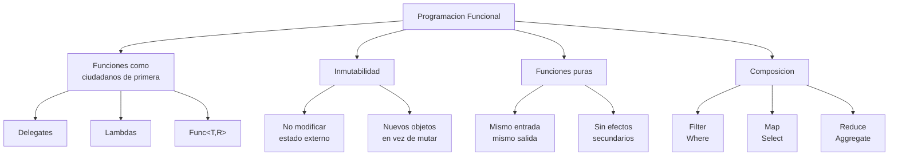
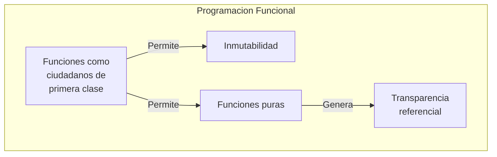
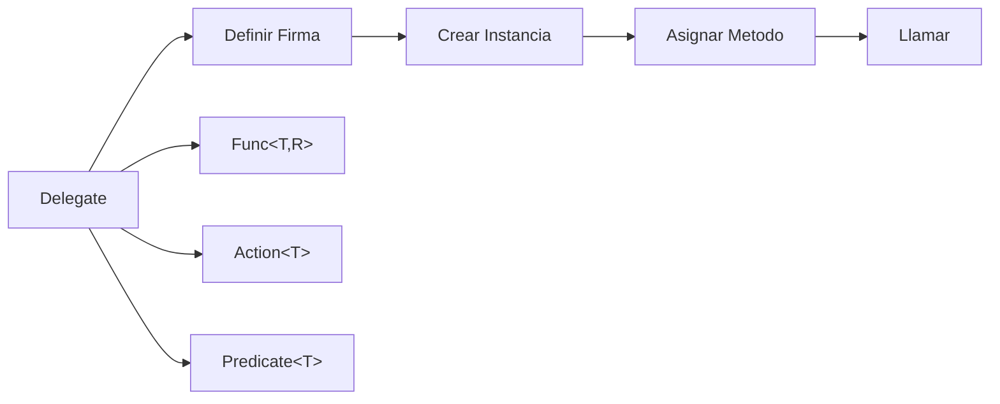
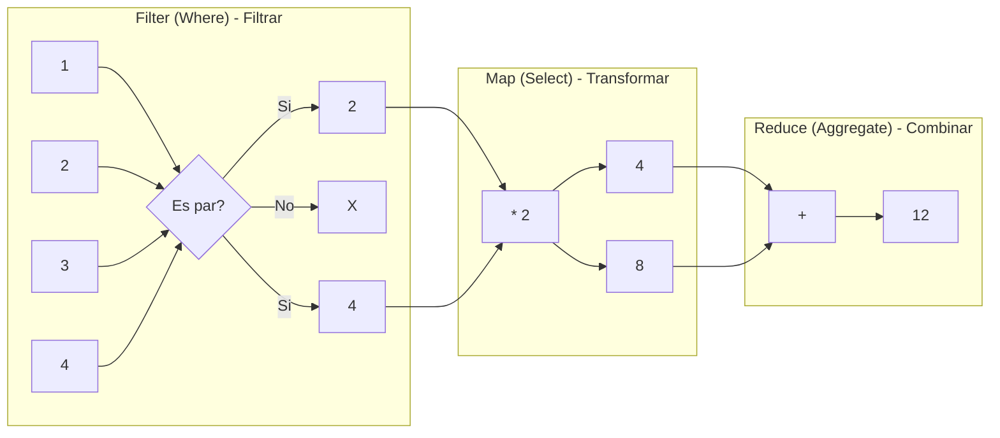
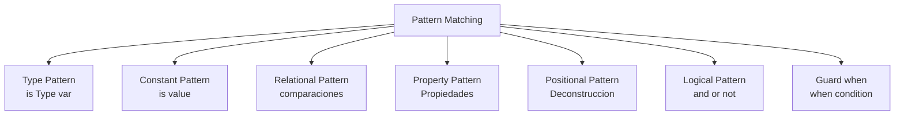
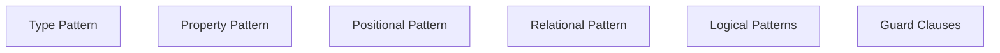

- [3. Programación Funcional en C#](#3-programación-funcional-en-c)
  - [3.1. Conceptos Fundamentales](#31-conceptos-fundamentales)
    - [3.1.1. Funciones como ciudadanos de primera clase](#311-funciones-como-ciudadanos-de-primera-clase)
    - [3.1.2. Inmutabilidad](#312-inmutabilidad)
    - [3.1.3. Funciones puras vs. funciones con efectos secundarios](#313-funciones-puras-vs-funciones-con-efectos-secundarios)
    - [3.1.4. Transparencia referencial](#314-transparencia-referencial)
    - [📊 Resumen Visual](#-resumen-visual)
  - [3.2. Delegates (Delegados)](#32-delegates-delegados)
    - [3.2.1. Fundamentos](#321-fundamentos)
    - [3.2.2. Delegates Personalizados](#322-delegates-personalizados)
    - [3.2.3. Delegates Genéricos Predefinidos](#323-delegates-genéricos-predefinidos)
    - [3.2.4. Multicast Delegates](#324-multicast-delegates)
  - [3.3. Expresiones Lambda](#33-expresiones-lambda)
    - [3.3.1. Sintaxis Básica](#331-sintaxis-básica)
    - [3.3.2. Variantes Sintácticas](#332-variantes-sintácticas)
    - [3.3.3. Captura de Variables (Closures)](#333-captura-de-variables-closures)
  - [3.4. Funciones Anónimas](#34-funciones-anónimas)
    - [3.4.1. Métodos anónimos con `delegate`](#341-métodos-anónimos-con-delegate)
    - [3.4.2. Comparación con Lambdas](#342-comparación-con-lambdas)
    - [3.4.3. ¿Cuándo Usar Cada Uno?](#343-cuándo-usar-cada-uno)
  - [3.5. Funciones de Orden Superior](#35-funciones-de-orden-superior)
    - [3.5.1. Funciones que Reciben Funciones](#351-funciones-que-reciben-funciones)
    - [3.5.2. Funciones que Devuelven Funciones](#352-funciones-que-devuelven-funciones)
    - [3.5.3. Operaciones Funcionales Básicas](#353-operaciones-funcionales-básicas)
    - [3.5.4. Composición de Operaciones](#354-composición-de-operaciones)
  - [3.6. Métodos de Extensión](#36-métodos-de-extensión)
    - [3.6.1. Fundamentos](#361-fundamentos)
    - [3.6.2. Extensión de Tipos Incorporados](#362-extensión-de-tipos-incorporados)
    - [3.6.3. Métodos de Extensión Genéricos](#363-métodos-de-extensión-genéricos)
    - [3.6.4. Extensiones Funcionales Fluidas](#364-extensiones-funcionales-fluidas)
    - [3.6.5. Encapsulamiento y Mejoras en Métodos Extensión](#365-encapsulamiento-y-mejoras-en-métodos-extensión)
  - [3.7. Sobrecarga de Operadores](#37-sobrecarga-de-operadores)
    - [3.7.1. Fundamentos](#371-fundamentos)
    - [⚠️ Operadores Sobrecargables vs No Sobrecargables](#️-operadores-sobrecargables-vs-no-sobrecargables)
    - [3.7.2. Operadores de Comparación](#372-operadores-de-comparación)
    - [3.7.3. Operadores de Conversión](#373-operadores-de-conversión)
    - [3.7.4. Buenas Prácticas](#374-buenas-prácticas)
  - [3.8. Pattern Matching](#38-pattern-matching)
    - [3.8.1. Tipos de Patterns](#381-tipos-de-patterns)
    - [3.8.2. Logical Patterns y Guards](#382-logical-patterns-y-guards)
    - [3.8.3. Switch Expression vs Switch Statement](#383-switch-expression-vs-switch-statement)
    - [📊 Tabla Resumen de Patterns](#-tabla-resumen-de-patterns)

# 3. Programación Funcional en C#



La programación funcional es un paradigma que trata las funciones como **ciudadanos de primera clase**. Esto significa que las funciones pueden:
- **Asignarse a variables**
- **Pasarse como argumentos** a otras funciones
- **Devolverse como resultado** de otras funciones
- **Almacenarse en estructuras de datos**

## 3.1. Conceptos Fundamentales

### 3.1.1. Funciones como ciudadanos de primera clase

En C#, las funciones son ciudadanos de primera clase gracias a los **delegados**.

**Asignar funciones a variables:**

```csharp
Func<int, int, int> operacion = Sumar;
int resultado = operacion(5, 3); // 8

// Cambiar la función asignada
operacion = Restar;
resultado = operacion(5, 3); // 2

int Sumar(int a, int b) => a + b;
int Restar(int a, int b) => a - b;
```

**Pasar funciones como argumentos:**

```csharp
EjecutarOperacion(10, 5, Multiplicar); // Resultado: 50
EjecutarOperacion(10, 5, Dividir);     // Resultado: 2

// Lambdas también funcionan
EjecutarOperacion(10, 5, (x, y) => x + y);  // 15
EjecutarOperacion(10, 5, (x, y) => x - y);  // 5

void EjecutarOperacion(int a, int b, Func<int, int, int> operacion)
{
    int resultado = operacion(a, b);
    Console.WriteLine($"Resultado: {resultado}");
}

int Multiplicar(int a, int b) => a * b;
int Dividir(int a, int b) => a / b;
```

**Devolver funciones como resultado:**

```csharp
Func<int, int> duplicar = CrearMultiplicador(2);
Func<int, int> triplicar = CrearMultiplicador(3);
Func<int, int> sumarDiez = CrearSumador(10);

Console.WriteLine($"Duplicar 5: {duplicar(5)}");   // 10
Console.WriteLine($"Triplicar 5: {triplicar(5)}"); // 15
Console.WriteLine($"Sumar 10 a 5: {sumarDiez(5)}"); // 15

Func<int, int> CrearMultiplicador(int factor)
{
    return (numero) => numero * factor;
}

Func<int, int> CrearSumador(int incremento)
{
    return (numero) => numero + incremento;
}
```

**Almacenar funciones en estructuras de datos:**

```csharp
Dictionary<string, Func<int, int, int>> calculadora =
    new Dictionary<string, Func<int, int, int>>
{
    { "suma", Sumar },
    { "resta", Restar },
    { "multiplicacion", Multiplicar },
    { "division", Dividir }
};

int a = 20, b = 5;
foreach (var operacion in calculadora)
{
    int resultado = operacion.Value(a, b);
    Console.WriteLine($"{operacion.Key}: {a} y {b} = {resultado}");
}
```

**🧠 Analogía:** El Chef y las Recetas

Imagina un chef que puede:
- Anotar una receta en un papel (asignar a variable)
- Dar una receta a otro chef (pasar como argumento)
- Crear nuevas recetas basadas en otras (devolver funciones)

Esto es programación funcional: las funciones son herramientas flexibles que puedes manipular como cualquier otro valor.

> 💡 **Tip del Examinador**: "Ciudadanos de primera clase" significa que las funciones tienen los mismos derechos que los datos. Puedes hacer con ellas todo lo que haces con enteros, strings o cualquier otro tipo.

### 3.1.2. Inmutabilidad

La inmutabilidad es un principio clave en programación funcional. Significa que una vez que un valor se crea, no se puede modificar.

**Ejemplo SIN inmutabilidad (imperativo):**

```csharp
class Persona
{
    public string Nombre { get; set; }
    public int Edad { get; set; }
    public void CumplirAños() => Edad++;
}

Persona persona = new Persona { Nombre = "Ana", Edad = 25 };
persona.CumplirAños(); // Muta el objeto
```

**Ejemplo CON inmutabilidad (funcional):**

```csharp
record PersonaInmutable(string Nombre, int Edad)
{
    public PersonaInmutable CumplirAños() => this with { Edad = Edad + 1 };
}

PersonaInmutable persona1 = new PersonaInmutable("Ana", 25);
PersonaInmutable persona2 = persona1.CumplirAños();

Console.WriteLine($"Original: {persona1}");  // (Ana, 25)
Console.WriteLine($"Modificada: {persona2}"); // (Ana, 26)
```

**📝 Nota del Profesor:** ¿Por qué inmutabilidad?

La inmutabilidad evita bugs sutiles causados por estado compartido. Si un objeto no cambia después de crearlo, no necesitas preocuparte de que alguien lo modifique "a tus espaldas".

### 3.1.3. Funciones puras vs. funciones con efectos secundarios

**Función pura:**
- Siempre devuelve el mismo resultado para los mismos argumentos
- No tiene efectos secundarios
- Es predecible y fácil de probar

**Función impura (con efectos secundarios):**
- Puede devolver resultados diferentes para los mismos argumentos
- Modifica estado externo, hace I/O, etc.

```csharp
// ✓ FUNCIÓN PURA: mismos argumentos = mismo resultado
int SumarPura(int a, int b) => a + b;

// ❌ FUNCIÓN IMPURA: tiene efecto secundario
int contador = 0;
int SumarImpura(int a, int b)
{
    contador++; // Efecto secundario
    return a + b;
}

// ✓ FUNCIÓN PURA: recibe todo lo que necesita
int SumarConContadorPura(int a, int b, int contador) => a + b + contador;
```

**⚠️ Advertencia:** Los Efectos Secundarios No Son Malos

Las funciones puras son ideales para lógica de negocio, pero algún código debe interactuar con el mundo real (base de datos, archivos, red). La clave es **controlar dónde ocurren los efectos secundarios**.

### 3.1.4. Transparencia referencial

Una expresión tiene **transparencia referencial** si puede ser reemplazada por su valor sin cambiar el comportamiento del programa.

```csharp
// Con transparencia referencial
int Cuadrado(int x) => x * x;
int resultado = Cuadrado(5) + Cuadrado(5); // = 25 + 25
int resultado2 = 25 + 25; // Equivalente

// Sin transparencia referencial
int CuadradoConLog(int x)
{
    Console.WriteLine($"Calculando cuadrado de {x}");
    return x * x;
}
// NO podemos reemplazar CuadradoConLog(5) por 25 sin perder el log
```

### 📊 Resumen Visual



## 3.2. Delegates (Delegados)



Los **delegates** son el mecanismo de C# que permite tratar las funciones como ciudadanos de primera clase.

### 3.2.1. Fundamentos

Un delegate es un tipo que define la firma de un método (parámetros y tipo de retorno).

```csharp
// Definir un delegate
delegate int OperacionMatematica(int a, int b);

OperacionMatematica operacion = Sumar;
int resultado = operacion(10, 5); // 15

int Sumar(int a, int b) => a + b;
```

### 3.2.2. Delegates Personalizados

Puedes crear delegates para situaciones específicas:

```csharp
delegate void ProcesadorElemento<T>(T elemento, int indice);
delegate bool FiltroAvanzado<T>(T elemento, int indice, T[] arrayCompleto);
delegate TResult Transformador<TInput, TResult>(TInput entrada);
```

### 3.2.3. Delegates Genéricos Predefinidos

C# proporciona tres delegates genéricos que cubren la mayoría de casos:

**`Action`**: Método que no retorna nada (void)

```csharp
Action saludar = () => Console.WriteLine("¡Hola!");
Action<string> saludarConNombre = nombre => Console.WriteLine($"¡Hola, {nombre}!");
```

**`Func`**: Método que retorna un valor

```csharp
Func<int> obtenerNumero = () => new Random().Next(1, 100);
Func<int, bool> esPar = n => n % 2 == 0;
Func<int, int, int> sumar = (a, b) => a + b;
```

**`Predicate`**: Método que evalúa una condición (equivalente a `Func<T, bool>`)

```csharp
Predicate<int> esPar = n => n % 2 == 0;
```

**💡 Tip del Examinador:** ¿Cuándo usar cada uno?

| Delegate    | Uso                                       |
| ----------- | ----------------------------------------- |
| `Action`    | Acciones que no retornan valor            |
| `Func`      | Cálculos que retornan un valor            |
| `Predicate` | Evaluación de condiciones (más semántico) |

### 3.2.4. Multicast Delegates

Los delegates pueden apuntar a **múltiples métodos**:

```csharp
Action acciones = Metodo1;
acciones += Metodo2;
acciones += Metodo3;

acciones(); // Ejecuta los tres métodos en orden

// Quitar un método
acciones -= Metodo2;
```

**⚠️ Advertencia:** Valores de Retorno en Multicast

Solo se obtiene el valor del **último** método ejecutado.

```csharp
Func<int> multi = () => 1;
multi += () => 2;
multi += () => 3;

int resultado = multi(); // Solo retorna 3
```

## 3.3. Expresiones Lambda

Las expresiones lambda son una forma concisa de escribir funciones anónimas.

### 3.3.1. Sintaxis Básica

```
(parámetros) => expresión
```

```csharp
// Lambda simple: un parámetro, una expresión
Func<int, int> cuadrado = x => x * x;

// Lambda: dos parámetros
Func<int, int, int> sumar = (a, b) => a + b;

// Lambda sin parámetros
Func<int> obtenerCuarenta = () => 42;
```

### 3.3.2. Variantes Sintácticas

**Con statement body (múltiples líneas):**

```csharp
Func<int, int, string> compararNumeros = (a, b) =>
{
    if (a > b) return $"{a} es mayor que {b}";
    if (a < b) return $"{a} es menor que {b}";
    return $"{a} es igual a {b}";
};
```

**Con tipos explícitos:**

```csharp
Func<int, int, int> dividir = (int a, int b) => a / b;
```

### 3.3.3. Captura de Variables (Closures)

Las lambdas pueden **capturar** variables del ámbito externo:

```csharp
int multiplicador = 10;
Func<int, int> multiplicar = x => x * multiplicador;

multiplicador = 20;
Console.WriteLine(multiplicar(5)); // 100 (ve el valor actual)
```

**⚠️ Advertencia:** Captura en Bucles

```csharp
// ❌ INCORRECTO: todas las lambdas capturan la misma variable
for (int i = 0; i < 5; i++)
    funciones.Add(() => i); //Todas retornan 5

// ✓ CORRECTO: usar variable local
for (int i = 0; i < 5; i++)
{
    int capturada = i;
    funciones.Add(() => capturada); // Cada una captura su propio valor
}
```

**📝 Nota del Profesor:** El Closure Mantiene Referencia

La variable capturada sobrevive mientras exista la lambda. Esto permite crear "fábricas de funciones" con estado:

```csharp
Func<int> CrearContador()
{
    int cuenta = 0;
    return () => ++cuenta; // 'cuenta' sobrevive a la función
}

var contador1 = CrearContador();
var contador2 = CrearContador();

contador1(); // 1
contador1(); // 2
contador2(); // 1 (contador independiente)
```

## 3.4. Funciones Anónimas

### 3.4.1. Métodos anónimos con `delegate`

Forma más antigua de crear delegates sin nombre:

```csharp
Func<int, int> cuadrado = delegate(int x)
{
    return x * x;
};

Action saludar = delegate()
{
    Console.WriteLine("¡Hola!");
};
```

### 3.4.2. Comparación con Lambdas

```csharp
// Delegate (más verboso)
Func<int, int> cuadrado1 = delegate(int x) { return x * x; };

// Lambda (moderno y conciso)
Func<int, int> cuadrado2 = x => x * x;
```

### 3.4.3. ¿Cuándo Usar Cada Uno?

**Usar lambdas (recomendado):**
- Código nuevo y moderno
- Mayor legibilidad
- Estándar actual de C#

**Usar funciones anónimas (casos específicos):**
- Código legacy existente
- Necesidad de omitir lista de parámetros

## 3.5. Funciones de Orden Superior

Las **funciones de orden superior** son funciones que:
- **Reciben** otras funciones como parámetros
- **Devuelven** funciones como resultado

### 3.5.1. Funciones que Reciben Funciones

```csharp
int[] numeros = { 1, 2, 3, 4, 5, 6, 7, 8, 9, 10 };

// Filtrar números pares
int[] pares = Filtrar(numeros, n => n % 2 == 0);

// Encontrar el primer número mayor que 5
int primero = Encontrar(numeros, n => n > 5);

// Aplicar transformación a cada elemento
string[] textos = Transformar(numeros, n => $"#{n}");

T[] Filtrar<T>(T[] array, Func<T, bool> predicado) { ... }
T Encontrar<T>(T[] array, Func<T, bool> predicado) { ... }
TResult[] Transformar<T, TResult>(T[] array, Func<T, TResult> transformador) { ... }
```

### 3.5.2. Funciones que Devuelven Funciones

**Currying y aplicación parcial:**

```csharp
Func<int, int> CrearSumador(int valor) => x => x + valor;

var sumar5 = CrearSumador(5);
Console.WriteLine(sumar5(3)); // 8

// Currying completo
Func<int, Func<int, int>> SumarCurried() => a => b => a + b;
var sumar20 = SumarCurried()(20);
Console.WriteLine(sumar20(5)); // 25
```

### 3.5.3. Operaciones Funcionales Básicas



**Filter (Where):**

```csharp
T[] Filter<T>(T[] array, Func<T, bool> predicado)
{
    int contador = 0;
    foreach (var elemento in array)
        if (predicado(elemento)) contador++;
    
    T[] resultado = new T[contador];
    int indice = 0;
    foreach (var elemento in array)
        if (predicado(elemento))
            resultado[indice++] = elemento;
    
    return resultado;
}

// Uso
int[] pares = Filter(numeros, n => n % 2 == 0);
```

**Map (Select):**

```csharp
TResult[] Map<T, TResult>(T[] array, Func<T, TResult> transformador)
{
    TResult[] resultado = new TResult[array.Length];
    for (int i = 0; i < array.Length; i++)
        resultado[i] = transformador(array[i]);
    return resultado;
}

// Uso
int[] duplicados = Map(numeros, n => n * 2);
```

**Reduce (Aggregate):**

```csharp
TResult Reduce<T, TResult>(T[] array, TResult valorInicial, Func<TResult, T, TResult> acumulador)
{
    TResult resultado = valorInicial;
    foreach (T elemento in array)
        resultado = acumulador(resultado, elemento);
    return resultado;
}

// Uso
int suma = Reduce(numeros, 0, (acum, n) => acum + n);
```

**🧠 Analogía:** La Línea de Montaje

Imagina una fábrica:
- **Filter**: Separa los productos defectuosos
- **Map**: Transforma materias primas en productos
- **Reduce**: Combina componentes en un producto final

### 3.5.4. Composición de Operaciones

```csharp
int[] numeros = { 1, 2, 3, 4, 5, 6, 7, 8, 9, 10 };

// Pipeline: filtrar pares -> duplicar -> sumar
var resultado = Filter(numeros, n => n % 2 == 0)
    .Mapear(n => n * 2)
    .Reducir(0, (acum, n) => acum + n);

Console.WriteLine(resultado); // (2 + 4 + 6 + 8 + 10) * 2 = 60
```

## 3.6. Métodos de Extensión

Los métodos de extensión permiten "añadir" métodos a tipos existentes sin modificar el código original.

### 3.6.1. Fundamentos

**Requisitos:**
1. Estar en una **clase estática**
2. Ser **métodos estáticos**
3. El primer parámetro debe tener **`this`** antes del tipo

```csharp
public static class ExtensionesString
{
    public static int ContarPalabras(this string texto)
    {
        return texto.Split(' ', StringSplitOptions.RemoveEmptyEntries).Length;
    }
}

// Uso
string frase = "Hola mundo desde C#";
int palabras = frase.ContarPalabras(); // 4
```

### 3.6.2. Extensión de Tipos Incorporados

```csharp
public static class ExtensionesNumericas
{
    public static bool EsPar(this int numero) => numero % 2 == 0;
    public static bool EsPrimo(this int numero) { ... }
    public static long Factorial(this int numero) { ... }
}

public static class ExtensionesString
{
    public static string Capitalizar(this string texto) => 
        string.IsNullOrEmpty(texto) ? texto : char.ToUpper(texto[0]) + texto.Substring(1).ToLower();
    
    public static string Invertir(this string texto)
    {
        char[] chars = texto.ToCharArray();
        Array.Reverse(chars);
        return new string(chars);
    }
}
```

### 3.6.3. Métodos de Extensión Genéricos

```csharp
public static class ExtensionesGenericas
{
    public static void ImprimirInfo<T>(this T item)
    {
        Console.WriteLine($"Tipo: {typeof(T).Name}, Valor: {item}");
    }
    
    public static T Si<T>(this T item, Func<T, bool> condicion, Action<T> accion)
    {
        if (condicion(item)) accion(item);
        return item;
    }
}

// Uso
42.ImprimirInfo();
10.Si(x => x > 5, x => Console.WriteLine($"{x} es mayor que 5"));
```

### 3.6.4. Extensiones Funcionales Fluidas

```csharp
public static class ExtensionesArrayFuncional
{
    public static T[] Filtrar<T>(this T[] array, Func<T, bool> predicado) { ... }
    public static TResult[] Mapear<T, TResult>(this T[] array, Func<T, TResult> transformador) { ... }
    public static TResult Reducir<T, TResult>(this T[] array, TResult valorInicial, Func<TResult, T, TResult> acumulador) { ... }
}

// Uso fluido
int[] resultado = numeros
    .Filtrar(n => n % 2 == 0)
    .Mapear(n => n * n)
    .Filtrar(n => n > 10);
```

### 3.6.5. Encapsulamiento y Mejoras en Métodos Extensión

Uno de los problemas que tenemos es que a todas las funciones debemos definirlas dentro de una clase estática (`static`), en métodos estáticos (`static`) y pasar el objeto como primer parámetro con la palabra clave `this`. Esto puede ser un poco engorroso , si tenemos muchos métodos de extensión. Para ello podemos usar la nueva forma usando `extension` y con ella pasarle el parámetro que queremos extender y realizar todas las funciones agrupadas en una sola clase. 
```csharp

// ENFOQUE TRADICIONAL
// Requiere clase estática y repetir 'this' en cada método
public static class ExtensionesCadena
{
    public static string Capitalizar(this string texto) 
        => string.IsNullOrEmpty(texto) ? texto : char.ToUpper(texto[0]) + texto.Substring(1).ToLower();

    public static int ContarVocales(this string texto)
    {
        int contador = 0;
        foreach (char c in texto.ToLower())
            if ("aeiou".Contains(c)) contador++;
        return contador;
    }
}

// NUEVO ENFOQUE (Extension Types)
// Más limpio: declaras el tipo a extender una sola vez
public static class ExtensionesCadena
{
    extension(string texto)
    {
        public string Capitalizar() 
            => string.IsNullOrEmpty(texto) ? texto : char.ToUpper(texto[0]) + texto.Substring(1).ToLower();

        public int ContarVocales()
        {
            int contador = 0;
            foreach (char c in texto.ToLower())
                if ("aeiou".Contains(c)) contador++;
            return contador;
        }
    }
}
```

## 3.7. Sobrecarga de Operadores

### 3.7.1. Fundamentos

Permite definir el comportamiento de operadores estándar para tus tipos.

```csharp
public class Vector2D
{
    public double X { get; set; }
    public double Y { get; set; }
    
    public static Vector2D operator +(Vector2D a, Vector2D b)
        => new Vector2D { X = a.X + b.X, Y = a.Y + b.Y };
}

// Uso
Vector2D v1 = new Vector2D { X = 3, Y = 4 };
Vector2D v2 = new Vector2D { X = 1, Y = 2 };
Vector2D suma = v1 + v2;
```

### ⚠️ Operadores Sobrecargables vs No Sobrecargables

**Sobrecargables:** `+`, `-`, `*`, `/`, `%`, `==`, `!=`, `<`, `>`, `<=`, `>=`, `++`, `--`, `!`, `~`

**No sobrecargables:** `=`, `.`, `()`, `[]`, `&&`, `||`, `??`, `?.`

### 3.7.2. Operadores de Comparación

Al sobrecargar `==` debes sobrecargar `!=`, y lo mismo con `<`/`>` y `<=`/`>=`.

```csharp
public class Dinero
{
    public decimal Cantidad { get; private set; }
    
    public static bool operator ==(Dinero a, Dinero b)
        => a.Cantidad == b.Cantidad;
    
    public static bool operator !=(Dinero a, Dinero b)
        => !(a == b);
    
    public override bool Equals(object obj) { ... }
    public override int GetHashCode() { ... }
}
```

### 3.7.3. Operadores de Conversión

**Implícita:** Conversión automática, sin pérdida de información

```csharp
public static implicit operator Temperatura(double celsius)
    => new Temperatura(celsius);

Temperatura t = 25.5; // Conversión automática
```

**Explícita:** Requiere cast, puede perder información

```csharp
public static explicit operator Fraccion(double valor)
    => new Fraccion((int)(valor * 1000000), 1000000);

Fraccion f = (Fraccion)0.5; // Requiere cast
```

### 3.7.4. Buenas Prácticas

```csharp
// ✓ Coherencia semántica
public class Vector { public static Vector operator +(Vector a, Vector b) { ... } }

// ✓ Simetría
public static Vector operator *(Vector v, double e) { ... }
public static Vector operator *(double e, Vector v) { ... }

// ✓ Sin efectos secundarios
public static Vector operator +(Vector a, Vector b)
    => new Vector(a.X + b.X, a.Y + b.Y); // No modifica a ni b
```

## 3.8. Pattern Matching



**Pattern Matching** permite inspeccionar y descomponer valores de forma declarativa.

### 3.8.1. Tipos de Patterns

**Type Pattern:**

```csharp
object obj = "Hola";

switch (obj)
{
    case string texto: Console.WriteLine($"Texto: {texto}"); break;
    case int numero: Console.WriteLine($"Número: {numero}"); break;
}
```

**Constant Pattern:**

```csharp
int? numero = 42;

string mensaje = numero switch
{
    null => "Sin valor",
    0 => "Cero",
    42 => "La respuesta",
    _ => "Otro"
};
```

**Relational Pattern:**

```csharp
int edad = 25;

string categoria = edad switch
{
    < 18 => "Menor",
    >= 18 and < 65 => "Adulto",
    >= 65 => "Senior"
};
```

**Property Pattern:**

```csharp
record Persona(string Nombre, int Edad);

Persona p = new Persona("Ana", 30);

string descripcion = p switch
{
    { Edad: < 18 } => "Menor de edad",
    { Edad: >= 65 } => "Senior",
    _ => "Adulto"
};
```

**Positional Pattern:**

```csharp
record Punto(int X, int Y);

Punto punto = new Punto(0, 0);

string posicion = punto switch
{
    (0, 0) => "Origen",
    (0, _) => "Eje Y",
    (_, 0) => "Eje X",
    (int x, int y) when x == y => "Diagonal",
    _ => "Otro cuadrante"
};
```

### 3.8.2. Logical Patterns y Guards

```csharp
int numero = 25;

bool valido = numero is > 0 and < 100;  // Entre 0 y 100
bool extremo = numero is < 10 or > 90;   // Menor que 10 o mayor que 90
bool noCero = numero is not 0;

string resultado = numero switch
{
    > 0 and <= 5 => "Muy pequeño",
    > 5 when numero % 2 == 0 => "Par pequeño",
    _ => "Otro"
};
```

### 3.8.3. Switch Expression vs Switch Statement

**Statement (tradicional):**

```csharp
switch (valor)
{
    case 1: resultado = "Uno"; break;
    case 2: resultado = "Dos"; break;
    default: resultado = "Otro"; break;
}
```

**Expression (moderno):**

```csharp
string resultado = valor switch
{
    1 => "Uno",
    2 => "Dos",
    _ => "Otro"
};
```

**💡 Tip del Examinador:** Ventajas del Pattern Matching

- ✓ Código más declarativo
- ✓ Menos errores de casting
- ✓ Exhaustividad verificable (el compilador avisa si falta un caso)
- ✓ Mejor integración con records



### 📊 Tabla Resumen de Patterns

| Pattern    | Uso                      | Ejemplo               |
| ---------- | ------------------------ | --------------------- |
| Type       | Verificar tipo y extraer | `obj is string texto` |
| Constant   | Valor exacto             | `x is 42`             |
| Relational | Comparaciones            | `edad is >= 18`       |
| Property   | Propiedades              | `{ Edad: > 18 }`      |
| Positional | Deconstrucción           | `(0, 0) => "Origen"`  |
| Logical    | `and`, `or`, `not`       | `x is > 0 and < 100`  |
