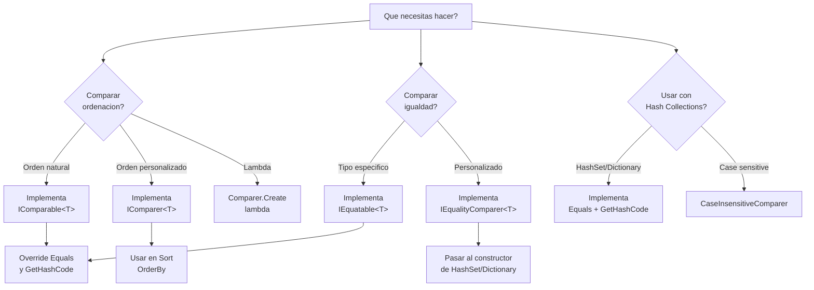

- [4. Comparación y Ordenación](#4-comparación-y-ordenación)
  - [Diagrama de Decisión: ¿Qué Interfaz Usar?](#diagrama-de-decisión-qué-interfaz-usar)
  - [¿Cuándo Usar Cada Interfaz?](#cuándo-usar-cada-interfaz)
  - [4.1. Interfaz IComparable](#41-interfaz-icomparable)
    - [4.1.1. Fundamentos](#411-fundamentos)
    - [4.1.2. Implementación](#412-implementación)
    - [4.1.3. Uso con Arrays](#413-uso-con-arrays)
  - [4.2. Interfaz IComparer](#42-interfaz-icomparer)
    - [4.2.1. Fundamentos](#421-fundamentos)
    - [4.2.2. Implementación](#422-implementación)
    - [4.2.3. Comparadores con Lambdas](#423-comparadores-con-lambdas)
    - [4.2.4. Múltiples Criterios](#424-múltiples-criterios)
  - [4.3. Interfaz IEquatable](#43-interfaz-iequatable)
    - [4.3.1. Fundamentos y Uso](#431-fundamentos-y-uso)
    - [4.3.2. Implementación](#432-implementación)
  - [4.4. Interfaz IEqualityComparer](#44-interfaz-iequalitycomparer)
  - [4.5. Ordenación de Arrays](#45-ordenación-de-arrays)
    - [4.5.1. Métodos de Ordenación](#451-métodos-de-ordenación)
    - [4.5.2. Búsqueda Binaria](#452-búsqueda-binaria)
  - [4.6. Integración con LINQ y Colecciones](#46-integración-con-linq-y-colecciones)
  - [4.7. Errores Comunes](#47-errores-comunes)

# 4. Comparación y Ordenación

La comparación y ordenación son operaciones fundamentales en programación. C# proporciona varias interfaces y mecanismos para definir cómo se comparan y ordenan los objetos.

## Diagrama de Decisión: ¿Qué Interfaz Usar?



## ¿Cuándo Usar Cada Interfaz?

| **Escenario**                                    | **Interfaz/Método**                | **Método**          |
| ------------------------------------------------ | ---------------------------------- | ------------------- |
| Definir orden natural de un tipo                 | `IComparable<T>`                   | `CompareTo(T)`      |
| Múltiples formas de ordenar                      | `IComparer<T>`                     | `Compare(T x, T y)` |
| Comparación eficiente en colecciones específicas | `IEquatable<T>`                    | `Equals(T)`         |
| Comparador personalizado para HashSet/Dictionary | `IEqualityComparer<T>`             | `Equals(T x, T y)`  |
| Comparador rápido sin crear clase                | `Comparer.Create(lambda)`          | Lambda expression   |
| Comparación sin distinguir mayúsculas/minúsculas | `StringComparer.OrdinalIgnoreCase` | `StringComparer`    |

## 4.1. Interfaz IComparable<T>

### 4.1.1. Fundamentos

La interfaz `IComparable<T>` define el **orden natural** de un tipo.

```csharp
public interface IComparable<T>
{
    int CompareTo(T other);
}
```

**Método `CompareTo(T other)`:**
- **Número negativo**: si `this` es menor que `other`
- **Cero (0)**: si `this` es igual a `other`
- **Número positivo**: si `this` es mayor que `other`

### 4.1.2. Implementación

```csharp
public class Persona : IComparable<Persona>
{
    public string Nombre { get; set; }
    public string Apellido { get; set; }
    public int Edad { get; set; }

    public int CompareTo(Persona other)
    {
        if (other == null) return 1;
        int comparacion = this.Apellido.CompareTo(other.Apellido);
        if (comparacion != 0) return comparacion;
        return this.Nombre.CompareTo(other.Nombre);
    }
}
```

**📝 Nota del Profesor:** Contrato de IComparable

Al implementar `IComparable<T>`, debes cumplir:
1. **Reflexividad**: `x.CompareTo(x)` debe ser `0`
2. **Antisimetría**: Si `x < y`, entonces `y > x`
3. **Transitividad**: Si `x < y` y `y < z`, entonces `x < z`

### 4.1.3. Uso con Arrays

```csharp
Persona[] personas = new Persona[]
{
    new Persona { Nombre = "Juan", Apellido = "García" },
    new Persona { Nombre = "Ana", Apellido = "López" }
};

Array.Sort(personas); // Usa CompareTo
```

## 4.2. Interfaz IComparer<T>

### 4.2.1. Fundamentos

`IComparer<T>` permite definir **órdenes alternativos** o personalizados.

```csharp
public interface IComparer<T>
{
    int Compare(T x, T y);
}
```

**🧠 Analogía:** El Ordeñador de Libros

`IComparable<T>` es como tener un criterio de orden natural (ej: alfabético).
`IComparer<T>` es como tener múltiples formas de ordenar el mismo libro: por autor, por título, por año, por color de portada...

### 4.2.2. Implementación

```csharp
// Comparador por edad
public class ComparadorPorEdad : IComparer<Persona>
{
    public int Compare(Persona x, Persona y)
    {
        return x.Edad.CompareTo(y.Edad);
    }
}

// Comparador por nombre
public class ComparadorPorNombre : IComparer<Persona>
{
    public int Compare(Persona x, Persona y)
    {
        return x.Nombre.CompareTo(y.Nombre);
    }
}

// Uso
Array.Sort(personas, new ComparadorPorEdad());
```

### 4.2.3. Comparadores con Lambdas

C# proporciona una forma concisa:

```csharp
var comparador = Comparer<Persona>.Create((p1, p2) => 
    p1.Edad.CompareTo(p2.Edad));

Array.Sort(personas, comparador);
```

### 4.2.4. Múltiples Criterios

```csharp
var comparador = Comparer<Persona>.Create((p1, p2) =>
{
    int cmp = p1.Apellido.CompareTo(p2.Apellido);
    if (cmp != 0) return cmp;
    return p1.Nombre.CompareTo(p2.Nombre);
});
```

## 4.3. Interfaz IEquatable<T>

### 4.3.1. Fundamentos y Uso

`IEquatable<T>` define el método `Equals(T other)` para comparación eficiente de tipos específicos.

```csharp
public interface IEquatable<T>
{
    bool Equals(T other);
}
```

### 4.3.2. Implementación

```csharp
public class Punto : IEquatable<Punto>
{
    public int X { get; set; }
    public int Y { get; set; }

    public bool Equals(Punto other)
    {
        if (other == null) return false;
        return X == other.X && Y == other.Y;
    }

    public override bool Equals(object obj)
    {
        return Equals(obj as Punto);
    }

    public override int GetHashCode()
    {
        return HashCode.Combine(X, Y);
    }
}
```

**⚠️ Advertencia:** GetHashCode

Si implementas `Equals`, **debes** implementar `GetHashCode` de forma consistente. De lo contrario, las colecciones basadas en hash (`HashSet`, `Dictionary`) no funcionarán correctamente.

## 4.4. Interfaz IEqualityComparer<T>

Permite definir igualdad personalizada para colecciones que lo requieran:

```csharp
public class CaseInsensitiveComparer : IEqualityComparer<string>
{
    public bool Equals(string x, string y) => 
        string.Equals(x, y, StringComparison.OrdinalIgnoreCase);
    
    public int GetHashCode(string obj) => 
        obj.ToLowerInvariant().GetHashCode();
}
```

## 4.5. Ordenación de Arrays

### 4.5.1. Métodos de Ordenación

```csharp
int[] numeros = { 5, 2, 8, 1, 9 };

Array.Sort(numeros); // Orden ascendente
Array.Reverse(numeros); // Invertir

// Con comparador personalizado
Array.Sort(personas, new ComparadorPorEdad());
```

### 4.5.2. Búsqueda Binaria

**Requiere array ordenado:**

```csharp
int[] numeros = { 1, 2, 3, 4, 5, 6, 7, 8, 9, 10 };
Array.Sort(numeros);

int indice = Array.BinarySearch(numeros, 7); // Encuentra índice de 7
```

**📝 Nota del Profesor:** BinarySearch

`BinarySearch` solo funciona correctamente si el array está **ordenado** según el mismo criterio que usas para buscar. Si no lo está, el resultado es impredecible.

## 4.6. Integración con LINQ y Colecciones

```csharp
// LINQ OrderBy usa IComparable o IComparer
var ordenados = personas.OrderBy(p => p.Edad);

// ThenBy para múltiples criterios
var ordenados = personas
    .OrderBy(p => p.Apellido)
    .ThenBy(p => p.Nombre);

// Distinct usa Equals y GetHashCode
var unicos = personas.Distinct();
```

## 4.7. Errores Comunes

**1. Olvidar GetHashCode:**

```csharp
// ✗ MAL
public override int GetHashCode() => 42; // ¡Viola контракт!

// ✓ BIEN
public override int GetHashCode() => HashCode.Combine(X, Y);
```

**2. CompareTo inconsistente:**

```csharp
// ✗ MAL: SIEMPRE retorna 1
public int CompareTo(Persona other) => 1;

// ✓ BIEN
public int CompareTo(Persona other)
{
    if (other == null) return 1;
    return this.Edad.CompareTo(other.Edad);
}
```

**3. BinarySearch en array no ordenado:**

```csharp
// ✗ MAL
int[] desordenado = { 5, 2, 8 };
Array.BinarySearch(desordenado, 5); // Resultado incorrecto

// ✓ BIEN
Array.Sort(desordenado);
Array.BinarySearch(desordenado, 5); // Correcto
```

**💡 Tip del Examinador:** Regla Nemotécnica

**"C-E-G" para Comparación:**
- **C**omparar con cero (negativo/positivo)
- **E**sperar consistencia con `Equals`
- **G**etHashCode debe ser coherente
