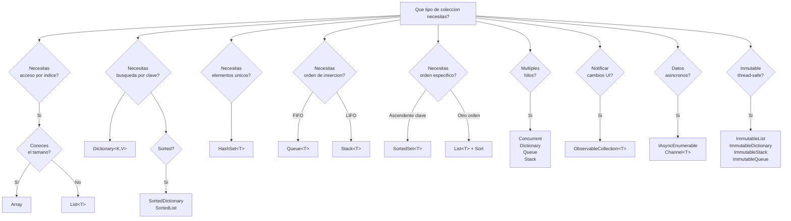

- [5. Colecciones en C#](#5-colecciones-en-c)
  - [5.1. Introducción a las Colecciones](#51-introducción-a-las-colecciones)
    - [5.1.1. ¿Qué son las colecciones?](#511-qué-son-las-colecciones)
    - [5.1.2. Namespaces Importantes](#512-namespaces-importantes)
    - [5.1.3. Jerarquía de Interfaces](#513-jerarquía-de-interfaces)
    - [5.1.4. Colecciones Genéricas vs. No Genéricas](#514-colecciones-genéricas-vs-no-genéricas)
  - [5.2. List](#52-list)
    - [5.2.1. Características](#521-características)
    - [5.2.2. Creación e Inicialización](#522-creación-e-inicialización)
    - [5.2.3. Operaciones Básicas](#523-operaciones-básicas)
    - [5.2.4. Búsqueda y Verificación](#524-búsqueda-y-verificación)
    - [5.2.5. Ordenación](#525-ordenación)
    - [5.2.6. Conversiones](#526-conversiones)
    - [5.2.7. Capacidad y Rendimiento](#527-capacidad-y-rendimiento)
  - [5.3. Dictionary\<TKey, TValue\>](#53-dictionarytkey-tvalue)
    - [5.3.1. Características](#531-características)
    - [5.3.2. Creación e Inicialización](#532-creación-e-inicialización)
    - [5.3.3. Operaciones Básicas](#533-operaciones-básicas)
    - [5.3.4. Recorrer Diccionarios](#534-recorrer-diccionarios)
    - [5.3.5. Propiedades Keys y Values](#535-propiedades-keys-y-values)
    - [5.3.6. Ejemplos Prácticos](#536-ejemplos-prácticos)
  - [5.4. HashSet](#54-hashset)
    - [5.4.1. Características](#541-características)
    - [5.4.2. Operaciones Básicas](#542-operaciones-básicas)
    - [5.4.3. Operaciones de Conjuntos](#543-operaciones-de-conjuntos)
  - [5.5. Queue y Stack](#55-queue-y-stack)
    - [5.5.1. Queue (FIFO)](#551-queue-fifo)
    - [5.5.2. Stack (LIFO)](#552-stack-lifo)
    - [5.5.3. PriorityQueue\<TElement, TPriority\> (C# 6+)](#553-priorityqueuetelement-tpriority-c-6)
  - [5.6. LinkedList](#56-linkedlist)
  - [5.7. SortedDictionary\<TKey, TValue\> y SortedList\<TKey, TValue\>](#57-sorteddictionarytkey-tvalue-y-sortedlisttkey-tvalue)
    - [SortedDictionary\<TKey, TValue\>](#sorteddictionarytkey-tvalue)
    - [SortedList\<TKey, TValue\>](#sortedlisttkey-tvalue)
    - [Comparación](#comparación)
  - [5.8. Colecciones Especializadas](#58-colecciones-especializadas)
    - [5.8.1. ReadOnlyCollection](#581-readonlycollection)
    - [5.8.2. ObservableCollection](#582-observablecollection)
  - [5.9. Colecciones Inmutables](#59-colecciones-inmutables)
  - [5.10. Colecciones Concurrentes](#510-colecciones-concurrentes)
    - [5.10.1. ConcurrentDictionary\<TKey, TValue\>](#5101-concurrentdictionarytkey-tvalue)
    - [5.10.2. ConcurrentQueue y ConcurrentStack](#5102-concurrentqueue-y-concurrentstack)
    - [5.10.3. ConcurrentBag](#5103-concurrentbag)
    - [5.10.4. BlockingCollection](#5104-blockingcollection)
  - [5.11. IAsyncEnumerable y Colecciones Asíncronas](#511-iasyncenumerable-y-colecciones-asíncronas)
  - [5.12. Yield Return e Iteradores](#512-yield-return-e-iteradores)
  - [5.13. LINQ to Collections](#513-linq-to-collections)
  - [5.14. Colecciones Personalizadas](#514-colecciones-personalizadas)
  - [5.15. Rendimiento y Optimización](#515-rendimiento-y-optimización)
    - [Elegir la Colección Correcta](#elegir-la-colección-correcta)
    - [Optimización de Memoria](#optimización-de-memoria)
    - [Parallel Processing con Colecciones](#parallel-processing-con-colecciones)
  - [5.16. Guía de Selección](#516-guía-de-selección)
    - [5.16.1. Árbol de Decisión](#5161-árbol-de-decisión)
    - [5.16.2. Tabla de Decisión Completa](#5162-tabla-de-decisión-completa)
    - [5.16.3. Comparación de Complejidad (Big O)](#5163-comparación-de-complejidad-big-o)
    - [5.16.4. Casos de Uso Prácticos por Escenario](#5164-casos-de-uso-prácticos-por-escenario)
  - [5.17. Resumen de Todas las Colecciones](#517-resumen-de-todas-las-colecciones)
    - [5.17.1. Tabla Resumen Maestra](#5171-tabla-resumen-maestra)
    - [5.17.2. Resumen por Namespace](#5172-resumen-por-namespace)
    - [5.17.3. Recomendaciones Finales](#5173-recomendaciones-finales)
    - [5.17.4. Checklist de Selección Rápida](#5174-checklist-de-selección-rápida)

# 5. Colecciones en C#

Las **colecciones** son estructuras de datos que permiten almacenar, organizar y manipular grupos de objetos relacionados. A diferencia de los arrays, las colecciones ofrecen mayor flexibilidad y funcionalidad.

## 5.1. Introducción a las Colecciones

### 5.1.1. ¿Qué son las colecciones?

| Aspecto           | Arrays    | Colecciones                         |
| ----------------- | --------- | ----------------------------------- |
| **Tamaño**        | Fijo      | Dinámico (en la mayoría)            |
| **Tipo**          | Homogéneo | Homogéneo (genéricas) o heterogéneo |
| **Funcionalidad** | Básica    | Rica (búsqueda, ordenación, etc.)   |
| **Sintaxis**      | `[]`      | Métodos y propiedades               |
| **Rendimiento**   | Excelente | Muy bueno (depende del tipo)        |

```csharp
// Array: tamaño fijo
int[] arrayNumeros = new int[5];
arrayNumeros[0] = 10;
// arrayNumeros[5] = 20; // Error: fuera de rango

// Colección: tamaño dinámico
List<int> listaNumeros = new List<int>();
listaNumeros.Add(10);
listaNumeros.Add(20);
listaNumeros.Add(30);
// Puedes seguir agregando elementos sin límite
```

**📝 Nota del Profesor:** ¿Cuándo Usar Arrays?

Los arrays siguen siendo útiles cuando:
- Conoces el tamaño exacto de antemano
- Necesites el máximo rendimiento
- Trabajes con matrices multidimensionales

### 5.1.2. Namespaces Importantes

**`System.Collections.Generic`**

Contiene las colecciones genéricas (las más usadas y recomendadas):

```csharp
using System.Collections.Generic;

List<int> lista = new List<int>();
Dictionary<string, int> diccionario = new Dictionary<string, int>();
HashSet<string> conjunto = new HashSet<string>();
Queue<int> cola = new Queue<int>();
Stack<int> pila = new Stack<int>();
```

**`System.Collections`**

Contiene las colecciones **no genéricas** (legacy, evitar en código nuevo):

```csharp
using System.Collections;

ArrayList arrayList = new ArrayList();
Hashtable hashtable = new Hashtable();
Queue queue = new Queue();
Stack stack = new Stack();
```

**`System.Collections.Specialized`**

Contiene colecciones especializadas para casos de uso específicos:

```csharp
using System.Collections.Specialized;

NameValueCollection config = new NameValueCollection();
StringCollection strings = new StringCollection();
OrderedDictionary ordenado = new OrderedDictionary();
```

### 5.1.3. Jerarquía de Interfaces

```mermaid
graph TD
    IEnumerableT["IEnumerable&lt;T&gt;"] --> ICollectionT["ICollection&lt;T&gt;"]
    ICollectionT --> IListT["IList&lt;T&gt;"]
    ICollectionT --> IDictionaryT["IDictionary&lt;TKey, TValue&gt;"]
    ICollectionT --> ISetT["ISet&lt;T&gt;"]
    
    IListT --> ListT["List&lt;T&gt;"]
    IDictionaryT --> DictionaryT["Dictionary&lt;K,V&gt;"]
    ISetT --> HashSetT["HashSet&lt;T&gt;"]
    ISetT --> SortedSetT["SortedSet&lt;T&gt;"]
    
    ICollectionT --> QueueT["Queue&lt;T&gt;"]
    ICollectionT --> StackT["Stack&lt;T&gt;"]
    QueueT --> PriorityQueueT["PriorityQueue&lt;T,TPriority&gt;"]
    
    IListT --> LinkedListT["LinkedList&lt;T&gt;"]
    IDictionaryT --> SortedDictionaryT["SortedDictionary&lt;K,V&gt;"]
    IDictionaryT --> SortedListT["SortedList&lt;K,V&gt;"]
    
    IEnumerableT --> IReadOnlyListT["IReadOnlyList&lt;T&gt;"]
    IEnumerableT --> IReadOnlyDictionaryT["IReadOnlyDictionary&lt;K,V&gt;"]
    IEnumerableT --> IReadOnlyCollectionT["IReadOnlyCollection&lt;T&gt;"]
    
    IEnumerableT -.-> IAsyncEnumT["IAsyncEnumerable&lt;T&gt;"]
    IListT -.-> ObservableT["ObservableCollection&lt;T&gt;"]
    ICollectionT -.-> BlockingColT["BlockingCollection&lt;T&gt;"]
    
    ListT -.-> ReadOnlyListT["ReadOnlyCollection&lt;T&gt;"]
    DictionaryT -.-> ConcurrentDictT["ConcurrentDictionary&lt;K,V&gt;"]
    QueueT -.-> ConcurrentQueueT["ConcurrentQueue&lt;T&gt;"]
    StackT -.-> ConcurrentStackT["ConcurrentStack&lt;T&gt;"]
    ICollectionT -.-> ConcurrentBagT["ConcurrentBag&lt;T&gt;"]
    
    IEnumerableT -.-> ImmutableListT["ImmutableList&lt;T&gt;"]
    IDictionaryT -.-> ImmutableDictT["ImmutableDictionary&lt;K,V&gt;"]
    ISetT -.-> ImmutableSetT["ImmutableHashSet&lt;T&gt;"]
    ICollectionT -.-> ImmutableQueueT["ImmutableQueue&lt;T&gt;"]
    ICollectionT -.-> ImmutableStackT["ImmutableStack&lt;T&gt;"]
```



**Colecciones principales por categoría:**

| Categoría        | Colecciones                                                                                 |
| ---------------- | ------------------------------------------------------------------------------------------- |
| **Listas**       | `List<T>`, `LinkedList<T>`                                                                  |
| **Diccionarios** | `Dictionary<K,V>`, `SortedDictionary<K,V>`, `SortedList<K,V>`                               |
| **Conjuntos**    | `HashSet<T>`, `SortedSet<T>`                                                                |
| **Colas/Pilas**  | `Queue<T>`, `Stack<T>`, `PriorityQueue<T,TPriority>`                                        |
| **Solo lectura** | `ReadOnlyCollection<T>`, `IReadOnlyList<T>`, `IReadOnlyDictionary<K,V>`                     |
| **Observable**   | `ObservableCollection<T>`                                                                   |
| **Asíncronas**   | `IAsyncEnumerable<T>`, `Channel<T>`                                                         |
| **Inmutables**   | `ImmutableList<T>`, `ImmutableDictionary<K,V>`, `ImmutableHashSet<T>`                       |
| **Concurrentes** | `ConcurrentDictionary<K,V>`, `ConcurrentQueue<T>`, `ConcurrentStack<T>`, `ConcurrentBag<T>` |

**Interfaces principales:**

```csharp
// IEnumerable<T> - Iteración básica
public interface IEnumerable<T>
{
    IEnumerator<T> GetEnumerator();
}

// ICollection<T> - Operaciones básicas de colección
public interface ICollection<T> : IEnumerable<T>
{
    int Count { get; }
    bool IsReadOnly { get; }
    void Add(T item);
    void Clear();
    bool Contains(T item);
    void CopyTo(T[] array, int arrayIndex);
    bool Remove(T item);
}

// IList<T> - Lista con acceso por índice
public interface IList<T> : ICollection<T>
{
    T this[int index] { get; set; }
    int IndexOf(T item);
    void Insert(int index, T item);
    void RemoveAt(int index);
}

// IDictionary<TKey, TValue> - Diccionario clave-valor
public interface IDictionary<TKey, TValue> : ICollection<KeyValuePair<TKey, TValue>>
{
    TValue this[TKey key] { get; set; }
    ICollection<TKey> Keys { get; }
    ICollection<TValue> Values { get; }
    void Add(TKey key, TValue value);
    bool ContainsKey(TKey key);
    bool Remove(TKey key);
    bool TryGetValue(TKey key, out TValue value);
}

// ISet<T> - Conjuntos
public interface ISet<T> : ICollection<T>
{
    bool Add(T item);
    void ExceptWith(IEnumerable<T> other);
    void IntersectWith(IEnumerable<T> other);
    void UnionWith(IEnumerable<T> other);
    bool IsProperSubsetOf(IEnumerable<T> other);
    bool IsProperSupersetOf(IEnumerable<T> other);
}
```

```csharp
// IEnumerable<T> - Iteración básica
public interface IEnumerable<T>
{
    IEnumerator<T> GetEnumerator();
}

// ICollection<T> - Operaciones básicas de colección
public interface ICollection<T> : IEnumerable<T>
{
    int Count { get; }
    bool IsReadOnly { get; }
    void Add(T item);
    void Clear();
    bool Contains(T item);
    void CopyTo(T[] array, int arrayIndex);
    bool Remove(T item);
}

// IList<T> - Lista con acceso por índice
public interface IList<T> : ICollection<T>
{
    T this[int index] { get; set; }
    int IndexOf(T item);
    void Insert(int index, T item);
    void RemoveAt(int index);
}

// IDictionary<TKey, TValue> - Diccionario clave-valor
public interface IDictionary<TKey, TValue> : ICollection<KeyValuePair<TKey, TValue>>
{
    TValue this[TKey key] { get; set; }
    ICollection<TKey> Keys { get; }
    ICollection<TValue> Values { get; }
    void Add(TKey key, TValue value);
    bool ContainsKey(TKey key);
    bool Remove(TKey key);
    bool TryGetValue(TKey key, out TValue value);
}

// ISet<T> - Conjuntos
public interface ISet<T> : ICollection<T>
{
    bool Add(T item);
    void ExceptWith(IEnumerable<T> other);
    void IntersectWith(IEnumerable<T> other);
    void UnionWith(IEnumerable<T> other);
    bool IsProperSubsetOf(IEnumerable<T> other);
    bool IsProperSupersetOf(IEnumerable<T> other);
}
```

**🧠 Analogía:** La Biblioteca de Colecciones

Imagina una biblioteca:
- **`IEnumerable<T>`** es como poder caminar por los pasillos (recorrer)
- **`ICollection<T>`** es como poder añadir o quitar libros
- **`IList<T>`** es como los libros en una estantería con posiciones (índice)
- **`IDictionary<TKey, TValue>`** es como el catálogo (buscas por código, obtienes libro)
- **`ISet<T>`** es como una colección de libros únicos (no hay duplicados)

### 5.1.4. Colecciones Genéricas vs. No Genéricas

**Ventajas de las colecciones genéricas:**

```csharp
// === COLECCIÓN NO GENÉRICA (antigua, evitar) ===
ArrayList listaSinGenericos = new ArrayList();
listaSinGenericos.Add(1);           // Boxing: int → object
listaSinGenericos.Add("texto");     // Permite tipos mixtos (peligroso)
listaSinGenericos.Add(3.14);

int numero = (int)listaSinGenericos[0];  // Unboxing + cast necesario
// string texto = (string)listaSinGenericos[0]; // ¡Error en tiempo de ejecución!

// === COLECCIÓN GENÉRICA (moderna, recomendada) ===
List<int> listaConGenericos = new List<int>();
listaConGenericos.Add(1);          // Sin boxing
listaConGenericos.Add(2);
// listaConGenericos.Add("texto");  // Error en tiempo de compilación (type-safe)

int numero2 = listaConGenericos[0]; // Sin unboxing ni cast

// Ventajas:
// 1. Type-safety (errores en compilación, no en ejecución)
// 2. Sin boxing/unboxing (mejor rendimiento)
// 3. Código más limpio (sin casts)
```

**Comparación de rendimiento:**

```csharp
using System.Diagnostics;
using System.Collections;
using System.Collections.Generic;

const int CANTIDAD = 1000000;

// ArrayList (no genérico)
var sw1 = Stopwatch.StartNew();
ArrayList arrayList = new ArrayList();
for (int i = 0; i < CANTIDAD; i++)
{
    arrayList.Add(i); // Boxing
}
int suma1 = 0;
for (int i = 0; i < CANTIDAD; i++)
{
    suma1 += (int)arrayList[i]; // Unboxing + cast
}
sw1.Stop();

// List<T> (genérico)
var sw2 = Stopwatch.StartNew();
List<int> lista = new List<int>();
for (int i = 0; i < CANTIDAD; i++)
{
    lista.Add(i); // Sin boxing
}
int suma2 = 0;
for (int i = 0; i < CANTIDAD; i++)
{
    suma2 += lista[i]; // Sin unboxing ni cast
}
sw2.Stop();

Console.WriteLine($"ArrayList: {sw1.ElapsedMilliseconds}ms");
Console.WriteLine($"List<T>: {sw2.ElapsedMilliseconds}ms");
Console.WriteLine($"Mejora: {sw1.ElapsedMilliseconds / (double)sw2.ElapsedMilliseconds:F2}x");
```

**Regla general:**

✓ **USAR**: Colecciones genéricas (`List<T>`, `Dictionary<K,V>`, etc.)
✗ **EVITAR**: Colecciones no genéricas (`ArrayList`, `Hashtable`, etc.)

**⚠️ Advertencia:** El Contrato de Equals en Colecciones Hash

Al almacenar información en colecciones como `HashSet<T>` o `Dictionary<K, V>`, la colección necesita una forma de identificar si un objeto es único. Si trabajamos con tipos personalizados, debemos asegurar que el método `GetHashCode()` genere una "huella digital" coherente y que `Equals()` compare correctamente los valores. Sin esto, la colección no podrá recuperar o filtrar la información de forma fiable, tratando objetos con los mismos datos como si fueran diferentes.

```csharp
// Ejemplo de clase que funciona correctamente con HashSet
public class PersonaConEquals
{
    public string Nombre { get; set; }
    public int Edad { get; set; }

    public override bool Equals(object obj)
    {
        if (obj is PersonaConEquals otra)
        {
            return Nombre == otra.Nombre && Edad == otra.Edad;
        }
        return false;
    }

    public override int GetHashCode()
    {
        return HashCode.Combine(Nombre, Edad);
    }
}

// Uso con HashSet
HashSet<PersonaConEquals> personas = new HashSet<PersonaConEquals>();
personas.Add(new PersonaConEquals { Nombre = "Ana", Edad = 25 });
personas.Add(new PersonaConEquals { Nombre = "Ana", Edad = 25 }); // Se ignora (duplicado)

Console.WriteLine(personas.Count); // 1
```

## 5.2. List<T>

**List<T>** es la colección más usada en C#. Es una lista de tamaño dinámico con acceso por índice.

### 5.2.1. Características

- ✓ Tamaño dinámico (crece automáticamente)
- ✓ Acceso por índice O(1)
- ✓ Inserción/eliminación al final O(1) amortizado
- ✓ Inserción/eliminación en medio O(n)
- ✓ Búsqueda lineal O(n)
- ✓ Mantiene el orden de inserción

### 5.2.2. Creación e Inicialización

```csharp
// 1. Constructor por defecto (lista vacía)
List<int> lista1 = new List<int>();

// 2. Con capacidad inicial
List<int> lista2 = new List<int>(100); // Capacidad para 100 elementos

// 3. Desde otra colección
int[] array = { 1, 2, 3, 4, 5 };
List<int> lista3 = new List<int>(array);

// 4. Inicialización con colección
List<string> lista4 = new List<string> { "uno", "dos", "tres" };

// 5. Sintaxis simplificada (C# 9+)
List<int> lista5 = new() { 1, 2, 3, 4, 5 };

// 6. Crear desde otra lista
List<int> lista6 = new List<int>(lista1);
```

### 5.2.3. Operaciones Básicas

**Agregar elementos:**

```csharp
List<string> frutas = new List<string>();

// Add: agregar al final
frutas.Add("Manzana");
frutas.Add("Banana");
frutas.Add("Cereza");

// AddRange: agregar múltiples elementos
string[] masFrutas = { "Durazno", "Fresa", "Kiwi" };
frutas.AddRange(masFrutas);

// Insert: insertar en posición específica
frutas.Insert(0, "Arándano"); // Al inicio
frutas.Insert(3, "Coco");     // En posición 3

// InsertRange: insertar múltiples en posición
List<string> citricos = new List<string> { "Naranja", "Limón" };
frutas.InsertRange(2, citricos);
```

**Acceder a elementos:**

```csharp
List<int> numeros = new List<int> { 10, 20, 30, 40, 50 };

// Acceso por índice
int primero = numeros[0];
int ultimo = numeros[numeros.Count - 1];

// Modificar por índice
numeros[2] = 35;

// Recorrer con for
for (int i = 0; i < numeros.Count; i++)
{
    Console.WriteLine($"[{i}] = {numeros[i]}");
}

// Recorrer con foreach
foreach (int numero in numeros)
{
    Console.WriteLine(numero);
}
```

**Eliminar elementos:**

```csharp
List<string> colores = new List<string>
{
    "Rojo", "Verde", "Azul", "Amarillo", "Verde", "Naranja"
};

// Remove: elimina la primera ocurrencia
bool eliminado = colores.Remove("Verde");

// RemoveAt: elimina en índice específico
colores.RemoveAt(0);

// RemoveAll: elimina todos los que cumplan condición
int eliminados = colores.RemoveAll(c => c.Length > 5);

// RemoveRange: elimina rango
colores.Add("Blanco");
colores.Add("Negro");
colores.Add("Gris");
colores.RemoveRange(1, 2); // Elimina 2 elementos desde índice 1

// Clear: elimina todos
colores.Clear();
```

### 5.2.4. Búsqueda y Verificación

```csharp
List<int> numeros = new List<int> { 10, 20, 30, 40, 50, 30, 60 };

// Contains: verifica si existe
bool contiene30 = numeros.Contains(30);
bool contiene100 = numeros.Contains(100);

// IndexOf: índice de primera ocurrencia
int indice1 = numeros.IndexOf(30);

// LastIndexOf: índice de última ocurrencia
int indice2 = numeros.LastIndexOf(30);

// IndexOf con inicio
int indice3 = numeros.IndexOf(30, 3); // Buscar desde índice 3

// Find: encuentra primer elemento que cumple condición
int primerMayorQue25 = numeros.Find(n => n > 25);

// FindLast: encuentra último elemento que cumple condición
int ultimoMayorQue25 = numeros.FindLast(n => n > 25);

// FindAll: encuentra todos los que cumplen condición
List<int> mayoresQue25 = numeros.FindAll(n => n > 25);

// FindIndex: índice del primer elemento que cumple
int indicePrimerPar = numeros.FindIndex(n => n % 2 == 0);

// Exists: verifica si existe alguno que cumple
bool hayMayoresQue100 = numeros.Exists(n => n > 100);

// TrueForAll: verifica si todos cumplen
bool todosPositivos = numeros.TrueForAll(n => n > 0);
```

**Ejemplo con objetos personalizados:**

```csharp
public class Producto
{
    public int Id { get; set; }
    public string Nombre { get; set; }
    public decimal Precio { get; set; }
    public string Categoria { get; set; }
    
    public override string ToString()
    {
        return $"{Nombre} (${Precio}) - {Categoria}";
    }
}

List<Producto> productos = new List<Producto>
{
    new Producto { Id = 1, Nombre = "Laptop", Precio = 1200, Categoria = "Electrónica" },
    new Producto { Id = 2, Nombre = "Mouse", Precio = 25, Categoria = "Electrónica" },
    new Producto { Id = 3, Nombre = "Libro C#", Precio = 45, Categoria = "Libros" },
    new Producto { Id = 4, Nombre = "Teclado", Precio = 75, Categoria = "Electrónica" },
    new Producto { Id = 5, Nombre = "Monitor", Precio = 300, Categoria = "Electrónica" }
};

// Buscar producto por Id
Producto producto = productos.Find(p => p.Id == 3);

// Buscar productos de una categoría
List<Producto> electronica = productos.FindAll(p => p.Categoria == "Electrónica");

// Verificar si hay productos caros
bool hayCaros = productos.Exists(p => p.Precio > 500);
```

### 5.2.5. Ordenación

```csharp
List<int> numeros = new List<int> { 5, 2, 8, 1, 9, 3, 7 };

Console.WriteLine($"Original: [{string.Join(", ", numeros)}]");

// Sort: ordenar en el lugar (modifica la lista)
numeros.Sort();
Console.WriteLine($"Después de Sort(): [{string.Join(", ", numeros)}]");

// Reverse: invertir orden
numeros.Reverse();
Console.WriteLine($"Después de Reverse(): [{string.Join(", ", numeros)}]");

// Sort con Comparison<T>
numeros.Sort((a, b) => a.CompareTo(b)); // Ascendente
numeros.Sort((a, b) => b.CompareTo(a)); // Descendente
```

**Ordenación de objetos personalizados:**

```csharp
public class Estudiante
{
    public string Nombre { get; set; }
    public double Promedio { get; set; }
    public int Edad { get; set; }
    
    public override string ToString()
    {
        return $"{Nombre} - Promedio: {Promedio:F2} - {Edad} años";
    }
}

List<Estudiante> estudiantes = new List<Estudiante>
{
    new Estudiante { Nombre = "Ana", Promedio = 8.5, Edad = 20 },
    new Estudiante { Nombre = "Juan", Promedio = 9.2, Edad = 19 },
    new Estudiante { Nombre = "María", Promedio = 7.8, Edad = 21 },
    new Estudiante { Nombre = "Pedro", Promedio = 9.5, Edad = 20 }
};

// Ordenar por nombre
estudiantes.Sort((e1, e2) => e1.Nombre.CompareTo(e2.Nombre));

// Ordenar por promedio (descendente)
estudiantes.Sort((e1, e2) => e2.Promedio.CompareTo(e1.Promedio));

// Ordenar por edad, luego por promedio
estudiantes.Sort((e1, e2) =>
{
    int comparacionEdad = e1.Edad.CompareTo(e2.Edad);
    if (comparacionEdad != 0) return comparacionEdad;
    return e2.Promedio.CompareTo(e1.Promedio); // Descendente en promedio
});
```

### 5.2.6. Conversiones

```csharp
List<int> lista = new List<int> { 1, 2, 3, 4, 5 };

// Lista a Array
int[] array = lista.ToArray();
Console.WriteLine($"Array: [{string.Join(", ", array)}]");

// Array a Lista
int[] otroArray = { 10, 20, 30 };
List<int> otraLista = new List<int>(otroArray);

// También con ToList() (requiere using System.Linq)
// List<int> lista2 = otroArray.ToList();
```

**Copiar listas:**

```csharp
List<string> original = new List<string> { "A", "B", "C" };

// Copia superficial con constructor
List<string> copia1 = new List<string>(original);

// Copia con GetRange
List<string> copia2 = original.GetRange(0, original.Count);

// Copia con ToArray + constructor
List<string> copia3 = new List<string>(original.ToArray());

// Modificar original
original[0] = "Z";

Console.WriteLine($"Original: [{string.Join(", ", original)}]");
Console.WriteLine($"Copia 1: [{string.Join(", ", copia1)}]");
Console.WriteLine($"Copia 2: [{string.Join(", ", copia2)}]");
Console.WriteLine($"Copia 3: [{string.Join(", ", copia3)}]");
```

**Nota sobre copia profunda:**

```csharp
public class Persona
{
    public string Nombre { get; set; }
    public int Edad { get; set; }
    
    public override string ToString()
    {
        return $"{Nombre} ({Edad})";
    }
}

List<Persona> original = new List<Persona>
{
    new Persona { Nombre = "Ana", Edad = 25 },
    new Persona { Nombre = "Juan", Edad = 30 }
};

// Copia superficial: copia las referencias
List<Persona> copiaSuperficial = new List<Persona>(original);

// Modificar objeto en copia
copiaSuperficial[0].Edad = 99;

// ¡Ambas listas afectadas! (comparten las mismas instancias)

// Para copia profunda, necesitas clonar cada objeto
List<Persona> copiaProfunda = new List<Persona>();
foreach (var persona in original)
{
    copiaProfunda.Add(new Persona
    {
        Nombre = persona.Nombre,
        Edad = persona.Edad
    });
}

copiaProfunda[0].Edad = 50;
```

### 5.2.7. Capacidad y Rendimiento

**Capacity vs Count:**

```csharp
List<int> numeros = new List<int>();

Console.WriteLine("Agregando elementos:");
for (int i = 1; i <= 10; i++)
{
    numeros.Add(i);
    Console.WriteLine($"Count: {numeros.Count}, Capacity: {numeros.Capacity}");
}

// Capacity crece automáticamente (duplicándose)
// 0 → 4 → 8 → 16 → ...
```

**TrimExcess:**

```csharp
List<int> numeros = new List<int>(100); // Capacidad 100

// Agregar solo 10 elementos
for (int i = 0; i < 10; i++)
{
    numeros.Add(i);
}

Console.WriteLine($"Antes de TrimExcess:");
Console.WriteLine($"Count: {numeros.Count}");
Console.WriteLine($"Capacity: {numeros.Capacity}");

// Reducir capacidad al tamaño real
numeros.TrimExcess();

Console.WriteLine($"Después de TrimExcess:");
Console.WriteLine($"Count: {numeros.Count}");
Console.WriteLine($"Capacity: {numeros.Capacity}");
```

**Optimización con capacidad inicial:**

```csharp
using System.Diagnostics;

const int CANTIDAD = 1000000;

// Sin capacidad inicial
var sw1 = Stopwatch.StartNew();
List<int> lista1 = new List<int>();
for (int i = 0; i < CANTIDAD; i++)
{
    lista1.Add(i);
}
sw1.Stop();

// Con capacidad inicial
var sw2 = Stopwatch.StartNew();
List<int> lista2 = new List<int>(CANTIDAD);
for (int i = 0; i < CANTIDAD; i++)
{
    lista2.Add(i);
}
sw2.Stop();

Console.WriteLine($"Sin capacidad inicial: {sw1.ElapsedMilliseconds}ms");
Console.WriteLine($"Con capacidad inicial: {sw2.ElapsedMilliseconds}ms");
Console.WriteLine($"Mejora: {sw1.ElapsedMilliseconds / (double)sw2.ElapsedMilliseconds:F2}x");
```

**💡 Tip del Examinador:** ¿Cuándo Especificar Capacity?

Especifica `Capacity` cuando:
- Conozcas el tamaño aproximado de antemano
- Vayas a agregar muchos elementos en un bucle
- Optimices para rendimiento máximo

## 5.3. Dictionary<TKey, TValue>

**Dictionary<TKey, TValue>** es una colección de pares clave-valor donde cada clave es única.

### 5.3.1. Características

- ✓ Búsqueda por clave O(1) promedio
- ✓ Inserción O(1) promedio
- ✓ Eliminación O(1) promedio
- ✓ Claves únicas (no permite duplicados)
- ✓ Valores pueden repetirse
- ✓ No mantiene orden de inserción (usar OrderedDictionary si necesitas orden)

### 5.3.2. Creación e Inicialización

```csharp
// 1. Constructor por defecto
Dictionary<string, int> dict1 = new Dictionary<string, int>();

// 2. Con capacidad inicial
Dictionary<string, int> dict2 = new Dictionary<string, int>(100);

// 3. Inicialización con colección
Dictionary<string, int> dict3 = new Dictionary<string, int>
{
    { "uno", 1 },
    { "dos", 2 },
    { "tres", 3 }
};

// 4. Sintaxis moderna (C# 6+)
Dictionary<string, int> dict4 = new Dictionary<string, int>
{
    ["uno"] = 1,
    ["dos"] = 2,
    ["tres"] = 3
};

// 5. Sintaxis simplificada (C# 9+)
Dictionary<string, int> dict5 = new()
{
    { "uno", 1 },
    { "dos", 2 }
};

// 6. Desde otra colección (ej: array de KeyValuePair)
KeyValuePair<string, int>[] pares =
{
    new KeyValuePair<string, int>("a", 1),
    new KeyValuePair<string, int>("b", 2)
};
Dictionary<string, int> dict6 = new Dictionary<string, int>(pares);
```

### 5.3.3. Operaciones Básicas

**Agregar elementos:**

```csharp
Dictionary<string, double> precios = new Dictionary<string, double>();

// Add: agregar clave-valor
precios.Add("Laptop", 1200.00);
precios.Add("Mouse", 25.50);
precios.Add("Teclado", 75.00);

// Indexador: agregar o modificar
precios["Monitor"] = 300.00; // Agregar (clave no existe)
precios["Mouse"] = 29.99;     // Modificar (clave existe)

// TryAdd (C# 7+): agregar solo si no existe
bool agregado1 = precios.TryAdd("Webcam", 80.00);
bool agregado2 = precios.TryAdd("Mouse", 20.00); // No agrega (ya existe)
```

**Acceder a elementos:**

```csharp
Dictionary<string, string> capitales = new Dictionary<string, string>
{
    { "España", "Madrid" },
    { "Francia", "París" },
    { "Italia", "Roma" },
    { "Alemania", "Berlín" }
};

// Acceso por indexador
string capitalEspaña = capitales["España"];

// TryGetValue: forma segura (no lanza excepción)
if (capitales.TryGetValue("Francia", out string capitalFrancia))
{
    Console.WriteLine($"Capital de Francia: {capitalFrancia}");
}

if (capitales.TryGetValue("Portugal", out string capitalPortugal))
{
    Console.WriteLine($"Capital de Portugal: {capitalPortugal}");
}
else
{
    Console.WriteLine("Portugal no está en el diccionario");
}

// ContainsKey: verificar si existe clave
bool tieneItalia = capitales.ContainsKey("Italia");

// ContainsValue: verificar si existe valor
bool tieneRoma = capitales.ContainsValue("Roma");
```

**Eliminar elementos:**

```csharp
Dictionary<int, string> productos = new Dictionary<int, string>
{
    { 1, "Laptop" },
    { 2, "Mouse" },
    { 3, "Teclado" },
    { 4, "Monitor" },
    { 5, "Webcam" }
};

// Remove: eliminar por clave
bool eliminado = productos.Remove(2);

// Remove con out: eliminar y obtener valor
if (productos.Remove(4, out string valorEliminado))
{
    Console.WriteLine($"Eliminado: clave 4, valor '{valorEliminado}'");
}

// Clear: eliminar todos
productos.Clear();
```

### 5.3.4. Recorrer Diccionarios

```csharp
Dictionary<string, int> edades = new Dictionary<string, int>
{
    { "Ana", 25 },
    { "Juan", 30 },
    { "María", 28 },
    { "Pedro", 35 }
};

// 1. Recorrer pares clave-valor
foreach (KeyValuePair<string, int> par in edades)
{
    Console.WriteLine($"{par.Key}: {par.Value}");
}

// 2. Usando var (más corto)
foreach (var par in edades)
{
    Console.WriteLine($"{par.Key}: {par.Value}");
}

// 3. Deconstrucción (C# 7+)
foreach (var (nombre, edad) in edades)
{
    Console.WriteLine($"{nombre}: {edad} años");
}

// 4. Recorrer solo claves
foreach (string nombre in edades.Keys)
{
    Console.WriteLine($"  {nombre}");
}

// 5. Recorrer solo valores
foreach (int edad in edades.Values)
{
    Console.WriteLine($"  {edad} años");
}

// 6. Acceder a clave y valor por separado
foreach (string nombre in edades.Keys)
{
    int edad = edades[nombre];
    Console.WriteLine($"{nombre} tiene {edad} años");
}
```

### 5.3.5. Propiedades Keys y Values

```csharp
Dictionary<string, double> calificaciones = new Dictionary<string, double>
{
    { "Matemáticas", 8.5 },
    { "Física", 7.8 },
    { "Química", 9.2 },
    { "Historia", 8.0 }
};

// Keys: colección de claves
Dictionary<string, double>.KeyCollection claves = calificaciones.Keys;
Console.WriteLine($"Cantidad de materias: {claves.Count}");

// Values: colección de valores
Dictionary<string, double>.ValueCollection valores = calificaciones.Values;

// Calcular promedio
double suma = 0;
foreach (double nota in calificaciones.Values)
{
    suma += nota;
}
double promedio = suma / calificaciones.Count;

// Convertir Keys a array
string[] materiasArray = new string[calificaciones.Keys.Count];
calificaciones.Keys.CopyTo(materiasArray, 0);

// Convertir Values a lista
List<double> notasLista = new List<double>(calificaciones.Values);
notasLista.Sort();
```

### 5.3.6. Ejemplos Prácticos

**Contador de palabras:**

```csharp
string texto = "el perro y el gato juegan en el parque el perro corre";

string[] palabras = texto.Split(' ');

Dictionary<string, int> frecuencia = new Dictionary<string, int>();

foreach (string palabra in palabras)
{
    if (frecuencia.ContainsKey(palabra))
    {
        frecuencia[palabra]++;
    }
    else
    {
        frecuencia[palabra] = 1;
    }
}

// Alternativa con TryGetValue (más eficiente)
Dictionary<string, int> frecuencia2 = new Dictionary<string, int>();
foreach (string palabra in palabras)
{
    if (frecuencia2.TryGetValue(palabra, out int contador))
    {
        frecuencia2[palabra] = contador + 1;
    }
    else
    {
        frecuencia2[palabra] = 1;
    }
}

Console.WriteLine("=== Frecuencia de palabras ===");
foreach (var par in frecuencia)
{
    Console.WriteLine($"'{par.Key}': {par.Value} veces");
}

// Palabra más frecuente
string palabraMasFrecuente = "";
int maxFrecuencia = 0;

foreach (var par in frecuencia)
{
    if (par.Value > maxFrecuencia)
    {
        maxFrecuencia = par.Value;
        palabraMasFrecuente = par.Key;
    }
}

Console.WriteLine($"\nPalabra más frecuente: '{palabraMasFrecuente}' ({maxFrecuencia} veces)");
```

**Caché de configuración:**

```csharp
class ConfiguracionApp
{
    private Dictionary<string, string> configuracion = new Dictionary<string, string>();
    
    public ConfiguracionApp()
    {
        configuracion["Idioma"] = "es";
        configuracion["Tema"] = "Claro";
        configuracion["TamañoFuente"] = "14";
        configuracion["MostrarNotificaciones"] = "true";
    }
    
    public string ObtenerValor(string clave, string valorPorDefecto = "")
    {
        if (configuracion.TryGetValue(clave, out string valor))
        {
            return valor;
        }
        return valorPorDefecto;
    }
    
    public void EstablecerValor(string clave, string valor)
    {
        configuracion[clave] = valor;
    }
    
    public bool ObtenerBooleano(string clave, bool valorPorDefecto = false)
    {
        string valor = ObtenerValor(clave);
        if (bool.TryParse(valor, out bool resultado))
        {
            return resultado;
        }
        return valorPorDefecto;
    }
    
    public int ObtenerEntero(string clave, int valorPorDefecto = 0)
    {
        string valor = ObtenerValor(clave);
        if (int.TryParse(valor, out int resultado))
        {
            return resultado;
        }
        return valorPorDefecto;
    }
    
    public void MostrarConfiguracion()
    {
        Console.WriteLine("=== Configuración Actual ===");
        foreach (var par in configuracion)
        {
            Console.WriteLine($"  {par.Key} = {par.Value}");
        }
    }
}
```

## 5.4. HashSet<T>

**HashSet<T>** es una colección de elementos únicos sin orden específico. Ofrece operaciones matemáticas de conjuntos de alta eficiencia.

### 5.4.1. Características

- ✓ No permite duplicados
- ✓ Búsqueda muy rápida O(1)
- ✓ No mantiene orden de inserción
- ✓ Útil para eliminar duplicados de una colección

### 5.4.2. Operaciones Básicas

```csharp
HashSet<int> numeros = new HashSet<int>();

// Add: agregar (ignora duplicados)
numeros.Add(1);
numeros.Add(2);
numeros.Add(1); // Se ignora

Console.WriteLine($"Elementos: {numeros.Count}"); // 2

// Contains: verificar existencia
bool tiene5 = numeros.Contains(5);

// Remove: eliminar
numeros.Remove(1);

// Clear: eliminar todos
numeros.Clear();
```

### 5.4.3. Operaciones de Conjuntos

```csharp
HashSet<int> pares = new HashSet<int> { 2, 4, 6, 8, 10 };
HashSet<int> mayores = new HashSet<int> { 5, 6, 7, 8, 9, 10 };

// UnionWith: unión (ambos conjuntos)
pares.UnionWith(mayores);
// Resultado: {2, 4, 5, 6, 7, 8, 9, 10}

// IntersectWith: intersección (comunes)
HashSet<int> pares2 = new HashSet<int> { 2, 4, 6, 8, 10 };
pares2.IntersectWith(mayores);
// Resultado: {6, 8, 10}

// ExceptWith: diferencia (primero sin segundo)
HashSet<int> pares3 = new HashSet<int> { 2, 4, 6, 8, 10 };
pares3.ExceptWith(mayores);
// Resultado: {2, 4}

// SymmetricExceptWith: diferencia simétrica (uno u otro, no ambos)
HashSet<int> pares4 = new HashSet<int> { 2, 4, 6, 8, 10 };
pares4.SymmetricExceptWith(mayores);
// Resultado: {2, 4, 5, 7, 9}

// IsSubsetOf: ¿es subconjunto de?
bool esSubconjunto = new HashSet<int> { 2, 4 }.IsSubsetOf(pares);

// IsSupersetOf: ¿es superconjunto de?
bool esSuperconjunto = pares.IsSupersetOf(new HashSet<int> { 2, 4 });

// Overlaps: ¿hay elementos en común?
bool hayComun = pares.Overlaps(mayores);

// SetEquals: ¿son iguales?
bool sonIguales = pares.SetEquals(new HashSet<int> { 2, 4, 6, 8, 10 });
```

**Ejemplo práctico: Eliminar duplicados:**

```csharp
List<int> listaConDuplicados = new List<int> { 1, 2, 2, 3, 3, 3, 4, 5, 5 };

// Convertir a HashSet (elimina duplicados)
HashSet<int> sinDuplicados = new HashSet<int>(listaConDuplicados);

// Volver a lista si es necesario
List<int> listaSinDuplicados = sinDuplicados.ToList();

Console.WriteLine($"Con duplicados: {listaConDuplicados.Count}");
Console.WriteLine($"Sin duplicados: {listaSinDuplicados.Count}");
```

**📝 Nota del Profesor:** HashSet vs List para Búsqueda

| Operación          | List<T> | HashSet<T>         |
| ------------------ | ------- | ------------------ |
| Búsqueda           | O(n)    | O(1)               |
| Inserción al final | O(1)*   | O(1)               |
| Memoria            | Menor   | Mayor (tabla hash) |

*Amortizado

Usa **HashSet<T>** cuando necesites buscar elementos frecuentemente.
Usa **List<T>** cuando necesites acceder por índice o iterar en orden.

## 5.5. Queue<T> y Stack<T>

### 5.5.1. Queue<T> (FIFO)

**Queue<T>** implementa el patrón First In, First Out (el primero en entrar es el primero en salir).

```csharp
Queue<string> cola = new Queue<string>();

// Enqueue: agregar al final
cola.Enqueue("Primer cliente");
cola.Enqueue("Segundo cliente");
cola.Enqueue("Tercer cliente");

// Peek: ver el primero sin eliminar
string primero = cola.Peek();

// Dequeue: extraer el primero
string cliente1 = cola.Dequeue(); // "Primer cliente"
string cliente2 = cola.Dequeue(); // "Segundo cliente"

// Recorrer
foreach (string cliente in cola)
{
    Console.WriteLine(cliente);
}

// Contador
Console.WriteLine($"Personas en cola: {cola.Count}");
```

**Ejemplo práctico: Cola de impresión:**

```csharp
Queue<string> colaImpresion = new Queue<string>();

colaImpresion.Enqueue("Documento1.pdf");
colaImpresion.Enqueue("Foto.png");
colaImpresion.Enqueue("Informe.docx");

Console.WriteLine("=== Cola de Impresión ===");
while (colaImpresion.Count > 0)
{
    string documento = colaImpresion.Dequeue();
    Console.WriteLine($"Imprimiendo: {documento}");
}
```

### 5.5.2. Stack<T> (LIFO)

**Stack<T>** implementa el patrón Last In, First Out (el último en entrar es el primero en salir).

```csharp
Stack<string> pila = new Stack<string>();

// Push: agregar en la cima
pila.Push("Primer plato");
pila.Push("Segundo plato");
pila.Push("Tercer plato");

// Peek: ver la cima sin eliminar
string ultimo = pila.Peek();

// Pop: extraer la cima
string plato1 = pila.Pop(); // "Tercer plato"
string plato2 = pila.Pop(); // "Segundo plato"

// Recorrer
foreach (string plato in pila)
{
    Console.WriteLine(plato);
}

// Contador
Console.WriteLine($"Platos en pila: {pila.Count}");
```

**Ejemplo práctico: Historial de navegación:**

```csharp
Stack<string> historialAtras = new Stack<string>();
Stack<string> historialAdelante = new Stack<string>();

// Visitar página
void Visitar(string url)
{
    historialAtras.Push(url);
    historialAdelante.Clear(); // Al visitar algo nuevo, se borra el "adelante"
    Console.WriteLine($"Visitando: {url}");
}

// Atrás
void Atras()
{
    if (historialAtras.Count > 0)
    {
        string paginaActual = historialAtras.Pop();
        historialAdelante.Push(paginaActual);
        
        if (historialAtras.Count > 0)
        {
            string paginaAnterior = historialAtras.Peek();
            Console.WriteLine($"Volviendo a: {paginaAnterior}");
        }
    }
}

// Adelante
void Adelante()
{
    if (historialAdelante.Count > 0)
    {
        string pagina = historialAdelante.Pop();
        historialAtras.Push(pagina);
        Console.WriteLine($"Avanzando a: {pagina}");
    }
}
```

### 5.5.3. PriorityQueue<TElement, TPriority> (C# 6+)

**PriorityQueue** es una cola donde cada elemento tiene una prioridad.

```csharp
using System.Collections.Generic;

// Paciente con prioridad (prioridad menor = más urgente)
PriorityQueue<string, int> salaUrgencias = new PriorityQueue<string, int>();

salaUrgencias.Enqueue("Juan", 3);  // Prioridad 3 (menos urgente)
salaUrgencias.Enqueue("María", 1); // Prioridad 1 (más urgente)
salaUrgencias.Enqueue("Pedro", 2); // Prioridad 2

// Atender: sale el de menor prioridad
string siguiente = salaUrgencias.Dequeue(); // "María"
siguiente = salaUrgencias.Dequeue(); // "Pedro"
siguiente = salaUrgencias.Dequeue(); // "Juan"
```

## 5.6. LinkedList<T>

**LinkedList<T>** es una lista doblemente enlazada. Cada elemento (nodo) contiene el valor y referencias al nodo anterior y siguiente.

**🧠 Analogía:** La Tren

Imagina los vagones de un tren:
- Cada vagón sabe cuál es el anterior y cuál es el siguiente
- Para llegar al vagón 10, debes pasar por el 1, 2, 3...
- Pero puedes añadir un vagón en medio conectándolo a sus vecinos

```csharp
LinkedList<int> lista = new LinkedList<int>();

// AddFirst: agregar al inicio
lista.AddFirst(3);
lista.AddFirst(2);
lista.AddFirst(1);

// AddLast: agregar al final
lista.AddLast(4);

// Recorrer hacia adelante
foreach (int num in lista)
{
    Console.WriteLine(num); // 1, 2, 3, 4
}

// Nodos
LinkedListNode<int> nodo3 = lista.Find(3);
LinkedListNode<int> nodo2 = nodo3.Previous;
LinkedListNode<int> nodo4 = nodo3.Next;

// Insertar después de un nodo
lista.AddAfter(nodo3, 5);

// Insertar antes de un nodo
lista.AddBefore(nodo2, 0);

// Eliminar nodo
lista.Remove(nodo4);

// Eliminar primer/último
lista.RemoveFirst();
lista.RemoveLast();
```

**Ventajas de LinkedList:**

| Operación           | List<T> | LinkedList<T> |
| ------------------- | ------- | ------------- |
| Acceso por índice   | O(1)    | O(n)          |
| Inserción al inicio | O(n)    | O(1)          |
| Inserción al final  | O(1)*   | O(1)          |
| Inserción en medio  | O(n)    | O(1)**        |
| Eliminación         | O(n)    | O(1)**        |

*Amortizado **Con referencia al nodo

```csharp
// Ejemplo: Procesar elementos manteniendo referencias
LinkedList<Cliente> colaClientes = new LinkedList<Cliente>();

colaClientes.AddLast(new Cliente { Nombre = "Ana", Prioridad = 1 });
colaClientes.AddLast(new Cliente { Nombre = "Juan", Prioridad = 2 });
colaClientes.AddLast(new Cliente { Nombre = "María", Prioridad = 1 });

// Atender clientes VIP (prioridad 1) manteniendo el resto en cola
var nodo = colaClientes.First;
while (nodo != null)
{
    if (nodo.Value.Prioridad == 1)
    {
        Console.WriteLine($"Atendiendo VIP: {nodo.Value.Nombre}");
        var siguiente = nodo.Next;
        colaClientes.Remove(nodo);
        nodo = siguiente;
    }
    else
    {
        nodo = nodo.Next;
    }
}
```

## 5.7. SortedDictionary<TKey, TValue> y SortedList<TKey, TValue>

**SortedDictionary** y **SortedList** mantienen las claves ordenadas.

### SortedDictionary<TKey, TValue>

```csharp
SortedDictionary<string, string> capitales = new SortedDictionary<string, string>();

capitales.Add("España", "Madrid");
capitales.Add("Francia", "París");
capitales.Add("Alemania", "Berlín");
capitales.Add("Italia", "Roma");

// Las claves se mantienen ordenadas alfabéticamente
foreach (var par in capitales)
{
    Console.WriteLine($"{par.Key}: {par.Value}");
}
// Salida:
// Alemania: Berlín
// España: Madrid
// Francia: París
// Italia: Roma
```

### SortedList<TKey, TValue>

```csharp
SortedList<int, string> ranking = new SortedList<int, string>();

ranking.Add(100, "Oro");
ranking.Add(50, "Plata");
ranking.Add(25, "Bronce");

// Acceso por índice (las claves están ordenadas)
for (int i = 0; i < ranking.Count; i++)
{
    Console.WriteLine($"Puesto {i + 1}: {ranking.Values[i]} ({ranking.Keys[i]} puntos)");
}
```

### Comparación

| Característica        | SortedDictionary | SortedList     |
| --------------------- | ---------------- | -------------- |
| Inserción/eliminación | O(log n)         | O(n)           |
| Acceso por índice     | O(n)             | O(1)           |
| Memoria               | O(n)             | O(n)           |
| Uso de memoria        | Mayor (árbol)    | Menor (arrays) |

```csharp
// SortedDictionary usa árbol binario (TreeMap en Java)
// SortedList usa dos arrays paralelos (Keys y Values)
```

## 5.8. Colecciones Especializadas

### 5.8.1. ReadOnlyCollection<T>

Wraper de solo lectura sobre una colección:

```csharp
List<string> original = new List<string> { "A", "B", "C" };
ReadOnlyCollection<string> soloLectura = new ReadOnlyCollection<string>(original);

// soloLectura[0] = "X"; // Error: Colección de solo lectura

// La colección original sí se puede modificar
original.Add("D");
// soloLectura refleja los cambios
Console.WriteLine(soloLectura.Count); // 4
```

### 5.8.2. ObservableCollection<T>

Notifica cambios automáticamente (útil para WPF/MAUI):

```csharp
ObservableCollection<string> items = new ObservableCollection<string>();

items.CollectionChanged += (s, e) =>
{
    switch (e.Action)
    {
        case System.Collections.Specialized.NotifyCollectionChangedAction.Add:
            Console.WriteLine($"Añadido: {e.NewItems[0]}");
            break;
        case System.Collections.Specialized.NotifyCollectionChangedAction.Remove:
            Console.WriteLine($"Eliminado: {e.OldItems[0]}");
            break;
    }
};

items.Add("Elemento 1"); // Imprime: Añadido: Elemento 1
items.Add("Elemento 2"); // Imprime: Añadido: Elemento 2
items.Remove("Elemento 1"); // Imprime: Eliminado: Elemento 1
```

**📝 Nota del Profesor:** ReadOnlyCollection vs IReadOnlyList

```csharp
// ReadOnlyCollection<T> (legacy, pero compatible)
ReadOnlyCollection<string> ro = new ReadOnlyCollection<string>(lista);

// IReadOnlyList<T> (interfaz moderna, preferible)
IReadOnlyList<string> ro2 = lista.AsReadOnly();

// Ambos exponen solo lectura, pero IReadOnlyList es más flexible
```

## 5.9. Colecciones Inmutables

**System.Collections.Immutable** proporciona colecciones inmutables que son thread-safe.

```csharp
using System.Collections.Immutable;

// ImmutableList<T>
ImmutableList<int> listaInmutable = ImmutableList<int>.Empty;

listaInmutable = listaInmutable.Add(1);
listaInmutable = listaInmutable.Add(2);
listaInmutable = listaInmutable.Add(3);

// Eliminar
listaInmutable = listaInmutable.RemoveAt(0);

// Insertar
listaInmutable = listaInmutable.Insert(0, 0);

// Las operaciones devuelven nuevas listas (la original no cambia)
Console.WriteLine($"Original: {listaInmutable.Count}");

// ImmutableDictionary<K, V>
ImmutableDictionary<string, int> diccionarioInmutable = ImmutableDictionary<string, int>.Empty;

diccionarioInmutable = diccionarioInmutable.Add("Ana", 25);
diccionarioInmutable = diccionarioInmutable.Add("Juan", 30);
diccionarioInmutable = diccionarioInmutable.SetItem("Ana", 26); // Actualizar

// Buscar
if (diccionarioInmutable.TryGetValue("Ana", out int edad))
{
    Console.WriteLine($"Ana tiene {edad} años");
}

// ImmutableHashSet<T>
ImmutableHashSet<string> conjuntoInmutable = ImmutableHashSet<string>.Empty;
conjuntoInmutable = conjuntoInmutable.Add("A").Add("B").Add("C");

// ImmutableQueue<T>
ImmutableQueue<string> colaInmutable = ImmutableQueue<string>.Empty;
colaInmutable = colaInmutable.Enqueue("Primero");
colaInmutable = colaInmutable.Enqueue("Segundo");
var (primero, resto) = colaInmutable.Dequeue();

// ImmutableStack<T>
ImmutableStack<string> pilaInmutable = ImmutableStack<string>.Empty;
pilaInmutable = pilaInmutable.Push("Primero");
pilaInmutable = pilaInmutable.Push("Segundo");
pilaInmutable = pilaInmutable.Pop();
```

**⚠️ Advertencia:** Rendimiento de Colecciones Inmutables

Cada modificación crea una nueva estructura de datos. Para conjuntos grandes o modificaciones frecuentes, puede haber overhead de memoria y CPU.

## 5.10. Colecciones Concurrentes

**System.Collections.Concurrent** proporciona colecciones thread-safe para escenarios multi-hilo.

### 5.10.1. ConcurrentDictionary<TKey, TValue>

```csharp
using System.Collections.Concurrent;

ConcurrentDictionary<string, int> cache = new ConcurrentDictionary<string, int>();

// AddOrUpdate: agregar o actualizar
cache.AddOrUpdate("clave1", 1, (k, old) => old + 1);

// GetOrAdd: obtener o agregar
int valor = cache.GetOrAdd("clave2", 0);

// TryRemove: eliminar de forma segura
if (cache.TryRemove("clave1", out int valorEliminado))
{
    Console.WriteLine($"Eliminado: {valorEliminado}");
}

// TryUpdate: actualizar de forma segura
bool actualizado = cache.TryUpdate("clave2", 2, 0); // Solo si el valor actual es 0

// Indexador thread-safe
cache["clave3"] = 100; // atomic
```

### 5.10.2. ConcurrentQueue<T> y ConcurrentStack<T>

```csharp
ConcurrentQueue<string> colaMensajes = new ConcurrentQueue<string>();
ConcurrentStack<string> pilaAcciones = new ConcurrentStack<string>();

// Producer
colaMensajes.Enqueue("Mensaje 1");
colaMensajes.Enqueue("Mensaje 2");

pilaAcciones.Push("Acción 1");
pilaAcciones.Push("Acción 2");

// Consumer
while (colaMensajes.TryDequeue(out string mensaje))
{
    Console.WriteLine($"Procesando: {mensaje}");
}

while (pilaAcciones.TryPop(out string accion))
{
    Console.WriteLine($"Ejecutando: {accion}");
}
```

### 5.10.3. ConcurrentBag<T>

Bolsa desordenada (optimizada para múltiples hilos que añaden sin un orden específico):

```csharp
ConcurrentBag<int> numeros = new ConcurrentBag<int>();

// Múltiples hilos añaden números
Parallel.For(0, 10, i => numeros.Add(i));

// Los números no están en orden
foreach (int n in numeros)
{
    Console.WriteLine(n);
}
```

### 5.10.4. BlockingCollection<T>

Cola con bloqueo para escenarios productor-consumidor:

```csharp
BlockingCollection<string> trabajos = new BlockingCollection<string>(boundedCapacity: 10);

// Producer
for (int i = 0; i < 5; i++)
{
    trabajos.Add($"Trabajo {i}");
}

trabajos.CompleteAdding(); // Indica que no habrá más trabajos

// Consumer
foreach (string trabajo in trabajos.GetConsumingEnumerable())
{
    Console.WriteLine($"Procesando: {trabajo}");
}
```

## 5.11. IAsyncEnumerable<T> y Colecciones Asíncronas

**IAsyncEnumerable<T>** (C# 8+) permite iterar sobre colecciones de forma asíncrona con `await foreach`.

```csharp
// Crear stream asíncrono
async IAsyncEnumerable<int> GenerarNumerosAsync(int cantidad)
{
    for (int i = 0; i < cantidad; i++)
    {
        await Task.Delay(100); // Simular latencia
        yield return i;
    }
}

// Consumir
await foreach (int numero in GenerarNumerosAsync(10))
{
    Console.WriteLine(numero);
}
```

**Channel<T>** para productor-consumidor asíncrono:

```csharp
using System.Threading.Channels;

var canal = Channel.CreateUnbounded<int>();

// Productor
await canal.Writer.WriteAsync(1);
canal.Writer.Complete();

// Consumidor
await foreach (var item in canal.Reader.ReadAllAsync())
{
    Console.WriteLine(item);
}
```

> **📝 Nota del Profesor**: Estas colecciones se verán en profundidad en el tema de async/await. Se mencionan aquí para completar la visión global de colecciones.

## 5.12. Yield Return e Iteradores

**`yield return`** permite crear iteradores de forma perezosa (lazy):

```csharp
public class ProcesadorNumeros
{
    private int[] _datos = [10, 21, 32, 43, 54, 65, 76, 87, 98];
    
    public IEnumerable<int> ObtenerParesMayoresQue(int umbral)
    {
        Console.WriteLine($"--- Iniciando iteración con umbral: {umbral} ---");
        foreach (int numero in _datos)
        {
            if (numero > umbral && numero % 2 == 0)
            {
                yield return numero;
            }
        }
        Console.WriteLine("--- Fin de la iteración ---");
    }
}

// Uso
var procesador = new ProcesadorNumeros();
Console.WriteLine("Solicitando pares mayores que 50:");
IEnumerable<int> pares = procesador.ObtenerParesMayoresQue(50);

Console.WriteLine("Ahora iterando:");
foreach (int p in pares)
{
    Console.WriteLine($"Encontrado: {p}");
}
```

**📝 Nota del Profesor:** Evaluación Perezosa vs Ansiosa

```csharp
// Evaluación perezosa (yield return): solo se genera lo que se necesita
foreach (var item in GrandeColeccion.Where(x => x > 100).Take(5))
{
    // Se procesa uno a uno
}

// Evaluación ansiosa (ToList/Take en LINQ):
var primeros5 = GrandeColeccion.Where(x => x > 100).Take(5).ToList();
// Se procesa toda la colección primero
```

## 5.13. LINQ to Collections

LINQ proporciona operadores de consulta para trabajar con colecciones:

```csharp
List<int> numeros = new List<int> { 1, 2, 3, 4, 5, 6, 7, 8, 9, 10 };

// Filtering
var pares = numeros.Where(n => n % 2 == 0);

// Projection
var cuadrados = numeros.Select(n => n * n);

// Ordering
var ordenados = numeros.OrderByDescending(n => n);

// Grouping
var grupos = numeros.GroupBy(n => n % 2 == 0 ? "Pares" : "Impares");

// Aggregation
int suma = numeros.Sum();
int maximo = numeros.Max();
double promedio = numeros.Average();

// Quantifiers
bool hayPares = numeros.Any(n => n % 2 == 0);
bool todosMayores = numeros.All(n => n > 0);

// Set Operations
var union = numeros.Union(new[] { 5, 10, 15 });
var interseccion = numeros.Intersect(new[] { 5, 10, 15 });
var diferencia = numeros.Except(new[] { 5, 10 });

// Element Operations
int primerPar = numeros.FirstOrDefault(n => n % 2 == 0);
int ultimo = numeros.Last();
int elementoEnIndice = numeros.ElementAt(5);

// Partitioning
var primeros3 = numeros.Take(3);
var restantes = numeros.Skip(5);
var rango = numeros.Skip(2).Take(3);

// Conversion
int[] array = numeros.ToArray();
List<int> lista = numeros.ToList();
Dictionary<int, string> diccionario = numeros.ToDictionary(n => n, n => $"Número {n}");
```

## 5.14. Colecciones Personalizadas

Puedes crear colecciones personalizadas heredando de las interfaces existentes:

```csharp
// Colección personalizada con validación
public class ColeccionValidada<T> : ICollection<T>
{
    private List<T> _elementos = new List<T>();
    private Func<T, bool> _validacion;
    
    public ColeccionValidada(Func<T, bool> validacion)
    {
        _validacion = validacion;
    }
    
    public int Count => _elementos.Count;
    public bool IsReadOnly => false;
    
    public void Add(T item)
    {
        if (!_validacion(item))
            throw new ArgumentException("El elemento no cumple la validación");
        _elementos.Add(item);
    }
    
    public void Clear() => _elementos.Clear();
    public bool Contains(T item) => _elementos.Contains(item);
    public void CopyTo(T[] array, int index) => _elementos.CopyTo(array, index);
    public IEnumerator<T> GetEnumerator() => _elementos.GetEnumerator();
    public bool Remove(T item) => _elementos.Remove(item);
    IEnumerator IEnumerable.GetEnumerator() => GetEnumerator();
}

// Uso
var coleccion = new ColeccionValidada<int>(n => n > 0);
coleccion.Add(5);
coleccion.Add(10);
// coleccion.Add(-5); // Exception: El elemento no cumple la validación
```

## 5.15. Rendimiento y Optimización

### Elegir la Colección Correcta

```csharp
// Acceso aleatorio frecuente → List<T>
List<int> lista = new List<int>(1000000);

// Búsqueda por clave frecuente → Dictionary<K,V>
Dictionary<int, string> cache = new Dictionary<int, string>(100000);

// Eliminar duplicados → HashSet<T>
HashSet<string> unicos = new HashSet<string>(existingItems);

// Orden FIFO → Queue<T>
Queue<Job> colaTrabajos = new Queue<Job>();

// Orden LIFO → Stack<T>
Stack<Command> comandosDeshacer = new Stack<Command>();

// Mantener orden + frecuentes inserciones → LinkedList<T>
LinkedList<AuditEntry> bitacora = new LinkedList<AuditEntry>();
```

### Optimización de Memoria

```csharp
// Especificar capacidad inicial cuando se conoce
List<Cliente> clientes = new List<Cliente>(10000);

// Usar struct en lugar de class para tipos pequeños
struct Punto { public int X; public int Y; }
List<Punto> puntos = new List<Punto>(1000);

// Liberar memoria de colecciones grandes
listaGrande.Clear();
listaGrande.TrimExcess();
listaGrande = null;

// Usar ArrayPool para arrays temporales
var pool = ArrayPool<int>.Shared;
int[] buffer = pool.Rent(1000);
try
{
    // Usar buffer
}
finally
{
    pool.Return(buffer);
}
```

### Parallel Processing con Colecciones

```csharp
using System.Threading.Tasks;

List<int> datos = Enumerable.Range(0, 1000000).ToList();

// Procesamiento paralelo con PLINQ
var resultados = datos.AsParallel()
    .Where(n => n % 2 == 0)
    .Select(n => n * 2)
    .ToList();

// ConcurrentBag para recolección de resultados
ConcurrentBag<int> paralelos = new ConcurrentBag<int>();
Parallel.For(0, 1000, i =>
{
    paralelos.Add(Procesar(i));
});
```

## 5.16. Guía de Selección

### 5.16.1. Árbol de Decisión



### 5.16.2. Tabla de Decisión Completa

| **Necesidad**                             | **Colección Recomendada**   | **Alternativa**                     |
| ----------------------------------------- | --------------------------- | ----------------------------------- |
| Lista general con acceso por índice       | `List<T>`                   | `ArrayList` (legacy)                |
| Mapeo rápido clave-valor                  | `Dictionary<K,V>`           | `Hashtable` (legacy)                |
| Conjunto sin duplicados                   | `HashSet<T>`                | `SortedSet<T>` (si necesitas orden) |
| Cola FIFO                                 | `Queue<T>`                  | `ConcurrentQueue<T>` (multi-hilo)   |
| Pila LIFO                                 | `Stack<T>`                  | `ConcurrentStack<T>` (multi-hilo)   |
| Lista con inserciones frecuentes en medio | `LinkedList<T>`             | `List<T>` (si inserciones al final) |
| Conjunto ordenado                         | `SortedSet<T>`              | `List<T>` + `Sort()`                |
| Diccionario ordenado por clave            | `SortedDictionary<K,V>`     | `SortedList<K,V>`                   |
| Solo lectura (exponer sin modificación)   | `IReadOnlyList<T>`          | `ReadOnlyCollection<T>`             |
| Completamente inmutable                   | `ImmutableList<T>`          | `ImmutableArray<T>`                 |
| Thread-safe (múltiples hilos)             | `ConcurrentDictionary<K,V>` | `ConcurrentBag<T>`                  |
| Productor-consumidor con bloqueo          | `BlockingCollection<T>`     | `ConcurrentQueue<T>`                |
| Notificar cambios (WPF/MAUI)              | `ObservableCollection<T>`   | -                                   |
| Stream asíncrono (API/DB)                 | `IAsyncEnumerable<T>`       | `Channel<T>`                        |
| Productor-consumidor asíncrono            | `Channel<T>`                | `BlockingCollection<T>`             |
| Elementos contienen su clave              | `KeyedCollection<K,V>`      | `Dictionary<K,V>`                   |

### 5.16.3. Comparación de Complejidad (Big O)

| **Operación**               | List&lt;T&gt; | Dictionary&lt;K,V&gt; | HashSet&lt;T&gt; | LinkedList&lt;T&gt; | SortedSet&lt;T&gt; | Queue&lt;T&gt; | Stack&lt;T&gt; |
| --------------------------- | ------------- | --------------------- | ---------------- | ------------------- | ------------------ | -------------- | -------------- |
| **Acceso por índice/clave** | O(1)          | O(1)                  | N/A              | O(n)                | N/A                | N/A            | N/A            |
| **Búsqueda**                | O(n)          | O(1)                  | O(1)             | O(n)                | O(log n)           | O(n)           | O(n)           |
| **Inserción al final**      | O(1)*         | O(1)                  | O(1)             | O(1)                | O(log n)           | O(1)           | O(1)           |
| **Inserción al inicio**     | O(n)          | N/A                   | N/A              | O(1)                | O(log n)           | N/A            | N/A            |
| **Inserción en medio**      | O(n)          | O(1)                  | O(1)             | O(1)**              | O(log n)           | N/A            | N/A            |
| **Eliminación**             | O(n)          | O(1)                  | O(1)             | O(1)**              | O(log n)           | O(1)           | O(1)           |
| **Enumeración**             | O(n)          | O(n)                  | O(n)             | O(n)                | O(n)               | O(n)           | O(n)           |
| **Contiene**                | O(n)          | O(1)                  | O(1)             | O(n)                | O(log n)           | O(n)           | O(n)           |
| **Ordenado**                | No            | No                    | No               | No                  | **Sí**             | No             | No             |

\* **O(1) amortizado** - Puede ser O(n) si necesita redimensionar el array interno  
\** **Si tienes referencia al nodo** - De lo contrario, O(n) para encontrar el nodo

### 5.16.4. Casos de Uso Prácticos por Escenario

**Escenario 1: Carrito de Compras**

```csharp
// Opción A: Si cada producto aparece una sola vez con cantidad
Dictionary<int, CarritoItem> carrito = new Dictionary<int, CarritoItem>();
// Clave: ProductoId, Valor: { Producto, Cantidad }

// Opción B: Si pueden haber múltiples instancias del mismo producto
List<Producto> carrito = new List<Producto>();
```

**Escenario 2: Historial de Navegación (Atrás/Adelante)**

```csharp
Stack<string> historialAtras = new Stack<string>();
Stack<string> historialAdelante = new Stack<string>();
```

**Escenario 3: Cola de Impresión**

```csharp
Queue<Documento> colaImpresion = new Queue<Documento>();
```

**Escenario 4: Eliminar Duplicados de una Lista**

```csharp
List<int> numerosConDuplicados = new List<int> { 1, 2, 2, 3, 3, 3, 4 };
HashSet<int> numerosUnicos = new HashSet<int>(numerosConDuplicados);
// O de vuelta a lista: List<int> resultado = numerosUnicos.ToList();
```

**Escenario 5: Caché de Configuración**

```csharp
Dictionary<string, string> configuracion = new Dictionary<string, string>();
```

**Escenario 6: Rankings Ordenados por Puntuación**

```csharp
SortedDictionary<int, string> ranking = new SortedDictionary<int, string>();
// Clave: puntuación, Valor: nombre del jugador
```

**Escenario 7: Log de Eventos (Solo Agregar al Final)**

```csharp
List<EventoLog> log = new List<EventoLog>();
```

**Escenario 8: Contador de Frecuencias (Palabras, Caracteres, etc.)**

```csharp
Dictionary<string, int> frecuencias = new Dictionary<string, int>();
```

**Escenario 9: Visitantes Únicos (IPs, Usuarios, etc.)**

```csharp
HashSet<string> visitantesUnicos = new HashSet<string>();
```

**Escenario 10: Notificaciones en Tiempo Real (WPF/MAUI)**

```csharp
ObservableCollection<Notificacion> notificaciones = new ObservableCollection<Notificacion>();
```

**Escenario 11: Procesamiento Paralelo de Datos**

```csharp
ConcurrentBag<Resultado> resultados = new ConcurrentBag<Resultado>();

Parallel.ForEach(datos, dato =>
{
    var resultado = Procesar(dato);
    resultados.Add(resultado);
});
```

**Escenario 12: Historial de Cambios (Undo/Redo)**

```csharp
ImmutableStack<Estado> historial = ImmutableStack<Estado>.Empty;
```

## 5.17. Resumen de Todas las Colecciones

### 5.17.1. Tabla Resumen Maestra

| **Colección**                       | **Namespace** | **Ordenada**    | **Duplicados** | **Indexada**       | **Thread-Safe** | **Complejidad**      | **Uso Principal**          |
| ----------------------------------- | ------------- | --------------- | -------------- | ------------------ | --------------- | -------------------- | -------------------------- |
| **List&lt;T&gt;**                   | Generic       | No              | Sí             | Sí                 | No              | O(1) acceso          | Lista general              |
| **Dictionary&lt;K,V&gt;**           | Generic       | No              | No (claves)    | Por clave          | No              | O(1) búsqueda        | Mapeo clave-valor          |
| **HashSet&lt;T&gt;**                | Generic       | No              | No             | No                 | No              | O(1) búsqueda        | Conjunto único             |
| **Queue&lt;T&gt;**                  | Generic       | FIFO            | Sí             | No                 | No              | O(1) enqueue/dequeue | Cola                       |
| **Stack&lt;T&gt;**                  | Generic       | LIFO            | Sí             | No                 | No              | O(1) push/pop        | Pila                       |
| **LinkedList&lt;T&gt;**             | Generic       | No              | Sí             | No                 | No              | O(1) inserción*      | Inserciones frecuentes     |
| **SortedSet&lt;T&gt;**              | Generic       | **Sí**          | No             | No                 | No              | O(log n)             | Conjunto ordenado          |
| **SortedDictionary&lt;K,V&gt;**     | Generic       | **Sí** (claves) | No (claves)    | Por clave          | No              | O(log n)             | Mapeo ordenado             |
| **SortedList&lt;K,V&gt;**           | Generic       | **Sí** (claves) | No (claves)    | Por índice y clave | No              | O(log n) búsqueda    | Híbrido lista/dic          |
| **ConcurrentDictionary&lt;K,V&gt;** | Concurrent    | No              | No (claves)    | Por clave          | **Sí**          | O(1)                 | Mapeo thread-safe          |
| **ConcurrentBag&lt;T&gt;**          | Concurrent    | No              | Sí             | No                 | **Sí**          | O(1)                 | Colección thread-safe      |
| **ConcurrentQueue&lt;T&gt;**        | Concurrent    | FIFO            | Sí             | No                 | **Sí**          | O(1)                 | Cola thread-safe           |
| **ConcurrentStack&lt;T&gt;**        | Concurrent    | LIFO            | Sí             | No                 | **Sí**          | O(1)                 | Pila thread-safe           |
| **BlockingCollection&lt;T&gt;**     | Concurrent    | -               | Sí             | No                 | **Sí**          | O(1)                 | Productor-consumidor       |
| **ImmutableList&lt;T&gt;**          | Immutable     | No              | Sí             | Sí                 | **Sí**          | O(log n)             | Lista inmutable            |
| **ImmutableArray&lt;T&gt;**         | Immutable     | No              | Sí             | Sí                 | **Sí**          | O(1) acceso          | Array inmutable            |
| **ImmutableDictionary&lt;K,V&gt;**  | Immutable     | No              | No (claves)    | Por clave          | **Sí**          | O(log n)             | Mapeo inmutable            |
| **ImmutableHashSet&lt;T&gt;**       | Immutable     | No              | No             | No                 | **Sí**          | O(log n)             | Conjunto inmutable         |
| **ImmutableSortedSet&lt;T&gt;**     | Immutable     | **Sí**          | No             | No                 | **Sí**          | O(log n)             | Conjunto ord. inmutable    |
| **ImmutableStack&lt;T&gt;**         | Immutable     | LIFO            | Sí             | No                 | **Sí**          | O(1)                 | Pila inmutable             |
| **ImmutableQueue&lt;T&gt;**         | Immutable     | FIFO            | Sí             | No                 | **Sí**          | O(1) amort.          | Cola inmutable             |
| **ObservableCollection&lt;T&gt;**   | ObjectModel   | No              | Sí             | Sí                 | No              | O(1) acceso          | Notificaciones WPF         |
| **ReadOnlyCollection&lt;T&gt;**     | ObjectModel   | No              | Sí             | Sí                 | No              | O(1) acceso          | Wrapper solo lectura       |
| **IAsyncEnumerable&lt;T&gt;**       | Generic       | No              | Sí             | No                 | -               | -                    | Stream asíncrono           |
| **Channel&lt;T&gt;**                | Channels      | -               | Sí             | No                 | **Sí**          | O(1)                 | Productor-consumidor async |
| **ArrayList**                       | Legacy        | No              | Sí             | Sí                 | No              | O(1) acceso          | **EVITAR**                 |
| **Hashtable**                       | Legacy        | No              | No (claves)    | Por clave          | No              | O(1) búsqueda        | **EVITAR**                 |

\* Con referencia al nodo

### 5.17.2. Resumen por Namespace

**System.Collections.Generic (⭐⭐⭐⭐⭐ USAR SIEMPRE)**

```csharp
List<T>                                   // Lista dinámica general
Dictionary<TKey, TValue>                  // Mapeo clave-valor rápido
HashSet<T>                                // Conjunto sin duplicados
Queue<T>                                  // Cola FIFO
Stack<T>                                  // Pila LIFO
LinkedList<T>                             // Lista enlazada
SortedSet<T>                              // Conjunto ordenado
SortedDictionary<TKey, TValue>            // Diccionario ordenado
SortedList<TKey, TValue>                  // Híbrido lista/diccionario
IAsyncEnumerable<T>                       // Stream asíncrono (C# 8+)
```

**System.Collections.Concurrent (⭐⭐⭐⭐ Usar en multi-hilo)**

```csharp
ConcurrentDictionary<TKey, TValue>        // Diccionario thread-safe
ConcurrentBag<T>                          // Colección desordenada thread-safe
ConcurrentQueue<T>                        // Cola thread-safe
ConcurrentStack<T>                        // Pila thread-safe
BlockingCollection<T>                     // Productor-consumidor con bloqueo
```

**System.Collections.Immutable (⭐⭐⭐⭐ Thread-safe + Inmutabilidad)**

```csharp
ImmutableList<T>                          // Lista inmutable
ImmutableArray<T>                         // Array inmutable (mejor rendimiento)
ImmutableDictionary<TKey, TValue>         // Diccionario inmutable
ImmutableHashSet<T>                       // Conjunto inmutable
ImmutableSortedSet<T>                     // Conjunto ordenado inmutable
ImmutableSortedDictionary<TKey, TValue>   // Diccionario ord. inmutable
ImmutableQueue<T>                         // Cola inmutable
ImmutableStack<T>                         // Pila inmutable
```

**System.Collections.ObjectModel (⭐⭐⭐ UI bindings)**

```csharp
ObservableCollection<T>                   // Notifica cambios (WPF/MAUI)
ReadOnlyCollection<T>                     // Wrapper de solo lectura
KeyedCollection<TKey, T>                  // Elementos con clave integrada
```

**System.Threading.Channels (⭐⭐⭐ Async streaming)**

```csharp
Channel<T>                                // Canal asíncrono genérico
ChannelReader<T>                          // Lector del canal
ChannelWriter<T>                          // Escritor del canal
```

**System.Collections.Specialized (⭐ Casos específicos)**

```csharp
NameValueCollection                       // Parejas string-string
StringCollection                          // Colección de strings
OrderedDictionary                         // Diccionario ordenado
HybridDictionary                          // Diccionario híbrido
```

**System.Collections (❌ LEGACY - EVITAR)**

```csharp
ArrayList                                 // ❌ Usar List<T>
Hashtable                                 // ❌ Usar Dictionary<TKey, TValue>
Queue                                     // ❌ Usar Queue<T>
Stack                                     // ❌ Usar Stack<T>
SortedList                                // ❌ Usar SortedList<TKey, TValue>
```

### 5.17.3. Recomendaciones Finales

**✓ HACER:**

1. **Siempre usa colecciones genéricas** (`List<T>`, `Dictionary<K,V>`, etc.)

2. **Especifica capacidad inicial** si conoces el tamaño aproximado
   ```csharp
   List<int> lista = new List<int>(1000); // Mejor rendimiento
   ```

3. **Elige la colección según el caso de uso** (no siempre `List<T>`)

4. **Usa colecciones concurrentes** para escenarios multi-hilo

5. **Usa colecciones inmutables** para thread-safety y funciones puras

6. **Expón colecciones como solo lectura** desde tus clases
   ```csharp
   public IReadOnlyList<Item> Items => _items.AsReadOnly();
   ```

7. **Considera el rendimiento** para grandes volúmenes (ver tabla Big O)

**✗ EVITAR:**

1. **NO uses colecciones no genéricas** (`ArrayList`, `Hashtable`, etc.)

2. **NO uses `List<T>` para todo** sin evaluar alternativas

3. **NO expongas colecciones mutables** directamente
   ```csharp
   // ✗ MAL
   public List<Item> Items { get; set; }
   
   // ✓ BIEN
   public IReadOnlyList<Item> Items => _items;
   ```

4. **NO uses colecciones normales en multi-hilo** sin sincronización

5. **NO ignores la capacidad inicial** en bucles grandes

6. **NO uses `Dictionary` si no necesitas búsqueda por clave**

7. **NO uses `LinkedList` si necesitas acceso por índice frecuente**

### 5.17.4. Checklist de Selección Rápida

**Antes de elegir una colección, pregúntate:**

- [ ] ¿Necesito acceso por índice? → `List<T>`
- [ ] ¿Necesito búsqueda rápida por clave? → `Dictionary<K,V>`
- [ ] ¿Necesito elementos únicos? → `HashSet<T>`
- [ ] ¿Necesito orden FIFO? → `Queue<T>`
- [ ] ¿Necesito orden LIFO? → `Stack<T>`
- [ ] ¿Necesito elementos ordenados? → `SortedSet<T>` o `SortedDictionary<K,V>`
- [ ] ¿Necesito inserciones frecuentes en medio? → `LinkedList<T>`
- [ ] ¿Múltiples hilos? → `Concurrent*`
- [ ] ¿Inmutabilidad? → `Immutable*`
- [ ] ¿Solo lectura? → `IReadOnly*` o `ReadOnlyCollection<T>`
