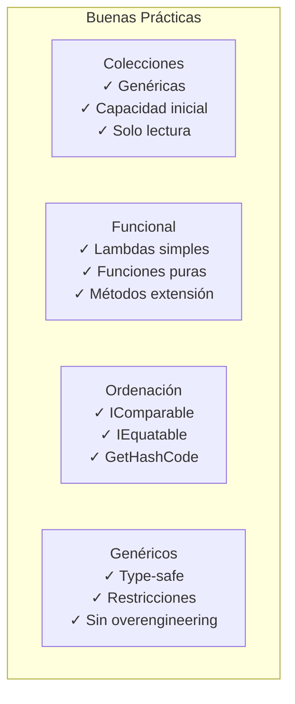

- [7. Buenas Prácticas y Recomendaciones](#7-buenas-prácticas-y-recomendaciones)
  - [7.1. Colecciones](#71-colecciones)
    - [✅ HACER](#-hacer)
    - [❌ EVITAR](#-evitar)
  - [7.2. Programación Funcional](#72-programación-funcional)
    - [✅ HACER](#-hacer-1)
    - [❌ EVITAR](#-evitar-1)
  - [7.3. Comparación y Ordenación](#73-comparación-y-ordenación)
    - [✅ HACER](#-hacer-2)
    - [❌ EVITAR](#-evitar-2)
  - [7.4. Genéricos](#74-genéricos)
    - [✅ HACER](#-hacer-3)
    - [❌ EVITAR](#-evitar-3)
  - [Resumen Visual](#resumen-visual)

# 7. Buenas Prácticas y Recomendaciones

## 7.1. Colecciones

### ✅ HACER

```csharp
// Usar colecciones genéricas
List<int> lista = new List<int>();

// Especificar capacidad inicial si la conoces
List<int> lista = new List<int>(1000);

// Usar IReadOnly* para exponer colecciones
public IReadOnlyList<Item> Items => _items.AsReadOnly();

// Usar colecciones concurrentes en multi-hilo
ConcurrentDictionary<K, V> cache = new ConcurrentDictionary<K, V>();
```

### ❌ EVITAR

```csharp
// Colecciones no genéricas (legacy)
ArrayList lista = new ArrayList(); // ❌

// Exponer colecciones mutables directamente
public List<Item> Items { get; set; } // ❌

// Usar List<T> para todo sin evaluar alternativas
```

**📝 Nota del Profesor:** Exposición de Colecciones

Expón colecciones como **solo lectura** para mantener encapsulamiento:

```csharp
// ✓ BIEN: Solo lectura
public IReadOnlyList<Persona> Empleados => _empleados.AsReadOnly();

// ❌ MAL: Mutable
public List<Persona> Empleados { get; set; }
```

## 7.2. Programación Funcional

### ✅ HACER

```csharp
// Usar lambdas para código conciso
var pares = numeros.Where(n => n % 2 == 0);

// Preferir funciones puras
decimal CalcularDescuento(decimal precio, decimal porcentaje)
{
    return precio * (1 - porcentaje / 100);
}

// Usar métodos de extensión
public static string Mayusculas(this string texto) => texto.ToUpper();
```

### ❌ EVITAR

```csharp
// Lambdas complejas (extraer a método)
var resultado = datos
    .Where(x => x.Activo && x.Fecha > DateTime.Now.AddDays(-30))
    .Select(x => new { x.Nombre, x.Total })
    .OrderBy(x => x.Total)
    .Skip(10)
    .Take(5)
    .ToList();

// Evitar closures complejos
int x = 1, y = 2, z = 3;
Func<int> calc = () => x + y + z; // Múltiples variables capturadas
```

**💡 Tip del Examinador:** Simplicity First

Escribe código funcional cuando **mejore la legibilidad**, no cuando la complique.

## 7.3. Comparación y Ordenación

### ✅ HACER

```csharp
// Implementar IComparable<T> para orden natural
public class Persona : IComparable<Persona>
{
    public int CompareTo(Persona other)
    {
        return Apellido.CompareTo(other?.Apellido ?? "");
    }
}

// Implementar IEquatable<T> y GetHashCode
public override int GetHashCode()
{
    return HashCode.Combine(Id, Nombre);
}
```

### ❌ EVITAR

```csharp
// CompareTo inconsistente
public int CompareTo(Persona other)
{
    return 1; // ❌ Siempre retorna lo mismo
}

// Olvidar GetHashCode
public override int GetHashCode() => 42; // ❌ Violates contract
```

## 7.4. Genéricos

### ✅ HACER

```csharp
// Usar genéricos para reutilización type-safe
public class Repositorio<T> where T : IIdentificable
{
    public T BuscarPorId(int id) { ... }
}

// Aplicar restricciones cuando sea necesario
public T Crear<T>() where T : new()
{
    return new T();
}
```

### ❌ EVITAR

```csharp
// Genéricos para todo sin necesidad
public class Contenedor<T>
{
    private T _valor;
    public void Set(T valor) { _valor = valor; }
    public T Get() { return _valor; }
} // ❌ Overengineering para casos simples

// Restricciones innecesarias
public void Procesar<T>(T dato) where T : class // ❌ Demasiado restrictivo
```

**📝 Nota del Profesor:** Balance

Los genéricos son herramientas poderosas, pero no son la solución para todo. Usa genéricos cuando:
- Necesites escribir código que funcione con múltiples tipos
- La seguridad de tipos sea crítica
- Necesites evitar boxing/unboxing

## Resumen Visual



**🧠 Analogía:** La Caja de Herramientas

Cada práctica es una herramienta:
- **Genéricos** = Llave inglesa (para muchos tamaños)
- **Funcional** = Atornillador eléctrico (hace el trabajo más rápido)
- **Colecciones** = Organizador (cada cosa en su sitio)
- **Ordenación** = Etiquetas (sabes dónde está cada cosa)

Usa la herramienta adecuada para cada trabajo.
