- [8. Resumen y Conclusiones](#8-resumen-y-conclusiones)
  - [8.1. Mapa Conceptual de la Unidad](#81-mapa-conceptual-de-la-unidad)
  - [8.2. Conceptos Clave Detallados](#82-conceptos-clave-detallados)
    - [8.2.1. Tipos Genéricos](#821-tipos-genéricos)
    - [8.2.2. Programación Funcional](#822-programación-funcional)
    - [8.2.3. Colecciones](#823-colecciones)
    - [8.2.4. Comparación y Ordenación](#824-comparación-y-ordenación)
  - [8.3. Resumen de Colecciones](#83-resumen-de-colecciones)
  - [8.4. Checklist de Supervivencia](#84-checklist-de-supervivencia)
    - [Genéricos](#genéricos)
    - [Programación Funcional](#programación-funcional)
    - [Colecciones](#colecciones)
    - [Comparación y Ordenación](#comparación-y-ordenación)

# 8. Resumen y Conclusiones

## 8.1. Mapa Conceptual de la Unidad

```mermaid
graph TD
    UD06["UD06: Programación<br/>Avanzada en C#"] --> GEN["Genéricos<br/>Type-Safety +<br/>Reutilización"]
    UD06 --> FUNC["Programación<br/>Funcional"]
    UD06 --> COL["Colecciones<br/>Estructuras de Datos"]
    UD06 --> COMP["Comparación y<br/>Ordenación"]
    
    GEN -->|"Clases"| CGE["Clases Genéricas<br/>Caja&lt;T&gt;"]
    GEN -->|"Métodos"| MGE["Métodos Genéricos<br/>&lt;T&gt;"]
    GEN -->|"Restricciones"| RES["Constraints<br/>where T :"]
    GEN -->|"Varianza"| VAR["out / in"]
    
    FUNC --> DEL["Delegates<br/>Func<Action, Func>"]
    FUNC --> LAM["Lambdas<br/>=> expression"]
    FUNC --> EXT["Extensiones<br/>this"]
    FUNC --> PAT["Pattern Matching<br/>switch expression"]
    
    COL --> INT["Interfaces<br/>IEnumerable, IList"]
    COL --> LIST["List&lt;T&gt;"]
    COL --> DICT["Dictionary&lt;K,V&gt;"]
    COL --> OTR["HashSet, Queue, Stack"]
    
    COMP --> ICOM["IComparable&lt;T&gt;"]
    COMP --> IEQU["IEquatable&lt;T&gt;"]
    COMP --> ICMP["IComparer&lt;T&gt;"]
    
    style UD06 fill:#1976d2,stroke:#0d47a1,stroke-width:3px,color:#fff
    style GEN fill:#1976d2,stroke:#0d47a1,stroke-width:2px,color:#fff
    style FUNC fill:#1976d2,stroke:#0d47a1,stroke-width:2px,color:#fff
    style COL fill:#1976d2,stroke:#0d47a1,stroke-width:2px,color:#fff
    style COMP fill:#1976d2,stroke:#0d47a1,stroke-width:2px,color:#fff
```



## 8.2. Conceptos Clave Detallados

### 8.2.1. Tipos Genéricos

Los genéricos permiten escribir código type-safe y reutilizable:

```csharp
// Una clase, múltiples tipos
public class Caja<T>
{
    public T Contenido { get; set; }
}

Caja<int> intBox = new Caja<int>();
Caja<string> strBox = new Caja<string>();
```

**Restricciones (`where`):**

| Restricción            | Significado                |
| ---------------------- | -------------------------- |
| `where T : class`      | Tipo referencia            |
| `where T : struct`     | Tipo valor                 |
| `where T : new()`      | Constructor sin parámetros |
| `where T : BaseClass`  | Hereda de clase            |
| `where T : IInterface` | Implementa interfaz        |
| `where T : notnull`    | No nullable (C# 8+)        |

**🧠 Analogía:** El Molde de Repostería

Los genéricos son como un molde de galletas:
- El molde (`Caja<T>`) es la estructura
- La masa (tipo `T`) define el resultado
- El mismo molde produce infinitas variaciones

### 8.2.2. Programación Funcional

**Funciones como ciudadanos de primera clase:**

```csharp
// Asignar a variable
Func<int, int> cuadrado = x => x * x;

// Pasar como argumento
numeros.Where(n => n % 2 == 0);

// Devolver como resultado
Func<int, int> CrearMultiplicador(int factor) => x => x * factor;
```

**Operaciones funcionales sobre colecciones:**

```csharp
// Filter: conservar lo que cumple condición
numeros.Where(n => n > 5);

// Map: transformar cada elemento
numeros.Select(n => n * 2);

// Reduce: reducir a un valor
numeros.Aggregate(0, (acc, n) => acc + n);
```

**📝 Nota del Profesor:** Pipeline Funcional

El código funcional se lee de izquierda a derecha, expresando **qué** quieres, no **cómo** hacerlo:

```csharp
// Imperativo: cómo
var resultado = new List<int>();
foreach (var n in numeros)
{
    if (n > 5 && n % 2 == 0)
    {
        resultado.Add(n * 2);
    }
}

// Funcional: qué
var resultado = numeros
    .Where(n => n > 5)      // Filtrar
    .Where(n => n % 2 == 0) // Filtrar
    .Select(n => n * 2);    // Transformar
```

### 8.2.3. Colecciones

| Colección         | Uso Principal | Complejidad Búsqueda |
| ----------------- | ------------- | -------------------- |
| `List<T>`         | Lista general | O(n)                 |
| `Dictionary<K,V>` | Clave-valor   | O(1)                 |
| `HashSet<T>`      | Conjuntos     | O(1)                 |
| `Queue<T>`        | FIFO          | O(n)                 |
| `Stack<T>`        | LIFO          | O(n)                 |

**🧠 Analogía:** La Biblioteca

- `List<T>` = Estantes de libros (ordenados, acceso por posición)
- `Dictionary<K,V>` = Catálogo (buscas por signatura, obtienes libro)
- `HashSet<T>` = Colección de libros únicos (no hay duplicados)

### 8.2.4. Comparación y Ordenación

**Interfaces clave:**

| Interfaz         | Propósito          | Método      |
| ---------------- | ------------------ | ----------- |
| `IComparable<T>` | Orden natural      | `CompareTo` |
| `IComparer<T>`   | Comparador externo | `Compare`   |
| `IEquatable<T>`  | Igualdad type-safe | `Equals`    |

## 8.3. Resumen de Colecciones

| Colección              | Namespace  | Duplicados | Ordenada | Thread-Safe |
| ---------------------- | ---------- | ---------- | -------- | ----------- |
| `List<T>`              | Generic    | Sí         | No       | No          |
| `Dictionary<K,V>`      | Generic    | Claves no  | No       | No          |
| `HashSet<T>`           | Generic    | No         | No       | No          |
| `Queue<T>`             | Generic    | Sí         | FIFO     | No          |
| `Stack<T>`             | Generic    | Sí         | LIFO     | No          |
| `ConcurrentDictionary` | Concurrent | Claves no  | No       | **Sí**      |
| `ImmutableList`        | Immutable  | Sí         | No       | **Sí**      |

## 8.4. Checklist de Supervivencia

Antes de dar por cerrado el tema, asegúrate de poder responder **SÍ** a estas preguntas:

### Genéricos
- [ ] ¿Entiendo por qué `Caja<Perro>` NO es subtipo de `Caja<Animal>`?
- [ ] ¿Sé cuándo usar `where T : class` vs `where T : struct`?
- [ ] ¿Conozco la diferencia entre covarianza (`out`) y contravarianza (`in`)?

### Programación Funcional
- [ ] ¿Puedo explicar qué significa "funciones como ciudadanos de primera clase"?
- [ ] ¿Sé usar `Where`, `Select` y `Aggregate` (Filter, Map, Reduce)?
- [ ] ¿Entiendo qué es un closure y cómo capturar variables?

### Colecciones
- [ ] ¿Sé elegir entre `List<T>`, `Dictionary<K,V>` y `HashSet<T>` según el caso?
- [ ] ¿Conozco la diferencia entre `IEnumerable<T>`, `ICollection<T>` e `IList<T>`?
- [ ] ¿Sé cuándo usar colecciones concurrentes?

### Comparación y Ordenación
- [ ] ¿Implemento correctamente `GetHashCode` cuando sobrescribo `Equals`?
- [ ] ¿Sé la diferencia entre `IComparable<T>` e `IComparer<T>`?
- [ ] ¿Entiendo el contrato de CompareTo (reflexividad, antisimetría, transitividad)?

**💡 Tip del Examinador:** Preguntas Típicas de Examen

1. "¿Cuál es la diferencia entre `IEnumerable<T>` e `IList<T>`?"
2. "¿Por qué `List<Animal>` no puede contener `Perro` aunque `Perro : Animal`?"
3. "¿Cómo harías para ordenar una lista por múltiples criterios?"
4. "¿Cuándo usarías `HashSet<T>` en lugar de `List<T>`?"
5. "¿Qué es un closure en C#?"

---
