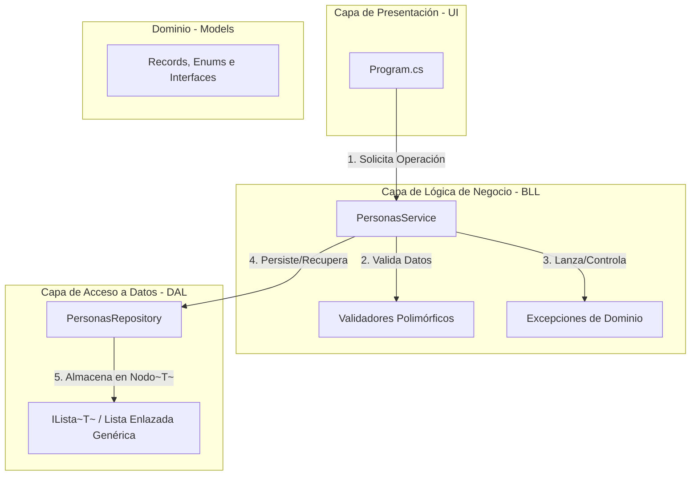
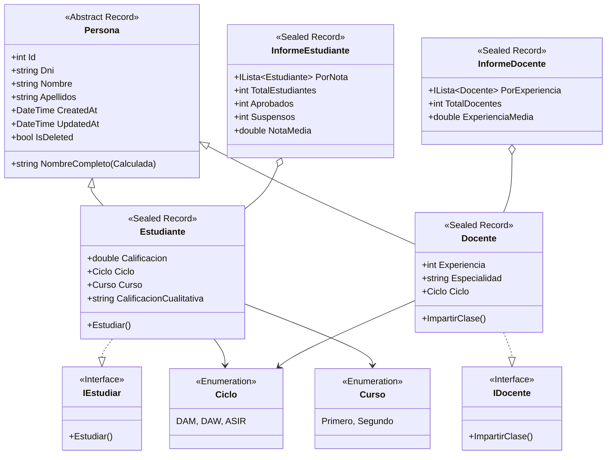
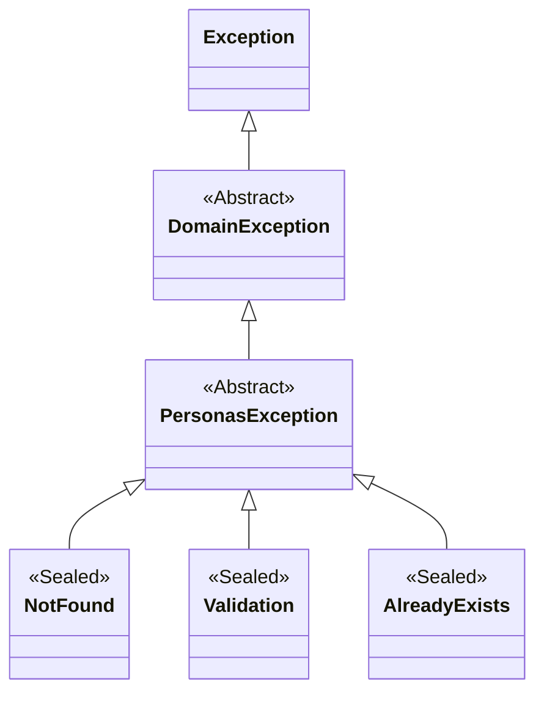
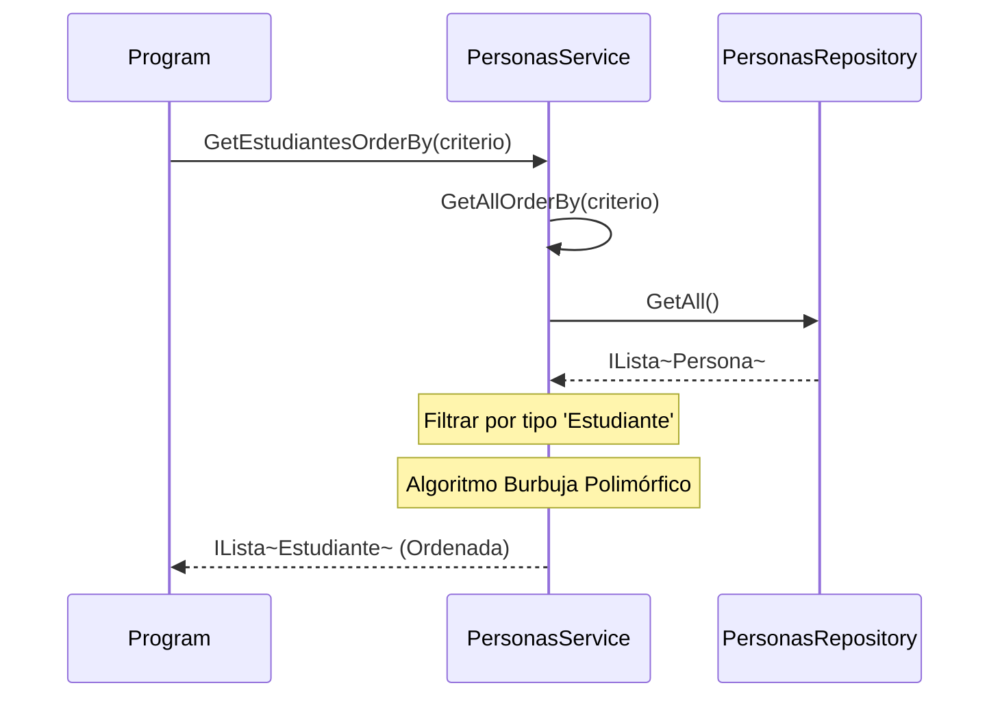
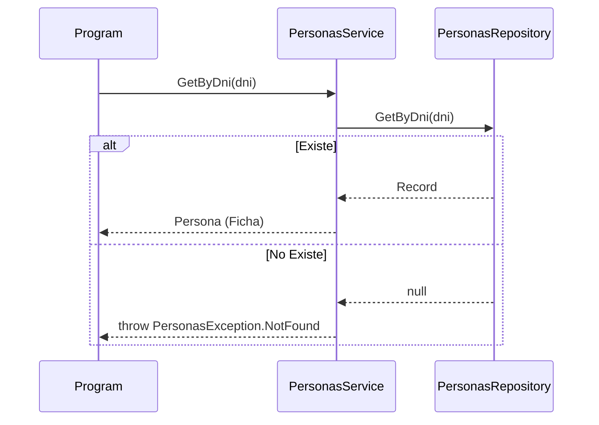
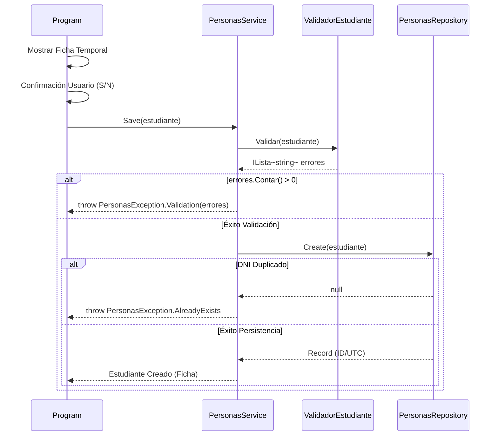
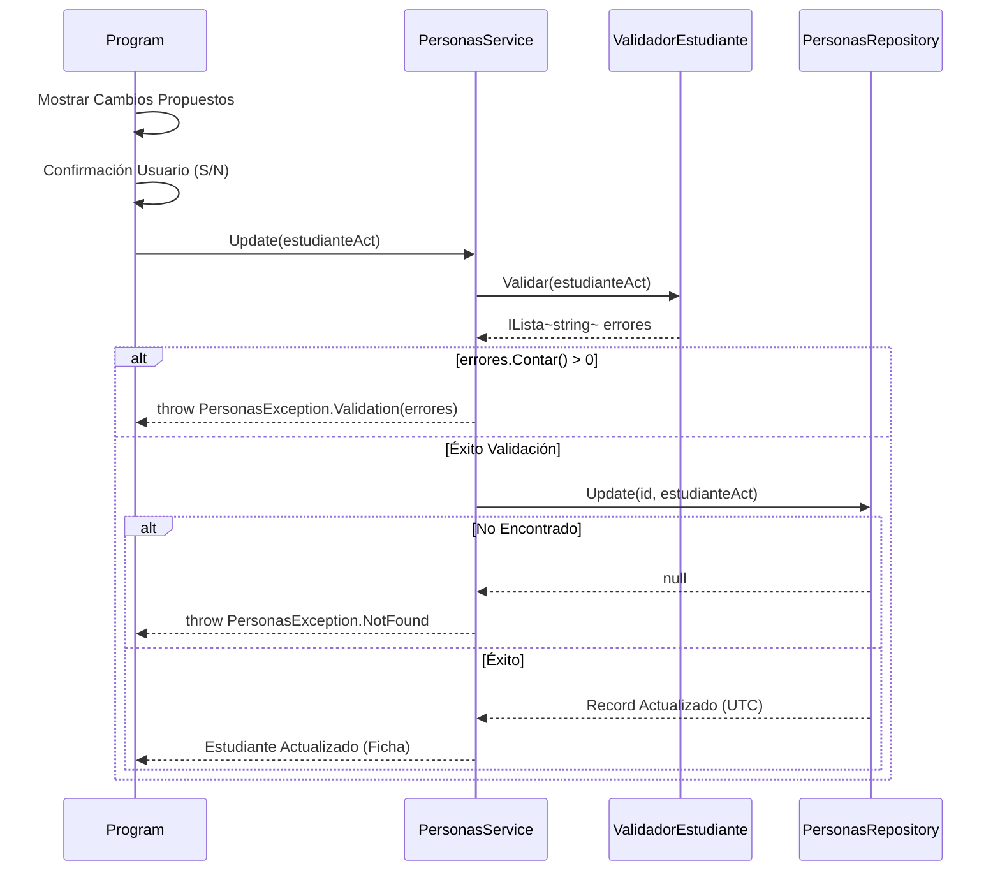
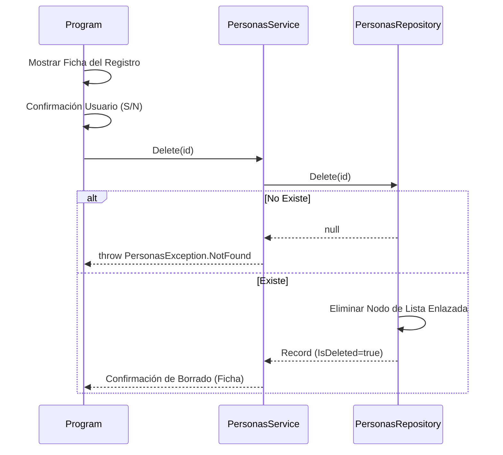
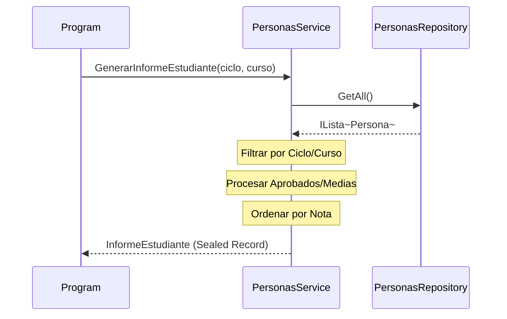

# 🎓 Sistema de Gestión Académica

Arquitectura robusta de tres capas para la gestión de Estudiantes y Docentes mediante estructuras de datos propias e inmutabilidad.

## 🏗️ Arquitectura y Dependencias
El sistema implementa un diseño desacoplado donde la lógica de negocio orquestra la validación, la gestión de errores y la persistencia sobre estructuras propias.

## 🧬 Jerarquía de Modelos y Dominio

## ⚠️ Gestión de Errores (Domain Exceptions)
El sistema utiliza una jerarquía de excepciones propia para comunicar errores de lógica de negocio de forma semántica, utilizando **clases anidadas** para agrupar los fallos relacionados con cada dominio.

### Importancia Pedagógica:
1.  **Semántica**: Se lanzan errores específicos como `PersonasException.NotFound` en lugar de errores genéricos del sistema.
2.  **Desacoplamiento**: La interfaz de usuario no depende de excepciones de infraestructura. Solo conoce los errores que el dominio académico define.
3.  **Encapsulación**: Las clases anidadas permiten organizar los errores bajo un mismo espacio de nombres ('PersonasException.Tipo').

## 🔄 Flujos de Secuencia (Estudiantes)

### 1. Listar Estudiantes (Filtrado y Ordenación)

### 2. Buscar Estudiante por DNI

### 3. Registrar Nuevo Estudiante (Alta)

### 4. Actualizar Estudiante

### 5. Eliminar Estudiante (Borrado Físico)

### 6. Informe Académico de Estudiantes

## 📝 Especificaciones Técnicas
- **Inmutabilidad**: Uso de `records` con propiedades `init`. Las actualizaciones generan nuevas instancias mediante el operador `with`.
- **Validaciones Acumulativas**: Los validadores no se detienen en el primer fallo; coleccionan todos los errores en una lista para informar al usuario de forma integral.
- **Campos Calculados**: La entidad `Persona` expone `NombreCompleto`, centralizando la lógica de visualización para las tablas.
- **Gestión Temporal (UTC)**: Auditoría gestionada en UTC (`DateTime.UtcNow`). Visualización formateada mediante `.ToLocalTime()` y `CultureInfo` (`es-ES`).
- **Patrón Singleton**: Repositorio seguro para entornos multihilo mediante `Lazy<T>` y propiedad estática `Instance`.