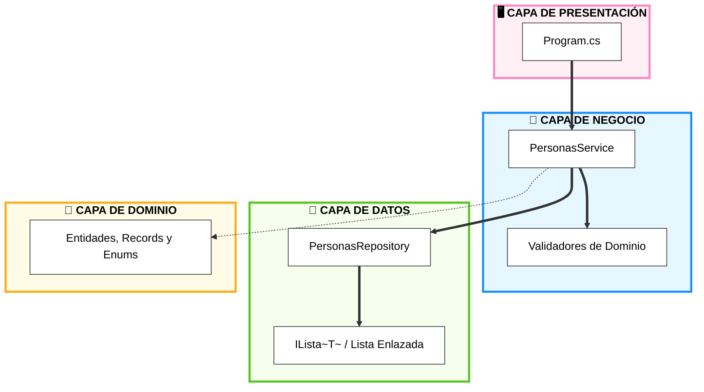
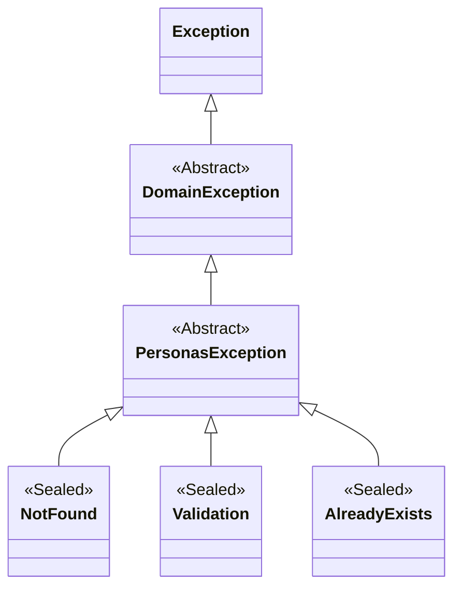
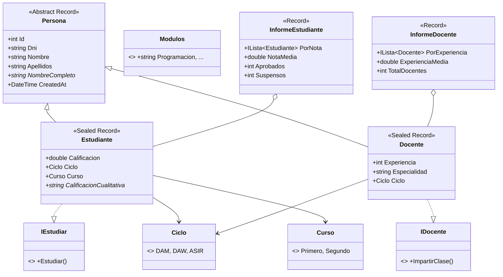
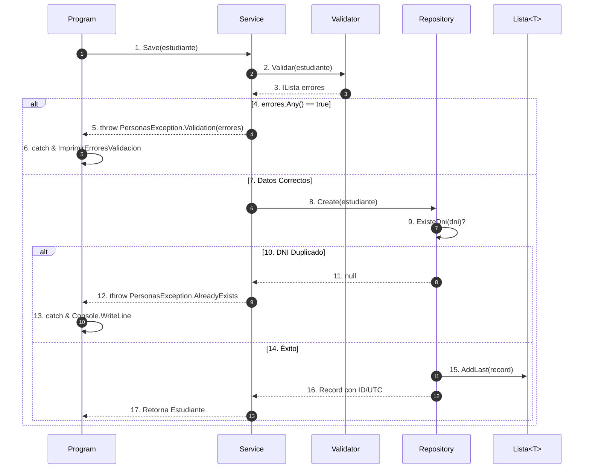
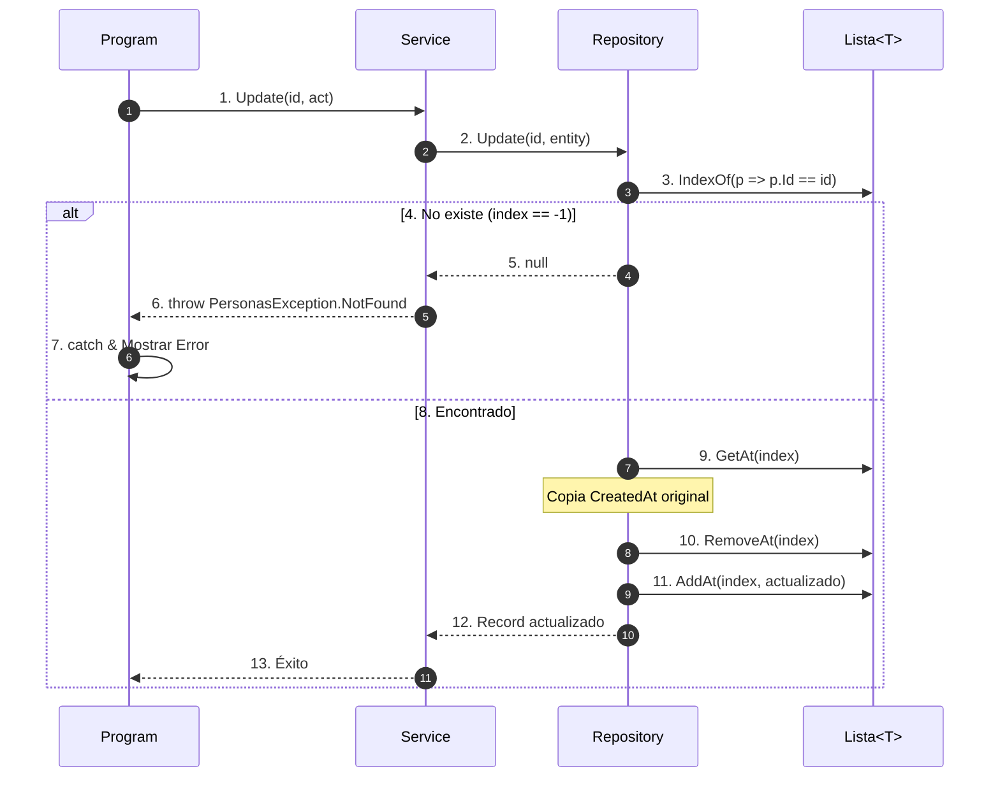
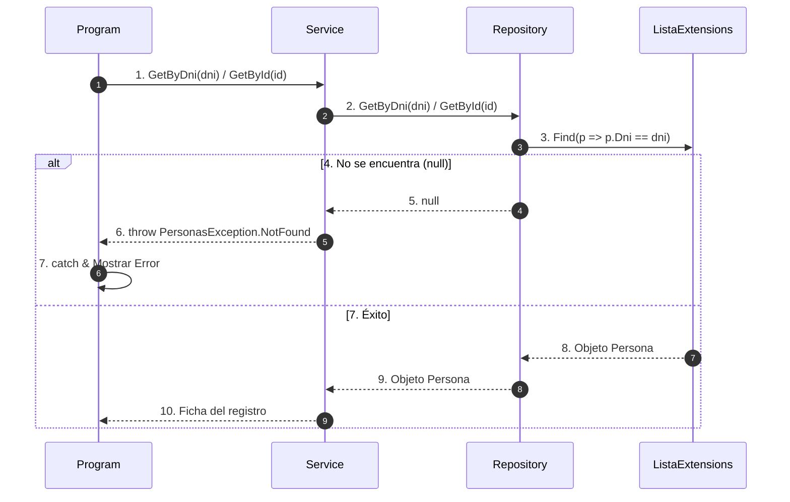
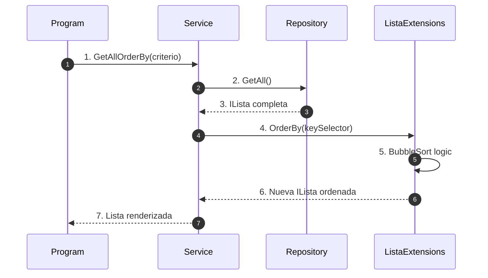
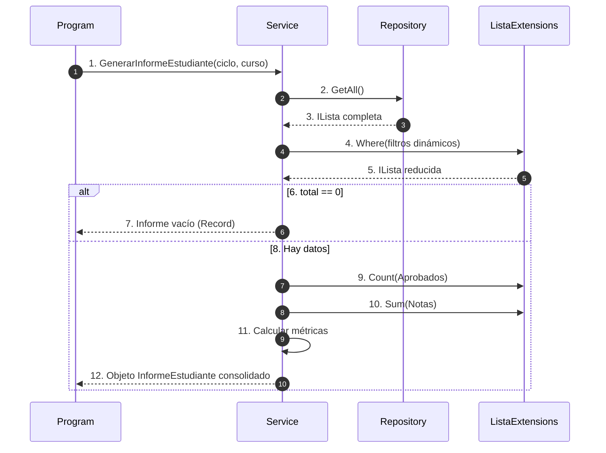
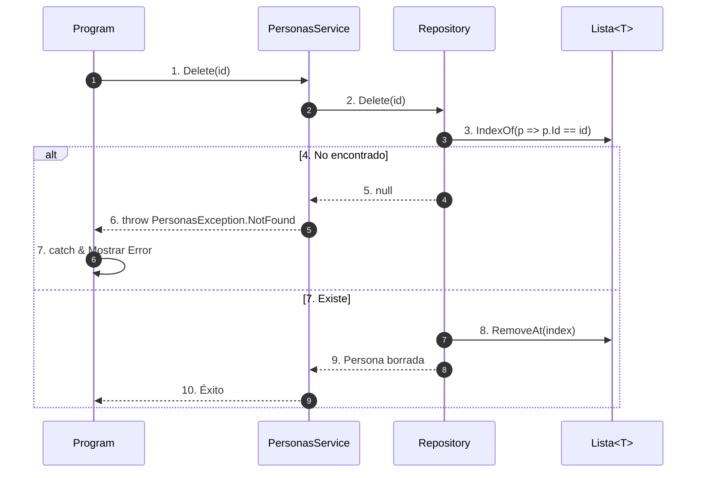

# 🎓 Guía Maestra: Sistema de Gestión Académica (DAW)

Este proyecto representa una implementación profesional de un sistema de gestión académica. Está diseñado como un recurso pedagógico avanzado para estudiar la **Arquitectura de Software**, las **Estructuras de Datos Genéricas** y los principios de la **Programación Funcional** en C# 14 y .NET 10.

---

## 1. El Problema y el Enunciado
El centro educativo "DAW Academy" requiere un sistema para gestionar su base de datos de **Estudiantes** y **Docentes**. 

### El Reto Académico
No se trata solo de almacenar datos, sino de garantizar su **integridad** y permitir la toma de decisiones mediante **informes estadísticos**.
*   **Gestión de Entidades:** Manejo de jerarquías (Herencia) para evitar redundancia de datos.
*   **Validación de Dominio:** Los datos deben cumplir reglas estrictas (DNI válido, notas en rango, experiencia no negativa).
*   **Motor de Búsqueda:** Implementar filtrado dinámico y ordenación multiaxis (por Nota, por Experiencia, por DNI, etc.).
*   **Restricción Técnica:** Prohibido el uso de `System.Collections.Generic.List<T>`. Se debe implementar una **Lista Enlazada Genérica** desde cero para comprender la complejidad algorítmica ($O(n)$ vs $O(1)$) y la gestión de punteros.

---

## 2. Arquitectura del Sistema (Capas)
El proyecto implementa una **Arquitectura en Capas** (N-Tier Architecture) con un flujo de control unidireccional, lo que garantiza que el sistema sea modular y escalable.



### Responsabilidades Detalladas:

#### 🖥️ Program (`Program.cs`)
Es el **"Camarero"** del sistema. Su única misión es atender al usuario.
*   **Interfaz de Usuario:** Gestiona menús, colores y formato de tablas.
*   **Sanitización de Entrada:** Usa **Regex** para asegurar que el usuario no introduce basura.
*   **Gestión de Excepciones:** Atrapa los errores que suben de las capas inferiores y los muestra de forma amigable.

#### 🛡️ Validator (`Validators/`)
Es la **"Aduana"** del sistema. No deja pasar ningún objeto que no cumpla las leyes.
*   **Reglas de Integridad:** Aquí se decide qué es un DNI válido, que la nota sea 0-10 o que un docente tenga experiencia coherente.
*   **Desacoplamiento:** El Servicio no sabe *cómo* se valida, solo sabe que el Validador le da el "visto bueno".

#### 🧠 Service (`PersonasService`)
Es el **"Chef"** o cerebro. Orquesta todo el proceso.
*   **Coordinación:** Decide cuándo validar y cuándo guardar.
*   **Transformación de Datos:** Crea los informes estadísticos aplicando la **Programación Funcional** sobre los datos brutos.

#### 💾 Repository (`PersonasRepository`)
Es la **"Despensa"**. Gestión física de los registros.
*   **Persistencia:** Almacena los objetos en la estructura de `ILista`.
*   **Identidad:** Asigna los identificadores únicos (IDs) y gestiona las marcas de tiempo (CreatedAt/UpdatedAt).

---

## 3. Gestión de Errores: Excepciones de Dominio
El sistema no utiliza errores genéricos, sino que define sus propias **Excepciones de Dominio**. Esto permite una comunicación precisa y profesional entre las capas.

### Jerarquía de Excepciones
Utilizamos clases anidadas para agrupar errores bajo un mismo contexto semántico (`PersonasException`).



### ¿Por qué usamos Excepciones Personalizadas?
1.  **Semántica Clara:** Es mucho más descriptivo capturar un `NotFound` que un error genérico.
2.  **Desacoplamiento:** La Capa de Presentación no necesita conocer detalles técnicos.
3.  **Seguridad de Datos:** Las excepciones de validación transportan una **lista de errores**.

---

## 4. Diagrama de Clases del Modelo (Detalle Completo)
El modelo de datos refleja fielmente la realidad académica, separando las capacidades mediante interfaces.



---

## 5. Programación Funcional: Del "Cómo" al "Qué"
Mediante el uso de **Extension Types** (C# 14), has transformado una estructura de datos rígida en una tubería de procesamiento dinámica. Esta evolución es el paso de la programación imperativa a la **programación declarativa**.

### 🛠️ Entendiendo el cambio de paradigma
*   **El "Cómo" (La Infraestructura):** Es la lógica de bajo nivel. Por ejemplo, cómo recorrer nodos, cómo manejar el puntero `Next` o cómo crear una lista temporal. Este código es propenso a errores y **no debería repetirse**.
*   **El "Qué" (La Intención):** Es la lógica de negocio. Por ejemplo, "quiero los alumnos aprobados" o "quiero los docentes de DAW".

### 🛑 Sin Programación Funcional: Repetición Infinita
Imagina que necesitas filtrar datos en 10 sitios distintos. Sin este patrón, tendrías que repetir el mismo bucle `while` con su gestión de punteros 10 veces. Si cometes un pequeño error en uno de esos bucles (te olvidas de avanzar el puntero, por ejemplo), el programa fallará de forma impredecible.

### ✨ Con Programación Funcional: Un Patrón, Infinitos Usos
Has encapsulado el "Cómo" en un único lugar (`ListaExtensions.cs`). Ahora, para cualquier necesidad de filtrado, solo indicas el "Qué" mediante una **lambda**:

```csharp
// El "CÓMO" se escribe UNA SOLA VEZ (Reutilización Total)
public ILista<T> Where(Predicate<T> predicado) {
    var resultado = new Lista<T>();
    foreach (var elemento in lista) // Lógica de recorrido centralizada
        if (predicado(elemento))    // Inyección de la intención externa
            resultado.AddLast(elemento);
    return resultado;
}

// El "QUÉ" se define según la necesidad (Cero Repetición)
var aprobados = lista.Where(e => e.Calificacion >= 5);
var daw = lista.Where(e => e.Ciclo == Ciclo.DAW);
```

### 🧪 Ventajas para el Testing y la Robustez
1.  **Testeo Único:** Al probar a fondo el método `Where`, garantizas automáticamente que todos los filtros del sistema funcionen bien. No necesitas testear la lógica de punteros 20 veces.
2.  **Patrón Reutilizable:** Has creado un lenguaje propio para tu lista. Esto te permite construir tuberías complejas (`lista.Where(...).OrderBy(...).Take(...)`) sabiendo que cada pieza es sólida.
3.  **Mantenibilidad:** Si el día de mañana optimizas el recorrido de la lista (por ejemplo, añadiendo una cola o usando hilos), todo el sistema mejorará su rendimiento instantáneamente sin tocar ni una línea del `Service`.


---

## 6. El Servicio: Motor de Inteligencia y Consultas
El `Service` no es un simple intermediario; es el **motor de orquestación** donde las reglas del mundo real se convierten en código. Su misión es transformar colecciones de datos en información estratégica.

### 6.1. El Hub Central: `GetAllOrderBy`
Has aprendido a no crear métodos rígidos para cada búsqueda. En su lugar, has implementado un sistema **altamente paramétrico**. Este método centraliza toda la lógica de ordenación del sistema, permitiendo que la UI solicite datos por ID, Nombre, Nota o Experiencia de forma unificada, inyectando filtros personalizados según la necesidad.

### 6.2. El "Doble Filtro": El secreto de la Robustez
Esta es la parte técnica más sofisticada del Servicio. Analicemos el caso de ordenar por **Nota**:

```csharp
TipoOrdenamiento.Nota => lista
    .Where(p => p is Estudiante) // PASO 1: Filtro de NEGOCIO (Semántica)
    .OrderByDescending(p => p is Estudiante e ? e.Calificacion : 0), // PASO 2: Filtro de COMPILACIÓN (Seguridad)
```

*   **Filtro de Negocio (`Where`):** Has comprendido que un docente no tiene nota. Si intentáramos ordenar una lista mezclada por calificación, los datos perderían sentido. El `Where` asegura que solo los Estudiantes entren en la "tubería" de procesamiento.
*   **Filtro de Compilación (`is Estudiante e`):** Aunque el `Where` ya limpió la lista, para C# cada elemento `p` sigue siendo una `Persona`. Una `Persona` no tiene la propiedad `.Calificacion`.
    *   **Pattern Matching:** `p is Estudiante e` pregunta si es estudiante y, si es cierto, crea la variable `e` ya convertida (cast) al tipo correcto de forma segura.
*   **Programación Defensiva (`? :`):** El operador ternario garantiza que, aunque sabemos que solo hay estudiantes, el sistema siempre tenga un valor de retorno (`0`) para evitar fallos inesperados.

### 6.3. Generación de Informes: Pipelines de Valor
Has aprendido a generar informes estadísticos no como una sucesión de bucles, sino como un **flujo de transformación**:

```csharp
public InformeEstudiante GenerarInformeEstudiante(Ciclo? ciclo, Curso? curso) {
    // 1. FILTRADO DINÁMICO: Combinamos filtros opcionales
    var estudiantes = GetEstudiantesOrderBy(TipoOrdenamiento.Nota)
        .Where(e => (ciclo == null || e.Ciclo == ciclo) && (curso == null || e.Curso == curso));

    // 2. EXTRACCIÓN DE MÉTRICAS: Preguntamos a los datos
    return new InformeEstudiante {
        PorNota = estudiantes,
        TotalEstudiantes = estudiantes.Count(),
        Aprobados = estudiantes.Count(e => e.Calificacion >= 5.0),
        NotaMedia = estudiantes.Sum(e => e.Calificacion) / estudiantes.Count()
    };
}
```
Este diseño permite que los informes sean extremadamente flexibles: has logrado que con una sola lógica puedas obtener el ranking de "Todos los alumnos", solo de "2º de DAW" o solo de "ASIR", reutilizando el 100% del código.

---

## 7. Análisis de Principios SOLID y DRY
Has aplicado los estándares de la industria para garantizar que el código sea mantenible, escalable y fácil de entender.

### 📐 Principios SOLID

#### **S - Single Responsibility (Responsabilidad Única)**
Cada clase tiene una única misión. Por ejemplo, el `ValidadorEstudiante` solo se encarga de las reglas de integridad, sin saber nada de menús o de cómo se guardan los datos.
```csharp
// Solo valida, no persiste ni imprime.
public class ValidadorEstudiante : IValidador<Persona> {
    public ILista<string> Validar(Persona persona) {
        if (estudiante.Calificacion is < 0 or > 10) 
            errores.AddLast("La calificación debe estar entre 0.0 y 10.0.");
        // ...
    }
}
```

#### **O - Open/Closed (Abierto/Cerrado)**
El sistema permite añadir funcionalidades nuevas (extender) sin modificar el código que ya funciona. Lo has logrado mediante **Extension Types**.
```csharp
// Añadimos 'Sum' a ILista sin tocar el archivo ILista.cs
public TResult Sum<TResult>(Func<T, TResult> selector) where TResult : INumber<TResult> {
    // ... lógica genérica de suma
}
```

#### **L - Liskov Substitution (Sustitución de Liskov)**
El repositorio almacena `Persona` (clase base), pero el programa funciona perfectamente inyectando `Estudiante` o `Docente`. La clase base es totalmente sustituible por sus hijas.
```csharp
// El repositorio acepta cualquier subtipo de Persona
_listado.AddLast(new Estudiante { ... });
_listado.AddLast(new Docente { ... });
```

#### **I - Interface Segregation (Segregación de Interfaces)**
No has creado una interfaz gigantesca. Has separado las capacidades: `IEstudiar` para alumnos e `IDocente` para profesores.
```csharp
public sealed record Estudiante : Persona, IEstudiar { ... }
public sealed record Docente : Persona, IDocente { ... }
```

#### **D - Dependency Inversion (Inversión de Dependencias)**
El `Service` no depende de una "Lista" o un "Repositorio" concreto, sino de sus **Interfaces**. Esto permite cambiar el almacenamiento (RAM por Base de Datos) sin tocar el Servicio.
```csharp
public class PersonasService(IPersonasRepository repository, ...)
```

---

### 💧 Principio DRY (Don't Repeat Yourself)
Has evitado la repetición de lógica mediante dos estrategias clave:

1.  **Motor de Consultas Unificado:** En lugar de tener 10 métodos de ordenación, usas un único `GetAllOrderBy` con un `switch` paramétrico.
2.  **Abstracción de Bucles:** Mediante extensiones como `Where` o `Count`, has eliminado la necesidad de escribir el mismo bucle `while` en cada informe del sistema.
```csharp
// En lugar de un bucle de 10 líneas, usas una sola expresión declarativa.
Aprobados = estudiantes.Count(e => e.Calificacion >= 5.0);
```

---

## 8. Ingeniería de Flujos: Trazabilidad Atómica Total
Los números en las flechas indican el orden exacto de ejecución en todas las capas.

### 8.1. Registro de Estudiante (Operación CREATE)

#### 💻 Trazabilidad de Código (Paso a Paso):
*   **[1] Program:** `var creado = service.Save(temp);`
*   **[2] Service:** `var errores = valEstudiante.Validar(persona);` (Delegación al validador inyectado).
*   **[3] Validator:** `if (estudiante.Calificacion is < 0 or > 10) errores.AddLast("Error...");`
*   **[5] Service (Excepción):** `throw new PersonasException.Validation(errores);`
*   **[6] Program (Captura):** `catch (PersonasException.Validation ex) { ImprimirErroresValidacion(ex.Errores); }`
*   **[9] Repository:** `if (ExisteDni(entity.Dni)) return null;`
*   **[12] Service (Excepción):** `repository.Create(persona) ?? throw new PersonasException.AlreadyExists(...);`
*   **[13] Program (Captura):** `catch (PersonasException.AlreadyExists ex) { Console.WriteLine(ex.Message); }`
*   **[15] Repository:** `_listado.AddLast(nuevaPersona);` (Persistencia física en la estructura).

---

### 8.2. Actualización de Registro (Operación UPDATE)

#### 💻 Trazabilidad de Código (Paso a Paso):
*   **[1] Program:** `var actualizado = service.Update(est.Id, act);`
*   **[2] Service:** `return repository.Update(...) ?? throw new PersonasException.NotFound(...);`
*   **[3] Repository:** `var index = _listado.IndexOf(p => p.Id == id);`
*   **[6] Service (Excepción):** `throw new PersonasException.NotFound(id.ToString());`
*   **[7] Program (Captura):** `catch (PersonasException.NotFound ex) { Console.WriteLine(ex.Message); }`
*   **[9] Repository:** `var actual = _listado.GetAt(index); // Auditoría de metadatos`
*   **[10-11] Repository:** `_listado.RemoveAt(index); _listado.AddAt(index, personaActualizada);`

---

### 8.3. Búsqueda por DNI o ID (Operación READ ONE)

#### 💻 Trazabilidad de Código (Paso a Paso):
*   **[1] Program:** `var p = service.GetByDni(dni);`
*   **[3] Repository:** `return _listado.Find(p => p.Dni == dni);` (Localización mediante extensión funcional).
*   **[6] Service (Excepción):** `repository.GetByDni(dni) ?? throw new PersonasException.NotFound(dni);`
*   **[7] Program (Captura):** `catch (PersonasException.NotFound ex) { Console.WriteLine(ex.Message); }`

---

### 8.4. Listado Integral y Ordenación (READ ALL)

#### 💻 Trazabilidad de Código (Paso a Paso):
*   **[1] Program:** `var lista = service.GetAllOrderBy(criterio);`
*   **[2-3] Service -> Repo:** `var lista = repository.GetAll();` (El Repositorio actúa como almacén pasivo).
*   **[4-6] Service -> Extensions:** `return orden switch { ... => lista.OrderBy(p => p.Nombre), ... };` (El Servicio orquesta la ordenación).

---

### 8.5. Generación de Informes (Pipeline Estadístico)

#### 💻 Trazabilidad de Código (Paso a Paso):
*   **[1] Program:** `var inf = service.GenerarInformeEstudiante(fCiclo, fCurso);`
*   **[2-3] Service -> Repo:** `var lista = repository.GetAll();` (Recuperación masiva).
*   **[4-5] Service -> Extensions:** `.Where(e => (ciclo == null || e.Ciclo == ciclo) && ...)` (Filtrado dinámico).
*   **[9-11] Service:** `Aprobados = estudiantes.Count(...), NotaMedia = estudiantes.Sum(...) / total;`

---

### 8.6. Eliminación Física (Operación DELETE)

#### 💻 Trazabilidad de Código (Paso a Paso):
*   **[1] Program:** `var eliminado = service.Delete(p.Id);`
*   **[3] Repository:** `var index = _listado.IndexOf(p => p.Id == id);` (Localización del nodo físico).
*   **[6] Service (Excepción):** `throw new PersonasException.NotFound(id.ToString());`
*   **[7] Program (Captura):** `catch (PersonasException.NotFound ex) { Console.WriteLine(ex.Message); }`
*   **[8] Repository:** `_listado.RemoveAt(index);` (Ajuste físico de punteros).

---

### 🚀 Lo que has aprendido en este proyecto: Pilares de Ingeniería
Completar este sistema te ha permitido trabajar con decisiones de diseño que reflejan cómo se construye el software de alta calidad en la industria. Estos son los conceptos clave que has asimilado:

#### 1. Abstracción de la Estructura de Datos (Ocultar el "Cómo")
Has aprendido a separar la lógica de almacenamiento de la lógica de negocio. Aunque has implementado una **Lista Enlazada** manual con sus nodos y punteros, has logrado que el resto del sistema (Program y Service) no tenga ni idea de que existe un `Nodo`.
*   **Logro:** Has comprendido que, al programar contra la interfaz `ILista`, proteges tu aplicación. Si en el futuro decides cambiar la lista enlazada por un árbol binario o una base de datos, solo tendrás que modificar el **Repository**, sin romper ni una sola línea del resto del código.

#### 2. El Salto a la Programación Declarativa
Gracias al uso de **Extension Types** y lambdas, has aprendido a transformar bucles `foreach` repetitivos en tuberías de datos elegantes y legibles.
*   **Logro:** Has pasado de "dar órdenes paso a paso" (programación imperativa: crea un contador, recorre, suma...) a "definir intenciones" (programación declarativa: "dame la suma de las notas de los aprobados"). Esto no solo reduce errores, sino que hace que tu código sea autodocumentado.

#### 3. Desacoplamiento Real mediante Inyección de Dependencias
Has comprendido por qué es vital que el `Service` no fabrique sus propios validadores ni su repositorio, sino que los reciba "inyectados" desde fuera.
*   **Logro:** Esta técnica te ha enseñado a crear sistemas **testables**. Ahora sabes que puedes inyectar un "Repositorio de Prueba" o un "Validador Flexible" para testear tu lógica sin cambiar el código del Servicio. Es el principio de Inversión de Dependencias aplicado a un caso real.

#### 4. Seguridad de Tipos con Pattern Matching
Has aprendido a utilizar herramientas modernas de C# como `p is Estudiante e` en los filtros de ordenación para gestionar el polimorfismo de forma segura.
*   **Logro:** Has comprendido la importancia de evitar los "Casts" antiguos que podían hacer fallar el programa en ejecución. Ahora, el compilador te obliga a comprobar el tipo antes de acceder a los datos, garantizando que tu sistema sea robusto y profesional.

#### 5. Excepciones de Dominio como Protocolo de Comunicación
Has aprendido a no usar `Console.WriteLine` dentro del Servicio para informar de fallos, sustituyéndolo por el lanzamiento de una `PersonasException`.
*   **Logro:** Has comprendido que el Servicio debe "gritar" cuando algo va mal, y debe ser el `Program.cs` quien decida cómo mostrar ese mensaje al usuario. Esto mantiene tu lógica de negocio limpia de interfaces visuales.
*   **Diferenciación de Errores:** Lo más valioso ha sido aprender a separar los **errores de dominio** (reglas de tu negocio, como un DNI duplicado) de los **errores del programa** (fallos técnicos como una referencia nula). De esta forma, puedes capturar y tratar específicamente los problemas académicos sin ocultar errores de código que necesitas depurar.

---

## 9. Preguntas de Investigación para el Alumnado
1.  **Eficiencia Algorítmica ($O$):** Nuestra `Lista` realiza una búsqueda secuencial en `IndexOf`. ¿Cómo cambiaría el rendimiento si usáramos un `Dictionary` basado en el ID?
2.  **Abstracción de Tipos:** ¿Por qué `GetAllOrderBy` devuelve `Persona` pero el informe requiere `Estudiante`? Investiga el **Casting Polimórfico**.
3.  **Inmutabilidad y Auditoría:** ¿Por qué en el `Update` es vital recuperar el `CreatedAt` original?
4.  **Localización:** El sistema usa `DateTime.UtcNow`. ¿Por qué nunca se guarda la hora local en una base de datos profesional?

---
*Este material ha sido diseñado para que comprendas que el código debe ser una obra de ingeniería segura, trazable y escalable.* 🚀