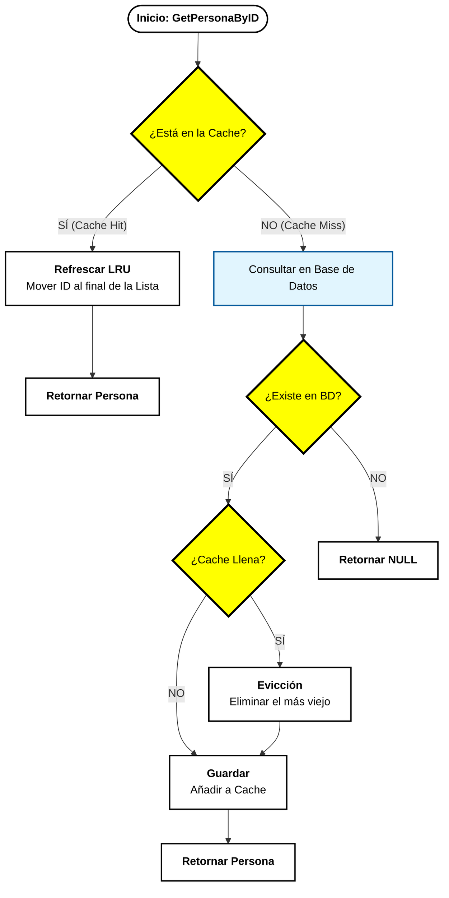
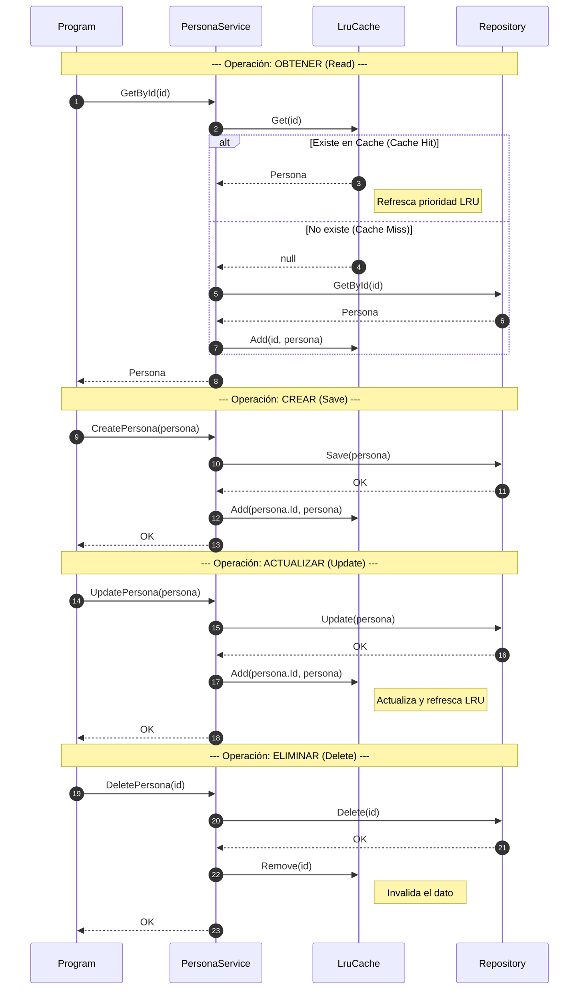

# 📚 Estrategias de Almacenamiento en Cache (C#)

En el desarrollo de software, una **Cache** es una capa de almacenamiento de alta velocidad que guarda un subconjunto de datos, normalmente transitorios, para que las solicitudes futuras se atiendan con mayor rapidez.

## 1. La Base: ¿Por qué no solo un Diccionario?

Aunque el `Dictionary<K, V>` es ultra rápido para encontrar datos (), tiene un defecto: **no tiene orden**. Si limitamos su capacidad para no agotar la RAM, el diccionario no sabe qué elemento borrar. Por eso usamos estructuras adicionales como **Colas** o **Listas Enlazadas**.

---

## 2. Comparativa de Estrategias

### A. Simple Cache (Borrado Arbitrario)

Es la implementación más básica. Cuando la cache se llena, se elimina el primer elemento que el motor de C# encuentre en el diccionario.

* **Objetivo:** Simplicidad absoluta y bajo consumo de recursos.
* **Ventaja:** No gasta memoria extra en estructuras de ordenación.
* **Desventaja:** Es "injusta". Podría borrar el dato que más usas simplemente porque fue el primero en la memoria.

### B. FIFO Cache (First-In, First-Out)

Sigue la lógica de una **cola de supermercado**. El primer elemento en entrar es el primero en salir.

* **Objetivo:** Justicia basada estrictamente en el tiempo de llegada.
* **Implementación:** Usamos una `LinkedList` o `Queue` para saber quién entró primero.
* **Ventaja:** Muy predecible y fácil de entender.
* **Desventaja:** No tiene en cuenta si un dato se usa mucho. Si el dato "A" entró hace una hora pero se usa cada segundo, FIFO lo borrará igual.

### C. LRU Cache (Least Recently Used)

Es la cache "inteligente". Expulsa el elemento que lleva más tiempo **sin ser consultado**.

* **Objetivo:** Maximizar la tasa de éxito (Cache Hits) manteniendo "vivo" lo más popular.
* **Implementación:** Usamos un `Dictionary` + `LinkedList`. Cada vez que haces un `Get` o `Add`, el elemento salta al final de la lista (rejuvenece).
* **Ventaja:** Se adapta al comportamiento real del usuario.
* **Desventaja:** Ligeramente más compleja de programar y requiere actualizar el orden en cada lectura.

---

## 3. Resumen de Diferencias

| Característica           | Simple Cache         | FIFO Cache               | LRU Cache                    |
| ------------------------ | -------------------- | ------------------------ | ---------------------------- |
| **Criterio de borrado**  | Aleatorio/Arbitrario | El más antiguo (llegada) | El menos usado recientemente |
| **Estructura adicional** | Ninguna              | `LinkedList` o `Queue`   | `LinkedList` (con refresco)  |
| **Complejidad**          | Muy Baja             | Media                    | Media-Alta                   |
| **Inteligencia**         | Nula                 | Baja                     | Alta                         |

---

## 4. Aplicación Real: Cache en un Servicio CRUD

Imagina que estás desarrollando un **Servicio de Gestión de Personas** que conecta tu aplicación con una Base de Datos (SQL Server, MongoDB, etc.).

### ¿Cuál elegiríamos para un CRUD de Personas?

La respuesta profesional es la **LRU Cache**.

### ¿Por qué?

En un CRUD típico (como una lista de empleados, clientes o jugadores), los datos suelen seguir la **Ley de Pareto**: el usuario consulta muchas veces al mismo grupo de personas (los más activos, los últimos creados, o los que está editando en ese momento).

1. **Optimización de Recursos:** La BD es lenta y costosa. La LRU asegura que las personas "populares" se queden en la RAM.
2. **Evicción Inteligente:** Si tu cache tiene capacidad para 100 personas y entra la 101, la LRU borrará a ese cliente que nadie consulta desde hace semanas, en lugar de borrar al que estás editando ahora mismo (cosa que FIFO sí podría hacer).
3. **Flujo de Trabajo:**
* **Get:** Si la persona está en la cache, se devuelve al instante y se "refresca" su posición.
* **Update/Add:** Se actualiza en la BD y se posiciona como el elemento "más reciente" en la cache.
* **Delete:** Se elimina de la BD y se limpia de la cache con `Remove(key)`.

> **Conclusión para el alumno:** Para cualquier sistema donde el patrón de acceso del usuario sea importante (casi todos los sistemas modernos), **LRU es el estándar de la industria**.

## 5. Diagrama de Flujo de GetPersonaByID con LRU Cache

## 6. Diagrama de Secuencia para Operaciones CRUD con LRU Cache

#### 📝 Notas Pedagógicas para 1DAW:
- **GetById**: Es la operación donde la cache brilla. El objetivo es que la mayoría de las veces el flujo se detenga en el paso 3 y no llegue al 6.

- **Save**: Fíjate que al crear una persona nueva, también la añadimos a la cache. ¿Por qué? Porque si acabas de crear un usuario, es muy probable que lo consultes inmediatamente después.

- **Update**: Aquí la cache actúa como un "espejo". Si el dato cambia en la base de datos (paso 13), debe cambiar en la cache (paso 15). Si no, el usuario vería datos viejos.
  
- **Delete**: Es fundamental el paso 20. Si borras a alguien de la BD pero te olvidas de la cache, tendrías un "zombie" en memoria: el sistema cree que existe porque lo ve en la RAM, pero ha muerto en el disco.
