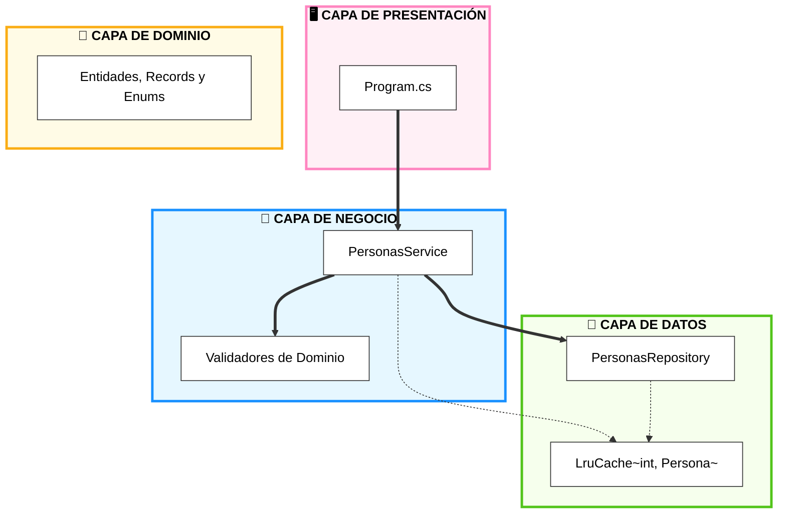
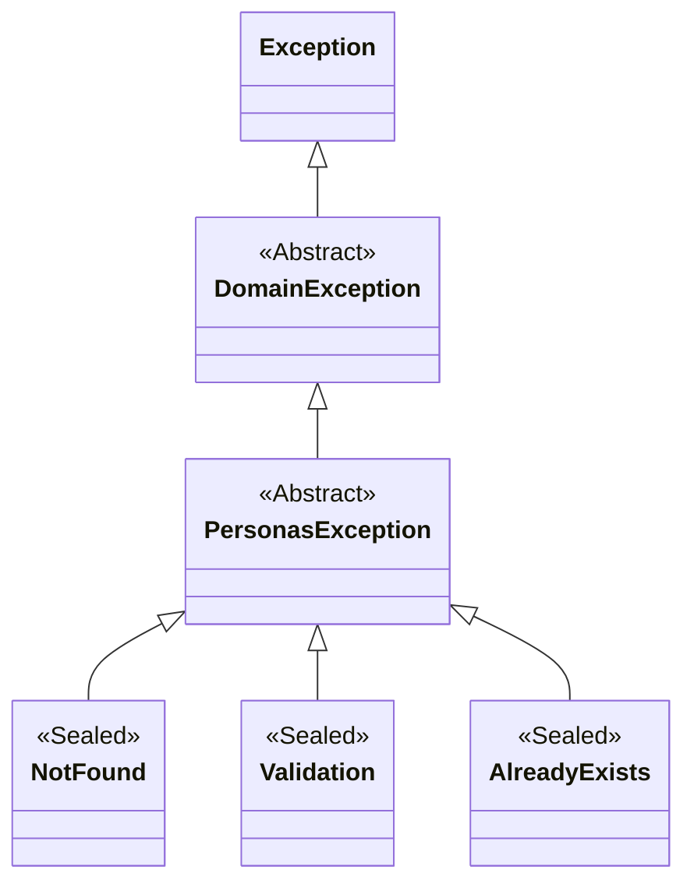
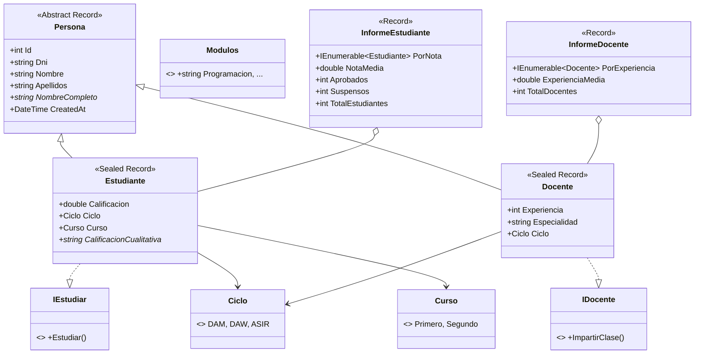
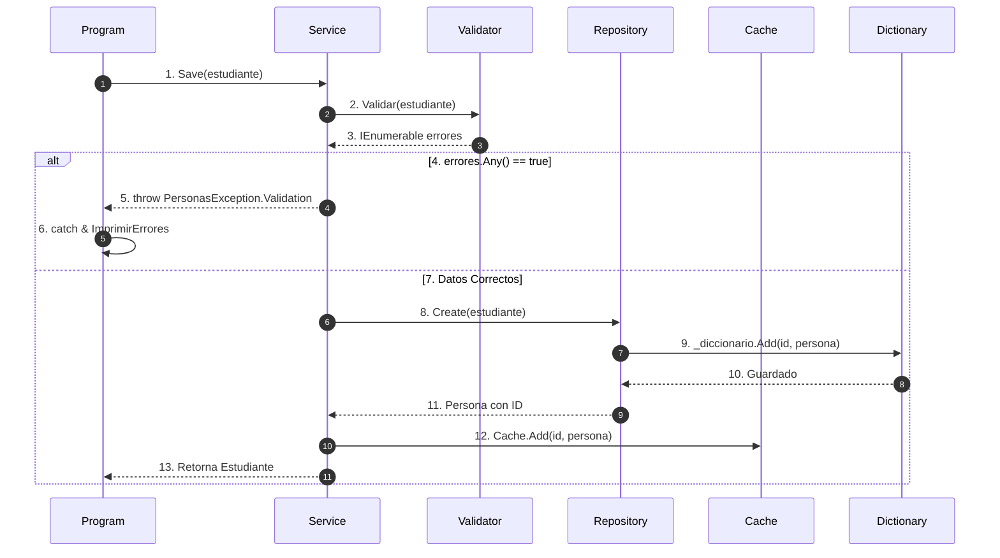
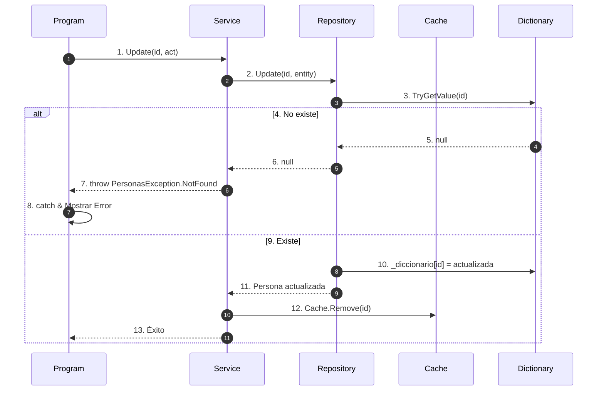
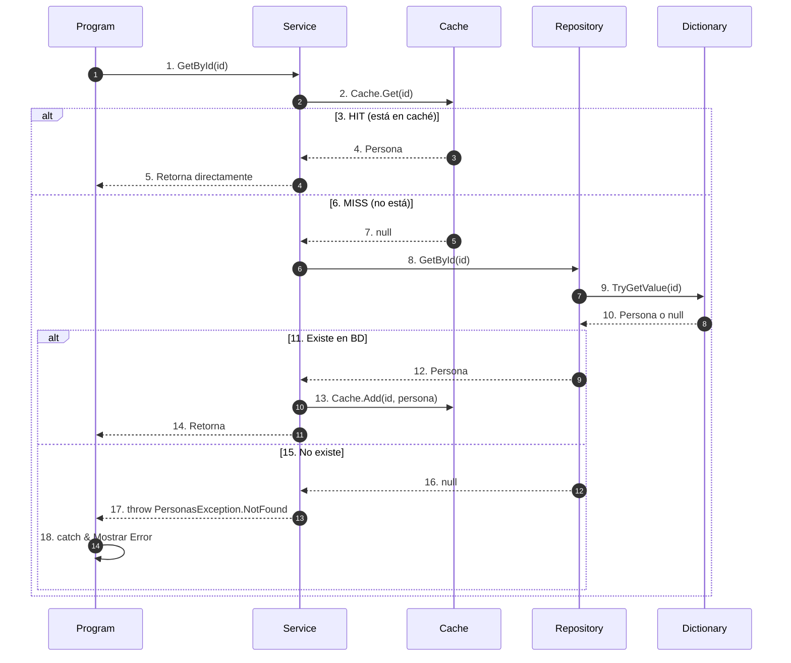
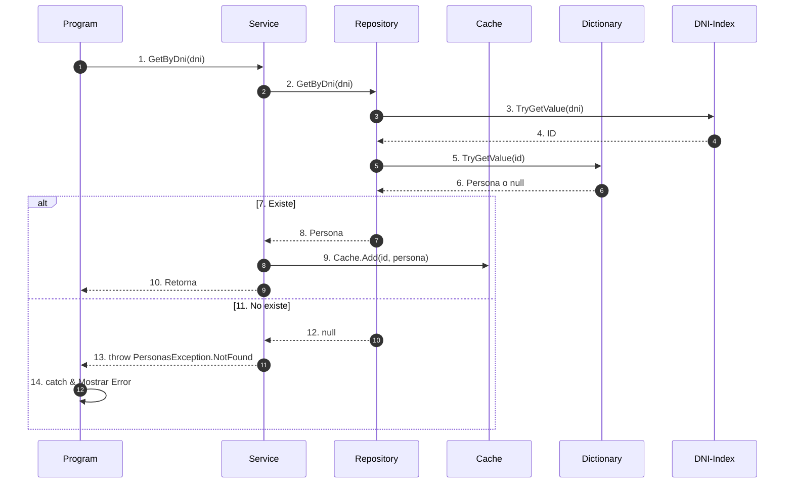
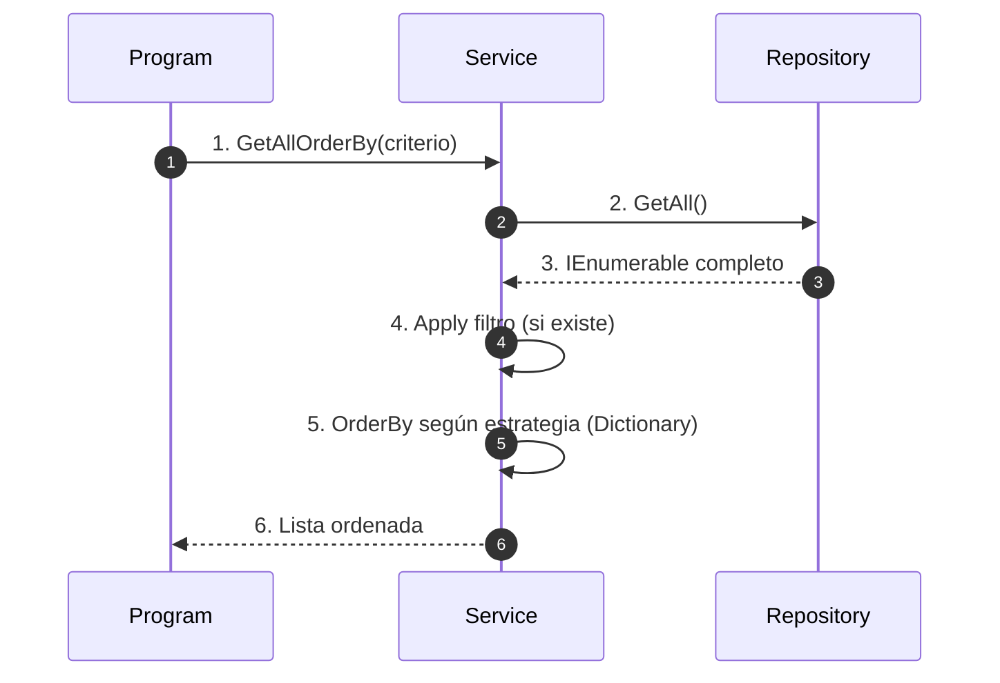
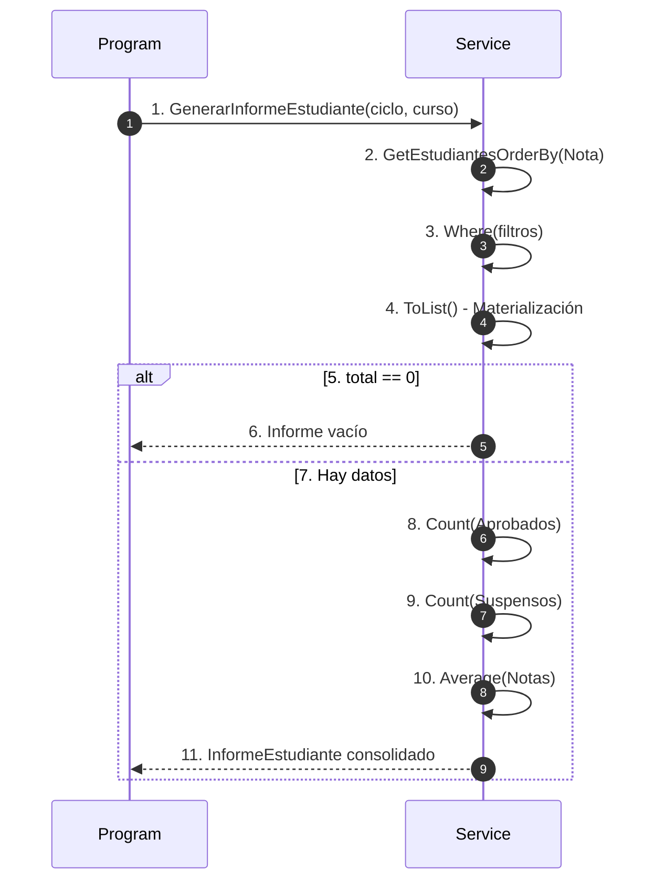
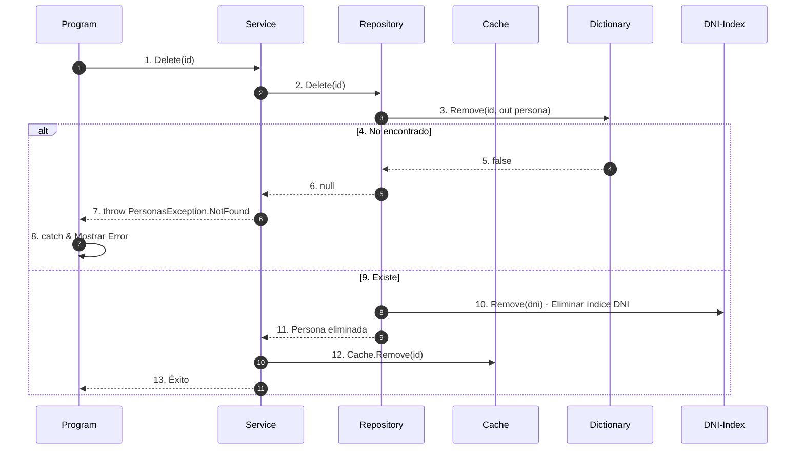

# 🎓 Guía Maestra: Sistema de Gestión Académica (DAW)

Este proyecto representa una implementación profesional de un sistema de gestión académica. Está diseñado como un recurso pedagógico avanzado para estudiar la **Arquitectura de Software**, las **Estructuras de Datos Genéricas** y los principios de la **Programación Funcional** en C# 14 y .NET 10.

---

## 1. El Problema y el Enunciado
El centro educativo "DAW Academy" requiere un sistema para gestionar su base de datos de **Estudiantes** y **Docentes**.

### El Reto Académico
No se trata solo de almacenar datos, sino de garantizar su **integridad** y permitir la toma de decisiones mediante **informes estadísticos**.
*   **Gestión de Entidades:** Manejo de jerarquías (Herencia) para evitar redundancia de datos.
*   **Validación de Dominio:** Los datos deben cumplir reglas estrictas (DNI válido, notas en rango, experiencia no negativa).
*   **Motor de Búsqueda:** Implementar filtrado dinámico y ordenación multiaxis (por Nota, por Experiencia, por DNI, etc.).
*   **Optimización:** Implementar una caché LRU para optimizar las lecturas repetidas por ID.
*   **Estructuras de Datos:** Se usa `Dictionary` para búsquedas O(1) en el Repository.

---

## 2. Arquitectura del Sistema (Capas)
El proyecto implementa una **Arquitectura en Capas** (N-Tier Architecture) con un flujo de control unidireccional, lo que garantiza que el sistema sea modular y escalable.


```mermaid
graph TD
    %% Estilos de Capas (Contenedores)
    classDef capaUI fill:#fff0f6,stroke:#ff85c0,stroke-width:3px,color:#000000,font-weight:bold;
    classDef capaBLL fill:#e6f7ff,stroke:#1890ff,stroke-width:3px,color:#000000,font-weight:bold;
    classDef capaDAL fill:#f6ffed,stroke:#52c41a,stroke-width:3px,color:#000000,font-weight:bold;
    classDef capaModel fill:#fffbe6,stroke:#faad14,stroke-width:3px,color:#000000,font-weight:bold;
    classDef capaCache fill:#ffe6e6,stroke:#ff4d4f,stroke-width:3px,color:#000000,font-weight:bold;

    %% Estilos de Componentes (Nodos)
    classDef comp fill:#ffffff,stroke:#333333,stroke-width:1px,color:#000000;

    subgraph UI [🖥️ CAPA DE PRESENTACIÓN]
        P[Program.cs]
    end

    subgraph BLL [🧠 CAPA DE NEGOCIO]
        S[PersonasService]
        V[Validadores de Dominio]
    end

    subgraph DAL [💾 CAPA DE DATOS]
        R[PersonasRepository]
        C[LruCache~int, Persona~]
    end

    subgraph Models [📂 CAPA DE DOMINIO]
        M[Entidades, Records y Enums]
    end

    %% Aplicación de Estilos
    class UI capaUI;
    class BLL capaBLL;
    class DAL capaDAL;
    class Models capaModel;
    class Cache capaCache;
    class P,S,V,R,C,M comp;

    %% Flujo de Dependencias
    P ==> S
    S ==> V
    S ==> R
    S -.-> C
    R -.-> C
```

### Responsabilidades Detalladas:

#### 🖥️ Program (`Program.cs`)
Es el **"Camarero"** del sistema. Su única misión es atender al usuario.
*   **Interfaz de Usuario:** Gestiona menús, colores y formato de tablas.
*   **Sanitización de Entrada:** Usa **Regex** para asegurar que el usuario no introduce basura.
*   **Gestión de Excepciones:** Atrapa los errores que suben de las capas inferiores y los muestra de forma amigable.
*   **Configuración de Caché:** Crea e inyecta la caché LRU con capacidad configurable.

#### 🛡️ Validator (`Validators/`)
Es la **"Aduana"** del sistema. No deja pasar ningún objeto que no cumpla las leyes.
*   **Reglas de Integridad:** Aquí se decide qué es un DNI válido, que la nota sea 0-10 o que un docente tenga experiencia coherente.
*   **Desacoplamiento:** El Servicio no sabe *cómo* se valida, solo sabe que el Validador le da el "visto bueno".

#### 🧠 Service (`PersonasService`)
Es el **"Chef"** o cerebro. Orquesta todo el proceso.
*   **Coordinación:** Decide cuándo validar y cuándo guardar.
*   **Transformación de Datos:** Crea los informes estadísticos.
*   **Caché LRU:** Implementa el patrón **Look-Aside**: primero consulta la caché, si no está, va al repositorio y lo guarda en caché.

#### 💾 Repository (`PersonasRepository`)
Es la **"Despensa"**. Gestión física de los registros.
*   **Persistencia:** Almacena los objetos en estructuras `Dictionary` para búsquedas O(1).
*   **Índices Secundarios:** Usa un índice adicional por DNI para búsquedas rápidas.
*   **Identidad:** Asigna los identificadores únicos (IDs) y gestiona las marcas de tiempo (CreatedAt/UpdatedAt).

#### ⚡ Cache (`LruCache<TKey, TValue>`)
Es el **" buffer de acceso rápido"**. Optimiza las lecturas frecuentes.
*   **Algoritmo LRU:** Least Recently Used - elimina el elemento menos usado cuando se alcanza la capacidad.
*   **O(1) en operaciones:** Gracias a `Dictionary` + `LinkedList`.
*   **Logging:** Registra HIT/MISS y evictions para facilitar el aprendizaje.

---

## 3. Gestión de Errores: Excepciones de Dominio
El sistema no utiliza errores genéricos, sino que define sus propias **Excepciones de Dominio**. Esto permite una comunicación precisa y profesional entre las capas.

### Jerarquía de Excepciones
Utilizamos clases anidadas para agrupar errores bajo un mismo contexto semántico (`PersonasException`).


```mermaid
classDiagram
    class DomainException { <<Abstract>> }
    class PersonasException { <<Abstract>> }
    class NotFound { <<Sealed>> }
    class Validation { <<Sealed>> }
    class AlreadyExists { <<Sealed>> }

    Exception <|-- DomainException
    DomainException <|-- PersonasException
    PersonasException <|-- NotFound
    PersonasException <|-- Validation
    PersonasException <|-- AlreadyExists
```

### ¿Por qué usamos Excepciones Personalizadas?
1.  **Semántica Clara:** Es mucho más descriptivo capturar un `NotFound` que un error genérico.
2.  **Desacoplamiento:** La Capa de Presentación no necesita conocer detalles técnicos.
3.  **Seguridad de Datos:** Las excepciones de validación transportan una **lista de errores**.

---

## 4. Diagrama de Clases del Modelo (Detalle Completo)
El modelo de datos refleja fielmente la realidad académica, separando las capacidades mediante interfaces.


```mermaid
classDiagram
    class Persona {
        <<Abstract Record>>
        +int Id
        +string Dni
        +string Nombre
        +string Apellidos
        +string NombreCompleto*
        +DateTime CreatedAt
    }

    class IEstudiar { <<Interface>> +Estudiar() }
    class IDocente { <<Interface>> +ImpartirClase() }

    class Estudiante {
        <<Sealed Record>>
        +double Calificacion
        +Ciclo Ciclo
        +Curso Curso
        +string CalificacionCualitativa*
    }

    class Docente {
        <<Sealed Record>>
        +int Experiencia
        +string Especialidad
        +Ciclo Ciclo
    }

    class Ciclo { <<Enum>> DAM, DAW, ASIR }
    class Curso { <<Enum>> Primero, Segundo }
    class Modulos { <<Static>> +string Programacion, ... }

    class InformeEstudiante {
        <<Record>>
        +IEnumerable~Estudiante~ PorNota
        +double NotaMedia
        +int Aprobados
        +int Suspensos
        +int TotalEstudiantes
    }

    class InformeDocente {
        <<Record>>
        +IEnumerable~Docente~ PorExperiencia
        +double ExperienciaMedia
        +int TotalDocentes
    }

    Persona <|-- Estudiante
    Persona <|-- Docente
    Estudiante ..|> IEstudiar
    Docente ..|> IDocente
    Estudiante --> Ciclo
    Estudiante --> Curso
    Docente --> Ciclo
    InformeEstudiante o-- Estudiante
    InformeDocente o-- Docente
```

---

## 5. IEnumerable: El Contrato de Solo Lectura
El sistema usa `IEnumerable<T>` como tipo de retorno en las consultas. Este es el contrato más simple posible: "te doy los datos, tú iteras".

### ¿Por qué IEnumerable y no IList o ILista?

| Interfaz | Características | Uso |
|----------|----------------|-----|
| `IEnumerable<T>` | Solo iteración, sin Add/Remove | Contrato de consulta |
| `IList<T>` | Add, Remove, Index | Modificación de lista |
| `ILista<T>` | Tu implementación propia | Estructura de datos |

```csharp
// El Repository devuelve IEnumerable - el llamador decide qué hacer
public IEnumerable<Persona> GetAll() => _diccionario.Values;

// El Servicio lo transforma con filtros y ordenación
var resultado = repository.GetAll()
    .Where(p => p.Ciclo == Ciclo.DAW)
    .OrderBy(p => p.Nombre);
```

**Ventajas de IEnumerable:**
1. **Desacoplamiento:** El Repository no impone cómo se usa el resultado.
2. **Flexibilidad:** El caller puede convertir a lista, array, o iterar directamente.
3. **LINQ:** IEnumerable es la base de todas las operaciones LINQ (Where, OrderBy, etc.).

---

## 6. El Servicio: Motor de Inteligencia y Consultas
El `Service` no es un simple intermediario; es el **motor de orquestación** donde las reglas del mundo real se convierten en código. Su misión es transformar colecciones de datos en información estratégica.

### 6.1. Inyección de Dependencias
El Servicio recibe sus dependencias desde el exterior (Program.cs), lo que facilita el testing y el cambio de implementaciones.

```csharp
public class PersonasService(
    IPersonasRepository repository,
    IValidador<Persona> valEstudiante,
    IValidador<Persona> valDocente,
    ICache<int, Persona> cache) : IPersonasService
```

### 6.2. El Hub Central: GetAllOrderBy
Centraliza toda la lógica de ordenación del sistema usando un **Diccionario de Estrategias**.

#### 6.2.1. ¿Qué es el Patrón Strategy?
El Patrón Strategy es un patrón de diseño comportamental que permite seleccionar un algoritmo en tiempo de ejecución. En lugar de usar un gran `switch` o múltiples `if/else`, definimos cada algoritmo (estrategia) como una función y las almacenamos en un diccionario.

```csharp
// DICCIONARIO DE ESTRATEGIAS
// ==========================
// Clave: TipoOrdenamiento (enum con los criterios disponibles)
// Valor: Func<IOrderedEnumerable<Persona>> (una función que devuelve una colección ordenada)

var comparadores = new Dictionary<TipoOrdenamiento, Func<IOrderedEnumerable<Persona>>> {
    { TipoOrdenamiento.Id, () => lista.OrderBy(p => p.Id) },
    { TipoOrdenamiento.Dni, () => lista.OrderBy(p => p.Dni) },
    // ... más estrategias
};
```

#### 6.2.2. ¿Por qué usar un diccionario y no un switch?

| Enfoque | Ventajas | Inconvenientes |
|---------|----------|----------------|
| **switch tradicional** | Familiar, fácil de entender | Cada caso nuevo requiere modificar el switch |
| **Diccionario de estrategias** | Abierto/Cerrado (Open/Closed Principle) | Menos intuitivo inicialmente |

**El switch tradicional:**
```csharp
// PROBLEMA: Si quieres añadir un nuevo criterio, aquí
return orden switch {
    TipoOrdenamiento.Id => lista.OrderBy(p => p.Id),
    TipoOrdenamiento.Dni => lista.OrderBy(p => p.Dni),
    // ... 10 casos después
    _ => lista.OrderBy(p => p.Id)
};
```

**El diccionario de estrategias:**
```csharp
// SOLUCIÓN: Añadir un criterio es añadir UNA LÍNEA al diccionario
// sin tocar el resto del código (Open/Closed Principle)
var comparadores = new Dictionary<...> {
    { TipoOrdenamiento.Id, () => lista.OrderBy(p => p.Id) },
    { TipoOrdenamiento.Dni, () => lista.OrderBy(p => p.Dni) },
    { TipoOrdenamiento.Nombre, () => lista.OrderBy(p => p.Nombre) },
    { TipoOrdenamiento.Edad, () => lista.OrderBy(p => p.Edad) }, // Nueva línea
};
```

#### 6.2.3. La magia de TryGetValue
Una vez definidas las estrategias, la ejecución es trivial:

```csharp
// TryGetValue: busca la clave en el diccionario
// Si existe, ejecuta la función asociada
// Si no existe, usa el fallback (orden por ID)

return comparadores.TryGetValue(orden, out var comparador)
    ? comparador()      // Ejecutar la estrategia encontrada
    : lista.OrderBy(p => p.Id);  // Fallback seguro
```

**¿Por qué TryGetValue?**
- Evita excepciones si la clave no existe
- Devuelve el valor directamente en el parámetro `out`
- Más eficiente que verificar `ContainsKey` + acceder

#### 6.2.4. Pattern Matching en propiedades polimórficas
Algunos criterios (Nota, Experiencia) solo aplican a ciertos tipos. Usamos pattern matching para manejar esto de forma segura:

```csharp
{ TipoOrdenamiento.Nota, () => lista.OrderByDescending(p => 
    p is Estudiante e ? e.Calificacion : -1) },
```

**Desglose:**
1. `p is Estudiante e` - ¿Es Estudiante? Si sí, guarda en `e`
2. `e.Calificacion` - Accedemos a la propiedad del tipo derivado
3. `: -1` - Si no es Estudiante, devolvemos -1 (va al final)

**Ventajas:**
- **Seguridad de tipos:** El compilador garantiza que solo accedemos a propiedades válidas
- **Legibilidad:** El código dice claramente qué queremos hacer
- **Flexibilidad:** Se ordena correctamente cada tipo

```csharp
// RESULTADO:
// Estudiantes: ordenados por nota (9, 8, 7, ...)
// Docentes: aparecen al final con valor -1
```

#### 6.2.5. Código completo del Hub

```csharp
public IEnumerable<Persona> GetAllOrderBy(
    TipoOrdenamiento orden = TipoOrdenamiento.Dni,
    Predicate<Persona>? filtro = null)
{
    // PASO 1: Obtener datos del repositorio
    var lista = filtro == null
        ? repository.GetAll()
        : repository.GetAll().Where(p => filtro(p));

    // PASO 2: Definir estrategias de ordenación
    var comparadores = new Dictionary<TipoOrdenamiento, Func<IOrderedEnumerable<Persona>>> {
        { TipoOrdenamiento.Id, () => lista.OrderBy(p => p.Id) },
        { TipoOrdenamiento.Dni, () => lista.OrderBy(p => p.Dni) },
        { TipoOrdenamiento.Nombre, () => lista.OrderBy(p => p.Nombre) },
        { TipoOrdenamiento.Apellidos, () => lista.OrderBy(p => p.Apellidos) },
        { TipoOrdenamiento.Ciclo, () => lista.OrderBy(p => ObtenerCicloTexto(p)) },
        { TipoOrdenamiento.Nota, () => lista.OrderByDescending(p => 
            p is Estudiante e ? e.Calificacion : -1) },
        { TipoOrdenamiento.Experiencia, () => lista.OrderByDescending(p => 
            p is Docente d ? d.Experiencia : -1) },
        { TipoOrdenamiento.Curso, () => lista.OrderBy(p => 
            p is Estudiante e ? (int)e.Curso : int.MaxValue) },
    };

    // PASO 3: Ejecutar la estrategia seleccionada
    return comparadores.TryGetValue(orden, out var comparador)
        ? comparador()
        : lista.OrderBy(p => p.Id);  // Fallback por seguridad
}
```

**Ventajas del patrón Strategy:**
1. **Open/Closed Principle:** Añadir criterios sin modificar código existente
2. **Desacoplamiento:** Cada estrategia es independiente
3. **Testeabilidad:** Cada estrategia se puede probar aisladamente
4. **Legibilidad:** Toda la lógica de ordenación en un solo lugar

### 6.3. Generación de Informes
Los informes se construyen aplicando filtros y calculando métricas.

```csharp
public InformeEstudiante GenerarInformeEstudiante(Ciclo? ciclo, Curso? curso) {
    var estudiantes = GetEstudiantesOrderBy(TipoOrdenamiento.Nota)
        .Where(e => (ciclo == null || e.Ciclo == ciclo) && 
                    (curso == null || e.Curso == curso))
        .ToList();

    var total = estudiantes.Count;
    if (total == 0) return new InformeEstudiante();

    return new InformeEstudiante {
        PorNota = estudiantes,
        TotalEstudiantes = total,
        Aprobados = estudiantes.Count(e => e.Calificacion >= 5.0),
        Suspensos = estudiantes.Count(e => e.Calificacion < 5.0),
        NotaMedia = estudiantes.Average(e => e.Calificacion)
    };
}
```

**Nota sobre `.ToList()`:** Se materializa el IEnumerable en una lista para poder contar varias veces (Aprobados, Suspensos) sin iterar múltiples veces sobre la colección.

---

## 8. Análisis de Principios SOLID y DRY
Has aplicado los estándares de la industria para garantizar que el código sea mantenible, escalable y fácil de entender.

### 📐 Principios SOLID

#### **S - Single Responsibility (Responsabilidad Única)**
Cada clase tiene una única misión. Por ejemplo, el `ValidadorEstudiante` solo se encarga de las reglas de integridad, sin saber nada de menús o de cómo se guardan los datos.

```csharp
// El validador solo valida, no persiste ni imprime
public class ValidadorEstudiante : IValidador<Persona> {
    public IEnumerable<string> Validar(Persona persona) {
        var errores = new List<string>();
        if (persona is not Estudiante estudiante) {
            errores.Add("La entidad no es un Estudiante.");
            return errores;
        }
        if (estudiante.Calificacion is < 0 or > 10)
            errores.Add("La calificación debe estar entre 0.0 y 10.0.");
        // ...
        return errores;
    }
}
```

#### **O - Open/Closed (Abierto/Cerrado)**
El sistema permite añadir funcionalidades nuevas (extender) sin modificar el código que ya funciona. Lo logras mediante **inversión de dependencias**.

```csharp
// GetAllOrderBy usa un diccionario de estrategias.
// Para añadir un nuevo criterio, solo añaden una línea al mapa:
{ TipoOrdenamiento.Edad, () => lista.OrderBy(p => p.Edad) }
```

#### **L - Liskov Substitution (Sustitución de Liskov)**
El repositorio almacena `Persona` (clase base), pero el programa funciona perfectamente inyectando `Estudiante` o `Docente`. La clase base es totalmente sustituible por sus hijas.

```csharp
// El repositorio acepta cualquier subtipo de Persona
_diccionario[id] = new Estudiante { ... };
_diccionario[id] = new Docente { ... };
```

#### **I - Interface Segregation (Segregación de Interfaces)**
No has creado una interfaz gigantesca. Has separado las capacidades: `IEstudiar` para alumnos e `IDocente` para profesores.

```csharp
public sealed record Estudiante : Persona, IEstudiar { ... }
public sealed record Docente : Persona, IDocente { ... }
```

#### **D - Dependency Inversion (Inversión de Dependencias)**
El `Service` no depende de implementaciones concretas, sino de sus **Interfaces**. Esto permite cambiar el almacenamiento o añadir caché sin tocar la lógica de negocio.

```csharp
public class PersonasService(
    IPersonasRepository repository,
    IValidador<Persona> valEstudiante,
    IValidador<Persona> valDocente,
    ICache<int, Persona> cache)
```

---

### 💧 Principio DRY (Don't Repeat Yourself)
Has evitado la repetición de lógica mediante:

1.  **Motor de Consultas Unificado:** Un único `GetAllOrderBy` con Dictionary de estrategias.
2.  **Validación Polimórfica:** Un solo método `ValidarPersonaConLogicaPolimorfica` que selecciona el validador correcto según el tipo.

```csharp
// Un solo método maneja todos los tipos de Persona
private void ValidarPersonaConLogicaPolimorfica(Persona persona) {
    var errores = persona switch {
        Estudiante => valEstudiante.Validar(persona),
        Docente => valDocente.Validar(persona),
        _ => ["Tipo no soportado."]
    };
    // ...
}
```

---

## 8. Caché LRU: Optimización de Lecturas
El sistema implementa una caché **LRU (Least Recently Used)** para optimizar las lecturas por ID.

### 8.1. ¿Qué es LRU?
LRU significa "Least Recently Used" (Menos Recientemente Usado). Cuando la caché está llena y se necesita añadir un nuevo elemento, se elimina el que lleva más tiempo sin ser accedido.

### 8.2. Estructura de la Caché

```csharp
public class LruCache<TKey, TValue> : ICache<TKey, TValue> where TKey : notnull {
    private readonly Dictionary<TKey, TValue> _data = new();      // O(1) búsqueda
    private readonly LinkedList<TKey> _usageOrder = new();       // Orden de uso
    private readonly int _capacity;                               // Capacidad máxima

    public LruCache(int capacity) {
        if (capacity <= 0)
            throw new ArgumentException("La capacidad debe ser mayor que 0.");
        _capacity = capacity;
    }
}
```

**¿Por qué dos estructuras?**
- `Dictionary`: Permite buscar cualquier elemento en O(1).
- `LinkedList`: Mantiene el orden de uso. El primer nodo (`First`) es el menos usado; el último (`Last`) es el más reciente.

### 8.3. Operaciones de la Caché

```csharp
// AÑADIR (Add)
public void Add(TKey key, TValue value) {
    if (_data.TryGetValue(key, out _)) {
        RefreshUsage(key); // Ya existe, actualizar y mover al final
        return;
    }

    if (_data.Count >= _capacity) {
        // Caché llena: eliminar el menos usado (First de la lista)
        var oldestKey = _usageOrder.First!.Value;
        _usageOrder.RemoveFirst();
        _data.Remove(oldestKey);
    }

    _data.Add(key, value);
    _usageOrder.AddLast(key);
}

// OBTENER (Get)
public TValue? Get(TKey key) {
    if (!_data.TryGetValue(key, out var value)) return default;
    RefreshUsage(key); // "Rejuvenecer" el elemento
    return value;
}

// REFRESCAR USO (RefreshUsage)
private void RefreshUsage(TKey key) {
    _usageOrder.Remove(key);  // Sacar de donde esté
    _usageOrder.AddLast(key); // Poner como el más reciente
}
```

### 8.4. Patrón Look-Aside en el Servicio
El Servicio implementa el patrón **Look-Aside** para la caché:

```csharp
public Persona GetById(int id) {
    var cached = cache.Get(id);
    if (cached != null) return cached;  // HIT: está en caché

    var persona = repository.GetById(id) ?? throw new PersonasException.NotFound(id.ToString());
    cache.Add(id, persona);  // MISS: añadir a caché
    return persona;
}
```

### 8.5. Estrategias de Caché en Operaciones CRUD

| Operación | Estrategia | Código |
|-----------|------------|--------|
| **Create** | Añadir | `cache.Add(id, persona)` |
| **Update** | Invalidar | `cache.Remove(id)` |
| **Delete** | Invalidar | `cache.Remove(id)` |
| **GetById** | Look-Aside | `cache.Get()` → repository → `cache.Add()` |
| **GetByDni** | Añadir (tenemos el ID) | `cache.Add(persona.Id, persona)` |

**Nota pedagógica:** En producción, Create normalmente NO añade a caché (se repoblará en el primer GetById). Aquí lo hacemos para que veáis el funcionamiento.

### 8.6. Complejidad Algorítmica

| Operación | Complejidad |
|-----------|-------------|
| `Add` | O(1) amortizado |
| `Get` | O(1) |
| `Remove` | O(1) |
| `RefreshUsage` | O(1) |

---

## 9. Ingeniería de Flujos: Trazabilidad Atómica Total
Los números en las flechas indican el orden exacto de ejecución en todas las capas.

### 9.1. Registro de Estudiante (Operación CREATE)

```mermaid
sequenceDiagram
    autonumber
    participant P as Program
    participant S as Service
    participant V as Validator
    participant R as Repository
    participant C as Cache
    participant D as Dictionary

    P->>S: 1. Save(estudiante)
    S->>V: 2. Validar(estudiante)
    V-->>S: 3. IEnumerable errores
    alt 4. errores.Any() == true
        S-->>P: 5. throw PersonasException.Validation
        P->>P: 6. catch & ImprimirErrores
    else 7. Datos Correctos
        S->>R: 8. Create(estudiante)
        R->>D: 9. _diccionario.Add(id, persona)
        D-->>R: 10. Guardado
        R-->>S: 11. Persona con ID
        S->>C: 12. Cache.Add(id, persona)
        S-->>P: 13. Retorna Estudiante
    end
```

#### 💻 Trazabilidad de Código (Paso a Paso):
*   **[1] Program:** `var creado = service.Save(temp);`
*   **[2-3] Service -> Validator:** `var errores = valEstudiante.Validar(persona);`
*   **[5] Service (Excepción):** `throw new PersonasException.Validation(errores);`
*   **[8-11] Repository:** `_diccionario[id] = persona;` (Persistencia en Dictionary)
*   **[12] Caché:** `cache.Add(id, persona);` (Añadimos el nuevo elemento)

---

### 9.2. Actualización de Registro (Operación UPDATE)

```mermaid
sequenceDiagram
    autonumber
    participant P as Program
    participant S as Service
    participant R as Repository
    participant C as Cache
    participant D as Dictionary

    P->>S: 1. Update(id, act)
    S->>R: 2. Update(id, entity)
    R->>D: 3. TryGetValue(id)
    alt 4. No existe
        D-->>R: 5. null
        R-->>S: 6. null
        S-->>P: 7. throw PersonasException.NotFound
        P->>P: 8. catch & Mostrar Error
    else 9. Existe
        R->>D: 10. _diccionario[id] = actualizada
        R-->>S: 11. Persona actualizada
        S->>C: 12. Cache.Remove(id)
        S-->>P: 13. Éxito
    end
```

#### 💻 Trazabilidad de Código (Paso a Paso):
*   **[1] Program:** `var actualizado = service.Update(est.Id, act);`
*   **[2] Service:** `return repository.Update(...) ?? throw ...;`
*   **[3-5] Repository:** `_diccionario.TryGetValue(id, out var actual)` (Búsqueda O(1))
*   **[6] Service (Excepción):** `throw new PersonasException.NotFound(id.ToString());`
*   **[10-11] Repository:** `_diccionario[id] = personaActualizada;` (Actualización directa O(1))
*   **[12] Caché:** `cache.Remove(id);` (Invalidamos el elemento)

---

### 9.3. Búsqueda por ID (Operación READ ONE - con Caché)

```mermaid
sequenceDiagram
    autonumber
    participant P as Program
    participant S as Service
    participant C as Cache
    participant R as Repository
    participant D as Dictionary

    P->>S: 1. GetById(id)
    S->>C: 2. Cache.Get(id)
    alt 3. HIT (está en caché)
        C-->>S: 4. Persona
        S-->>P: 5. Retorna directamente
    else 6. MISS (no está)
        C-->>S: 7. null
        S->>R: 8. GetById(id)
        R->>D: 9. TryGetValue(id)
        D-->>R: 10. Persona o null
        alt 11. Existe en BD
            R-->>S: 12. Persona
            S->>C: 13. Cache.Add(id, persona)
            S-->>P: 14. Retorna
        else 15. No existe
            R-->>S: 16. null
            S-->>P: 17. throw PersonasException.NotFound
            P->>P: 18. catch & Mostrar Error
        end
    end
```

#### 💻 Trazabilidad de Código (Paso a Paso):
*   **[1] Program:** `var p = service.GetById(id);`
*   **[2-4] Caché:** `cache.Get(id);` (HIT - devuelve directamente)
*   **[8] Service:** `var persona = repository.GetById(id) ?? throw ...;`
*   **[9-10] Repository:** `_diccionario.TryGetValue(id, out var persona);` (Búsqueda O(1))
*   **[13] Caché:** `cache.Add(id, persona);` (MISS - se añade tras lectura de BD)
*   **[17] Service (Excepción):** `throw new PersonasException.NotFound(id.ToString());`

---

### 9.4. Búsqueda por DNI (Operación READ ONE)

```mermaid
sequenceDiagram
    autonumber
    participant P as Program
    participant S as Service
    participant R as Repository
    participant C as Cache
    participant D as Dictionary
    participant I as DNI-Index

    P->>S: 1. GetByDni(dni)
    S->>R: 2. GetByDni(dni)
    R->>I: 3. TryGetValue(dni)
    I-->>R: 4. ID
    R->>D: 5. TryGetValue(id)
    D-->>R: 6. Persona o null
    alt 7. Existe
        R-->>S: 8. Persona
        S->>C: 9. Cache.Add(id, persona)
        S-->>P: 10. Retorna
    else 11. No existe
        R-->>S: 12. null
        S-->>P: 13. throw PersonasException.NotFound
        P->>P: 14. catch & Mostrar Error
    end
```

#### 💻 Trazabilidad de Código (Paso a Paso):
*   **[1] Program:** `var p = service.GetByDni(dni);`
*   **[3-4] Repository:** `_dniIndex.TryGetValue(dni, out var id)` (ÍNDICE SECUNDARIO: búsqueda O(1) por DNI)
*   **[5-6] Repository:** `_diccionario.TryGetValue(id, out var persona);` (Búsqueda O(1) por ID)
*   **[9] Caché:** `cache.Add(persona.Id, persona);` (añadimos tras lectura, tenemos el ID)
*   **[13] Service (Excepción):** `throw new PersonasException.NotFound(dni);`

---

### 9.5. Listado Integral y Ordenación (READ ALL)

```mermaid
sequenceDiagram
    autonumber
    participant P as Program
    participant S as Service
    participant R as Repository

    P->>S: 1. GetAllOrderBy(criterio)
    S->>R: 2. GetAll()
    R-->>S: 3. IEnumerable completo
    S->>S: 4. Apply filtro (si existe)
    S->>S: 5. OrderBy según estrategia (Dictionary)
    S-->>P: 6. Lista ordenada
```

#### 💻 Trazabilidad de Código (Paso a Paso):
*   **[1] Program:** `var lista = service.GetAllOrderBy(criterio);`
*   **[2-3] Service -> Repo:** `var lista = repository.GetAll();` (Devuelve `_diccionario.Values`).
*   **[5] Service:** `orden switch { ... }` (Usa diccionario de estrategias).

---

### 9.6. Generación de Informes (Pipeline Estadístico)

```mermaid
sequenceDiagram
    autonumber
    participant P as Program
    participant S as Service

    P->>S: 1. GenerarInformeEstudiante(ciclo, curso)
    S->>S: 2. GetEstudiantesOrderBy(Nota)
    S->>S: 3. Where(filtros)
    S->>S: 4. ToList() - Materialización
    alt 5. total == 0
        S-->>P: 6. Informe vacío
    else 7. Hay datos
        S->>S: 8. Count(Aprobados)
        S->>S: 9. Count(Suspensos)
        S->>S: 10. Average(Notas)
        S-->>P: 11. InformeEstudiante consolidado
    end
```

#### 💻 Trazabilidad de Código (Paso a Paso):
*   **[1] Program:** `var inf = service.GenerarInformeEstudiante(fCiclo, fCurso);`
*   **[2-3] Service:** `.Where(...)` (Filtros dinámicos).
*   **[4] Service:** `.ToList()` (Materialización para conteos múltiples).
*   **[8-10] Service:** `Aprobados = estudiantes.Count(...), NotaMedia = estudiantes.Average(...)`.

---

### 9.7. Eliminación Física (Operación DELETE)

```mermaid
sequenceDiagram
    autonumber
    participant P as Program
    participant S as Service
    participant R as Repository
    participant C as Cache
    participant D as Dictionary
    participant I as DNI-Index

    P->>S: 1. Delete(id)
    S->>R: 2. Delete(id)
    R->>D: 3. Remove(id, out persona)
    alt 4. No encontrado
        D-->>R: 5. false
        R-->>S: 6. null
        S-->>P: 7. throw PersonasException.NotFound
        P->>P: 8. catch & Mostrar Error
    else 9. Existe
        R->>I: 10. Remove(dni) - Eliminar índice DNI
        R-->>S: 11. Persona eliminada
        S->>C: 12. Cache.Remove(id)
        S-->>P: 13. Éxito
    end
```

#### 💻 Trazabilidad de Código (Paso a Paso):
*   **[1] Program:** `var eliminado = service.Delete(p.Id);`
*   **[3] Repository:** `_diccionario.Remove(id, out var persona)` (OPERACIÓN ATÓMICA O(1))
*   **[6] Service (Excepción):** `throw new PersonasException.NotFound(id.ToString());`
*   **[10] Repository:** `_dniIndex.Remove(persona.Dni)` (SINCRONIZAMOS ÍNDICE SECUNDARIO)
*   **[12] Caché:** `cache.Remove(id);` (Eliminamos el elemento)

---

## 10. Lo que has aprendido en este proyecto: Pilares de Ingeniería

Completar este sistema te ha permitido trabajar con decisiones de diseño que reflejan cómo se construye el software de alta calidad en la industria.

### 1. Abstracción de la Estructura de Datos
Has aprendido a separar la lógica de almacenamiento de la lógica de negocio. El `Dictionary` te ha enseñado la diferencia entre **O(n)** (búsqueda secuencial) y **O(1)** (búsqueda por clave).

### 2. Patrón Strategy con Dictionary
Has aprendido a centralizar lógica de ordenación en un diccionario, haciendo el código más mantenible y extensible.

### 3. Caché LRU
Has implementado un algoritmo clásico de optimización de lecturas, entendiendo:
- Patrón Look-Aside
- Trade-off entre memoria y velocidad
- Invalidación de caché

### 4. Dependency Injection
Has comprendido por qué el Servicio no fabrica sus propias dependencias, sino que las recibe desde fuera.

### 5. Validación de Dominio
Has aprendido a separar las reglas de negocio (DNI válido, nota 0-10) del resto de la aplicación.

### 6. Excepciones Personalizadas
Has comprendido la diferencia entre errores de dominio (reglas del negocio) y errores técnicos.

---

## 11. Preguntas de Investigación para el Alumnado

1. **Eficiencia Algorítmica:** ¿Por qué `Dictionary` es O(1) en búsqueda mientras que una lista enlazada es O(n)?
2. **Índices Secundarios:** ¿Por qué usamos un índice adicional para DNI si Dictionary ya permite buscar?
3. **Caché LRU:** ¿Qué ocurriría si no invalidáramos la caché tras un Update?
4. **Patrón Look-Aside vs Read-Through:** ¿Cuándo usarías uno u otro?
5. **Inmutabilidad:** ¿Por qué en el `Update` es vital recuperar el `CreatedAt` original?

---

*Este material ha sido diseñado para que comprendas que el código debe ser una obra de ingeniería segura, trazable y escalable.* 🚀